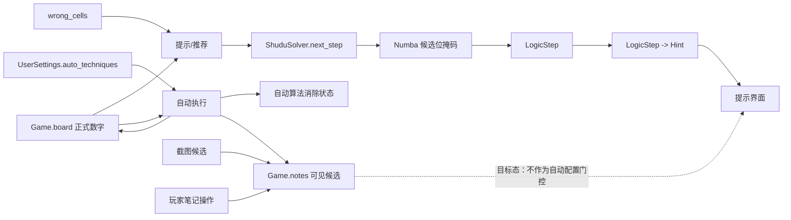
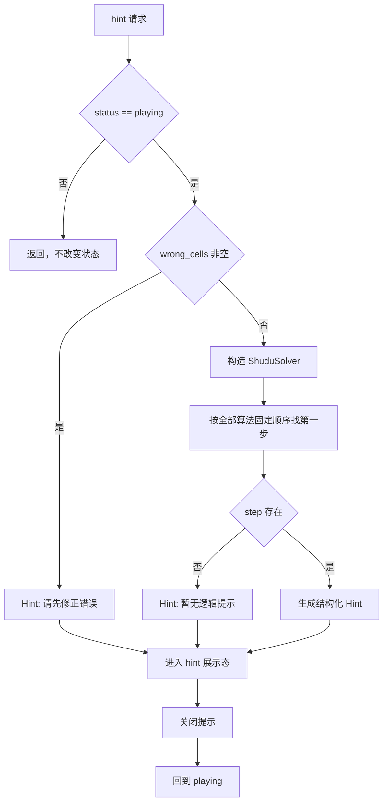

# 联合方案决策草案：提示推荐与自动完成配置解耦

- 状态：草案，等待 `$productivity:grilling` 确认
- 日期：2026-10-05
- 仓库：`jaried/shudu`
- 分支：`main`
- 事实基线 HEAD：`6c53c2b06eb2956872f6bed76a787d8121a7f65d`
- 本轮范围：提示/推荐与自动解决算法配置解耦；形成原子 Issue 草案、DAG、三图、ADR 修订草案
- 本轮动作：保存草案；不登记正式 Issue，不修改 Sprint tracker，不发布 canonical 方案，不进入设计或实施

> 仓库在本轮前不存在 `docs/01_sprint记录`。本目录仅作为首个 docs Sprint 的草案命名空间 `sprint01` 使用；正式 Sprint tracker 与正式 Issue 编号继续等待后续明确授权。

## 1. 结论先行

当前故障可以由现有代码和用户提供的关卡 119 复现共同解释：

1. 自动解决配置本身没有直接传入 `ShuduSolver.next_step()`；提示路径当前确实会扫描全部逻辑算法。
2. 真正的耦合点是 `Game.notes`：截图笔记、玩家笔记、自动算法生成的候选共用同一个可见状态；`sudoku_hints.pending_step()` 又用这个状态判断某个消除步骤是否“已经做过”。
3. 因此自动算法配置触发的候选重算能够间接改变提示结果。
4. 关卡 119 当前棋盘没有 Hidden Single、Naked Single 或可产生消除的 Naked Pair；按当前稳定优先级，第一条有效逻辑步骤是 **Hidden Pair**：第 6 行数字 3/6 只出现在 C2/C7，应从 R6C2 删除候选 7。当前默认自动集合未勾选 Hidden Pair，但提示仍应能够推荐这一步。
5. 目标架构应共享同一套数独算法实现与稳定顺序，但使用两套独立的**选择策略**：
   - 提示/推荐：固定使用全部算法，从简单到复杂取第一条可解释逻辑步骤；
   - 自动完成：只使用用户勾选集合，并继续持久化该集合。

当前唯一需要用户确认的产品选择是：**提示是否继续把玩家手工删除候选视为“这一步已经完成”**。这个选择决定是否需要新增显式的“玩家逻辑进度”状态。

## 2. 事实闭包

### 2.1 当前正式架构

现行 ADR 与代码已经确定：

- `ADR-002`：solver 拥有算法事实，`ShuduSolver.next_step()` 返回完整 `LogicStep`；Hint 只做语义适配；用户笔记不是 solver 推理前提。
- `ADR-003`：九种逻辑算法的核心计算使用 Numba 位掩码；提示不进入回溯。
- `ADR-005`：自动算法逐项勾选由本地偏好保存；算法目录是名称、顺序、标签与自动默认集合的元数据真源。
- `docs/codebase-design-review.md`：当前 Hint 还承担“跳过玩家已经手工完成的合法排除”。

### 2.2 当前代码链

```text
设置 -> auto_techniques
       -> Game.set_auto_technique()
       -> Game.auto_solve_enabled()
       -> ShuduSolver.solve_techniques_result(selected)
       -> Game.notes = solver 最终候选

提示
       -> Game.hint()
       -> make_hint(board, notes, wrong)
       -> pending_step(board, notes)
       -> ShuduSolver.next_step()  # 全算法
       -> already_noted(step, notes)
       -> 可能跳过该逻辑步骤
```

直接耦合发生在最后一段：**提示把可见 notes 当作“是否已经完成该消除”的判断输入**。

### 2.3 关卡 119 复现证据

用户提供的棋盘正式数字为：

```text
7183..459
6924..738
453879126
2...3.9..
...6...7.
5......82
.....7.4.
146583297
........3
```

按正式数字重新计算基础候选：

- R6C2 = {3,6,7}
- R6C7 = {3,6}
- 第 6 行中数字 3 与 6 仅出现在这两格
- 因此 Hidden Pair 3/6 成立，动作是删除 R6C2 的候选 7

用户截图里的 R6C2 已显示为 {3,6}。当前 `already_noted()` 因而可以把这条 Hidden Pair 判为已经完成并继续向后扫描。截图中其他候选也包含已经做过的逻辑消除，最终能够走到“暂无逻辑提示”。开启 Hidden Pair 后自动求解重新投影候选，提示路径看到的 `notes` 改变，于是表现为“只有勾选 Hidden Pair 才能提示”。

### 2.4 测试现状

已有测试覆盖：

- 提示只读，不修改棋盘、笔记与历史；
- 提示不调用完整求解或回溯；
- 自动算法逐项配置、持久化、启动恢复；
- 自动算法忽略用户笔记并以 solver 最终候选覆盖可见笔记；
- screenshot import 保留自动配置和导入笔记；
- 架构测试锁定 Hint -> ShuduSolver 的依赖方向。

当前缺口：

- 没有“同一棋盘下，自动完成勾选集合不影响提示推荐”的回归测试；
- 没有“截图导入的候选缺失不应屏蔽 Hidden Pair 推荐”的业务测试；
- 没有测试明确区分“可见 notes”与“推荐逻辑进度”。

## 3. 业务目标与验收

### 3.1 目标

用户点击“提示”时，推荐能力按当前棋盘使用全部九种逻辑算法，以稳定优先级从简单到复杂寻找下一条可解释步骤。自动解决菜单只控制自动执行范围。

稳定优先级沿用当前项目顺序：

1. Hidden Single
2. Naked Single
3. Naked Pair
4. Hidden Pair
5. Naked Triple
6. Pointing Pair
7. Box-Line Reduction
8. X-Wing
9. XY-Wing

### 3.2 必须满足

- 关卡 119 在默认自动配置下能够提示 Hidden Pair。
- 自动算法全部关闭时，同一棋盘仍能够提示 Hidden Pair。
- Hidden Pair 未勾选时，提示仍可推荐 Hidden Pair。
- `UserSettings.auto_techniques` 只影响自动执行，不成为提示输入。
- 提示继续只读，不填数、不删笔记、不使用回溯。
- 自动完成继续只执行用户勾选算法。
- 如果自动完成实际执行并改变了棋盘，则后续提示可以随新棋盘改变；这是业务状态变化，不是配置耦合。
- 推荐路径的读取与计算面不扩大到全盘求解、回溯、远端调用、子进程或额外 IO。

## 4. Module → Interface → Seam → Adapter → 文件布局

### 4.1 Module：项目级逻辑求解

**现有 Module**：`ShuduSolver`

**Interface：**

- `next_step() -> LogicStep | None`
- 输入状态只来自当前正式棋盘和 solver 内部候选状态；
- 使用项目支持的全部逻辑算法稳定顺序；
- 返回第一条逻辑步骤；
- 不读取自动完成配置；
- 不读取用户可见笔记；
- 不调用回溯。

**Seam：** 根级 `shudu_solver.py` 现有项目 solver seam。

**Adapter：** 无新增 Adapter；现有 `shudu/sudoku_hints.py` 消费 `LogicStep`。

### 4.2 Module：提示/推荐语义适配

**现有 Module**：`shudu/sudoku_hints.py`

**目标 Interface（共同部分）：**

- `make_hint(...)->Hint` 只接收形成推荐所需的最小状态；
- wrong cells 存在时返回错误提示；
- 正常状态只请求一条项目 solver 逻辑步骤并转换为 `Hint`；
- 算法识别继续只存在于 solver，Hint 不复制算法规则。

**Seam：** `Game.hint()` -> Hint Module。

**Adapter：** Hint Module 本身是 `LogicStep -> Hint` Adapter；当前只有一个真实 Adapter，不增加注册表或 Protocol。

### 4.3 Module：自动执行

**现有 Module/capability：**

- `Game.auto_solve_enabled()`
- `ShuduSolver.solve_techniques_result(names)`
- `UserSettings.auto_techniques`

**Interface：**

- 输入为用户勾选集合；
- 只执行该集合；
- 持久化只保存自动执行偏好；
- 自动执行产生的候选投影继续服务自动完成功能。

### 4.4 文件布局

本轮不新建生产 deep Module，不进行目录重构。目标改动集中在现有 locality：

```text
shudu_solver.py
shudu/
  sudoku_hints.py
  sudoku_game.py          # 仅在选择分支 A 时增加显式玩家逻辑进度
tests/
  test_sudoku_hints.py
  test_auto_technique_settings.py（仅需要补跨配置行为时）
docs/
  README / ADR / codebase-design-review 对应修订
```

现有 Numba 核心、截图识别、View、用户设置存储无需新增依赖。

## 5. 真正需要确认的方向选择

### 选择 A：保留“玩家手工完成消除后推荐继续向后走”

产品行为：

- 截图导入的候选、自动算法投影的候选都不作为推荐完成证据；
- 只有玩家在本应用中明确删除的候选记录为“玩家逻辑进度”；
- 推荐从正式棋盘和 solver 自有逻辑出发，可以跳过玩家已经明确完成的合法消除；
- 自动完成产生的逻辑进度与玩家逻辑进度分别保存，避免把可见 notes 当推理状态。

所需状态：

```text
Game.manual_eliminations: set[Change]
Game.simple_eliminations: 自动执行已证明的候选删除
Game.notes: 仅可见笔记投影
```

生命周期：

- 玩家从某格删除一个已存在笔记 -> 更新 `manual_eliminations`；
- 玩家重新加入该候选 -> 撤销对应 manual elimination；
- undo 快照恢复 manual eliminations；
- erase 这种扩大候选空间的动作同时清理与新棋盘不再可靠的逻辑进度；
- screenshot import 初始 `manual_eliminations = empty`；
- solver 推理仍不把玩家删除候选作为候选真源；
- 提示只在 solver 自己已经证明同一消除时使用 `manual_eliminations` 跳过展示。

优点：保留 ADR-002 / codebase review 当前“玩家做过的消除不重复提示”语义。  
代价：Game 多一个显式状态及快照生命周期，实施与测试范围更大。

### 选择 B：提示完全基于正式棋盘（推荐）

产品行为：

- notes 不参与推荐；
- 每次点击提示都从当前正式棋盘计算第一条逻辑步骤；
- screenshot notes、手工 notes、自动候选投影都不会改变推荐选择。

目标 Interface：

```text
Game.hint()
  -> make_hint(board, wrong)
      -> ShuduSolver(board).next_step()
      -> Hint
```

同时删除 `already_noted()` 和最多 729 次的跳过扫描循环。

优点：

- 最直接满足“推荐与自动完成配置完全独立”；
- Interface 更小；
- recommendation compute 从“可能多步扫描”缩为“一次 next_step”，执行面收缩；
- 无新增状态、无迁移状态、无额外 Adapter。

代价：

- 如果玩家只删除了某个候选而没有改变正式数字，再次点击提示仍可能看到同一条消除提示。
- 这会替换当前文档中的“玩家已经手工完成的合法排除会被跳过”行为。

**推荐选择 B**：它与本次明确需求最一致，并且 KISS、YAGNI、Deep Module 和执行面收缩最优；但由于它会改变一项现行已记录行为，必须由用户在 grilling 中确认。

## 6. 业务流程图

这张图回答：用户从“点击提示”到看到下一条推荐，自动完成配置在哪个阶段参与。


闭合检查：

- 正常出口：显示 LogicStep 或“暂无逻辑提示”；
- 错误出口：显示错误格提示；
- 自动配置没有进入推荐选择器；
- 自动执行真实改变正式棋盘后，后续提示读取新棋盘；
- 无远端、队列、异步恢复路径。

## 7. 数据流程图

这张图回答：推荐、自动完成、笔记各自以什么数据为真源。



分支 A 增加：

```text
玩家明确删除候选 -> manual_eliminations -> 推荐“已完成步骤”判断
```

分支 B 不增加该状态，`Notes` 完全不进入推荐选择。

闭合检查：

- recommendation 的算法真源是 solver/Numba；
- auto preference 的真源是 UserSettings；
- 可见 notes 是展示/玩家状态，不再承担“自动配置 -> 推荐”的隐式传递；
- 没有新的 IO、远端或 dataframe 计算。

## 8. 逻辑设计图

这张图回答：正常、无步骤和错误状态如何稳定到达一个确定结果。



分支 A 在 E/F 之间只增加“应用自动算法已证明消除 + 跳过玩家显式完成消除”的确定性处理；分支 B 没有额外循环。

闭合检查：

- 所有分支都有明确结果；
- 结果未知、重试、指数退避不适用：这是本地纯计算调用，没有远端失败面；
- 幂等：相同正式棋盘与相同推荐进度输入得到相同 LogicStep；
- 流式、队列、批量、异步均无当前业务场景，不引入。

## 9. 防回归矩阵

| 既有/新增行为 | 当前证据 | 新测试责任 | 完成证据 |
|---|---|---|---|
| 提示只读 | `test_hint_round_trip_preserves_all_play_data` | 保留 | focused + full pytest 通过 |
| 提示不回溯 | `test_hint_never_calls_full_solver_or_backtracking` | 保留 | 同上 |
| 自动算法只执行选择集合 | `test_solver_selection_reaches_each_algorithm` | 保留 | 同上 |
| 自动配置持久化 | `test_setting_change_is_saved_immediately` 等 | 保留 | 同上 |
| screenshot notes 能恢复 | `test_screenshot_import_preserves_preferences_and_rebinds_view` | 保留 | 同上 |
| 默认配置未勾 Hidden Pair 仍可推荐 Hidden Pair | 缺失 | 新增关卡 119 回归 | 期望 `step.name == "Hidden Pair"` |
| 自动算法集合为空仍可推荐 Hidden Pair | 缺失 | 新增同盘面对照 | 期望同一步 |
| 可见 notes 变化不再由 auto 配置门控推荐 | 缺失 | 新增同盘面/不同 notes 对照 | 根据 grilling 选择 A/B 固化 |
| 架构依赖仍为 Hint -> ShuduSolver | `test_architecture.py` | 保留并按需增强 | architecture tests 通过 |

测试门禁：

1. 先运行目标测试，必须真实 RED 证明复现；
2. 实施后目标测试 GREEN；
3. 运行 `uv run python -m pytest -q tests/test_sudoku_hints.py tests/test_auto_technique_settings.py tests/test_screenshot_import_menu.py tests/test_architecture.py`；
4. 再运行 `uv run python -m pytest -q`；
5. GUI 相关测试必须在可用 Tk 环境真实执行，不能用环境缺失产生的 skip 代替通过；
6. 当前改动不新增 dataframe 路径；Numba 核心不改，因此无需新增性能计算实现。分支 B 额外要求记录 recommendation 的 solver-step 调用次数从“可能循环”收缩为 1 次。

## 10. ADR 动作

正式批准后需要同步修订现行 ADR，而不是建立重复的第二套架构真源：

- `ADR-002`：更新 Hint Interface 与笔记关系；根据 grilling 的 A/B 选择写入唯一现行语义。
- `ADR-005`：明确 `auto_techniques` 只控制自动执行；提示推荐固定使用全算法策略。
- `docs/codebase-design-review.md`：同步 Hint Module 责任与执行面。
- `README.md`：用户可见说明增加“提示使用全部算法，与自动解决勾选独立”。

本轮只保存 ADR 修订草案，不修改已接受 ADR。

## 11. 原子 Issue 拆分

### BUG-D01：提示推荐使用全算法且与自动完成配置解耦

**类型建议：** BUG  
**优先级建议：** P1  
**点数：** 分支 B 3；分支 A 5  
**Blocked by：** None

**What it delivers：**

关卡 119 以及其他需要未勾选高级算法的盘面，点击提示时都能按全部逻辑算法稳定顺序得到下一步；自动解决的用户配置只控制自动执行。

**为什么只拆 1 个 Issue：**

这是一个窄的端到端行为切片，代码、测试和文档必须一起落地才能独立验收。再拆成“测试 Issue / Hint Issue / 文档 Issue”会变成水平切片并制造跨 Issue 集成，没有真实数据、状态或 Interface 依赖支持这种拆分。

## 12. Implementation Items 草案

### I01 — 固化关卡 119 的真实回归

- `objective`：在最高可观察 seam 复现“默认自动配置下推荐不到 Hidden Pair”，并锁定目标行为。
- `owner_surface`：`Game.hint -> Hint recommendation`
- `allowed_scope`：测试夹具与提示行为测试；使用关卡 119 的正式数字，必要时直接设置截图候选状态，不调用 OCR。
- `completion_evidence`：新增测试在当前基线 RED；期望下一步为 Hidden Pair，消除 R6C2 的 7；同一正式棋盘在 `auto_techniques=set()` 与默认集合下目标一致。
- `required_behavior_checks`：
  - 默认自动集合未含 Hidden Pair；
  - 推荐仍返回 Hidden Pair；
  - 自动集合为空仍返回相同步骤；
  - 提示不修改 board/notes/history。
- `item_dependencies`：[]

### I02 — 切断推荐对自动候选投影的隐式依赖

**分支 B：**

- `objective`：把提示选择 Interface 收缩为“正式棋盘 + 错误状态 -> 第一条全算法 LogicStep”。
- `owner_surface`：`shudu.sudoku_hints.make_hint/pending_step` 与 `Game.hint`
- `allowed_scope`：移除 notes 作为推荐选择输入；删除 `already_noted` 与多步跳过循环；保留 Hint 文案/视觉 Adapter。
- `completion_evidence`：I01 GREEN；相同 board 下改变 notes 或 auto_techniques 不改变推荐步骤；solver 只请求一条 next_step。
- `required_behavior_checks`：
  - 全算法顺序保持；
  - 无回溯；
  - 错误格提示保持；
  - 只读行为保持；
  - notes 仍可正常显示和被自动算法维护。
- `item_dependencies`：[I01]

**分支 A：**

- `objective`：用显式玩家逻辑进度替代 visible notes heuristic，使推荐只跳过玩家在本应用中明确完成的合法消除。
- `owner_surface`：`Game` 玩家候选操作状态 + `Hint recommendation`
- `allowed_scope`：新增独立 manual elimination 状态及 Snapshot/undo/erase 生命周期；提示只消费 solver 已证明的自动消除与玩家显式完成消除，不读取 visible notes 作为完成证明。
- `completion_evidence`：I01 GREEN；截图候选不屏蔽 Hidden Pair；玩家明确删除当前推荐候选后再次提示能够继续到下一逻辑步骤；自动配置变化不通过 notes 改写推荐进度。
- `required_behavior_checks`：
  - screenshot import 初始 manual progress 为空；
  - 玩家删除/重新加入候选可逆；
  - undo 恢复 manual progress；
  - erase 清理失效进度；
  - solver 不把 manual progress 当候选真源；
  - 自动执行仍只使用选择集合。
- `item_dependencies`：[I01]

### I03 — 文档/ADR 迁移与完整门禁

- `objective`：让 README、ADR、codebase-design review、架构测试与最终行为保持单一现行语义。
- `owner_surface`：`docs + architecture regression`
- `allowed_scope`：修订 ADR-002、ADR-005、README、codebase-design-review；按选定分支同步测试。
- `completion_evidence`：focused tests 与全量 pytest 真实通过；GUI 测试没有因运行环境被语义跳过；文档只保留最终选择。
- `required_behavior_checks`：
  - 推荐全算法固定策略；
  - 自动配置仅控制自动执行；
  - Hint 不复制算法识别；
  - 无新增远端/IO/子进程执行面；
  - 分支 B 证明 recommendation compute 面收缩；分支 A 证明新增状态只服务玩家逻辑进度。
- `item_dependencies`：[I02]

## 13. Issue DAG、并行组、关键路径

两种产品分支的 Issue DAG 都是：

```text
BUG-D01
```

- 并行组 P0：`{BUG-D01}`
- 关键路径：`BUG-D01`
- 串行 Issue 边：无

Issue 内 Item DAG：

```text
I01 -> I02 -> I03
```

这里的串行是实际 TDD 证据依赖：先证明基线失败，再实现，再做正式文档迁移和完整回归。不存在可以独立交付的第二个业务切片，因此不人为制造并行 Issue。

## 14. Deep Module / 执行面检查

- 依赖面：Hint 继续只依赖 `ShuduSolver` 的结构化步骤 Interface；不增加对设置存储、GUI、Numba finder 的依赖。
- 读取面：推荐只读取当前棋盘、错误状态以及分支 A 必要的显式玩家进度；不读取配置文件。
- 计算面：
  - 分支 B 从最多 `len(CELLS) * 9` 次逻辑 transition 收缩为一次 `next_step()`；
  - 分支 A 只为已证明/已完成消除做有限 fast-forward，不扩大到完整 solve/backtracking。
- 副作用面：提示仍为只读。
- process / remote：0。
- Python 热计算：继续由现有 Numba 位掩码 finder 完成；本轮不引入 DataFrame 或新的 NumPy 投影层。

## 15. 工程原则审查结论

- 原子化：一个可独立验收的业务 Bug，不拆水平票。
- KISS/YAGNI：分支 B 最小；分支 A 仅在确认保留“手工消除推进提示”时增加状态。
- DRY：继续共享 solver 算法实现，不复制一套“推荐算法”。
- Deep Module：推荐只消费需要的下一步 capability，不调用 solve-to-fixed-point。
- 最小改动：不改 OCR、View 布局、持久化格式、Numba finder、完整解算法。
- 性能：不扩大执行面；分支 B 明确缩小计算面。
- 测试：迁移与行为测试同步，完整门禁不可用 skip 替代。

## 16. 待 `$productivity:grilling` 确认

### Q1 — 玩家手工删除候选后，下一次提示是否应该跳到后续逻辑？

**A. 保留这个能力**：新增显式玩家逻辑进度，截图/自动候选不算玩家进度。  
**B. 提示只看正式棋盘**：每次都给当前棋盘的第一条逻辑步骤，notes 完全不影响推荐。

**推荐：B。** 这是最小、最稳定、计算面最小的语义，也最直接符合“推荐默认使用全部算法，与自动完成配置完全独立”。如果你希望“删掉提示中的候选后，再点提示一定进入下一步”，则选择 A。

除此之外，当前事实和既有规则可以唯一确定，不需要再向用户提问。
