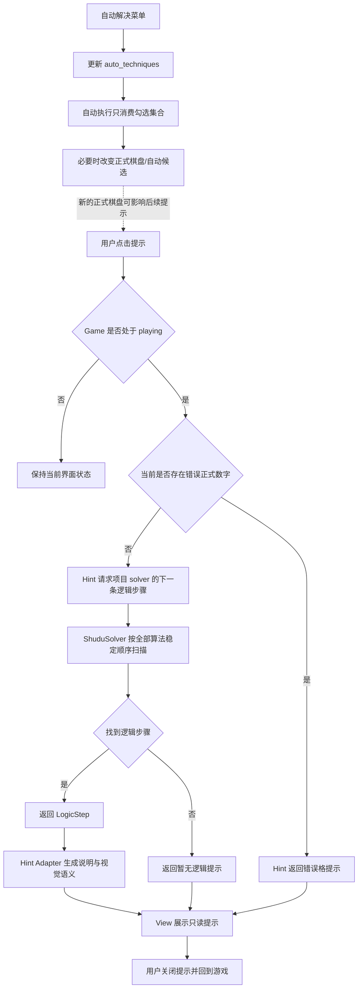
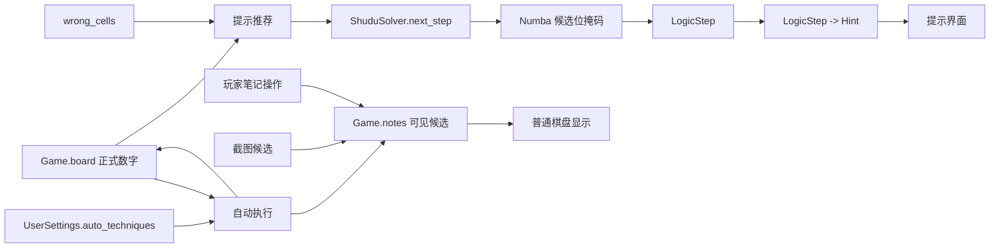
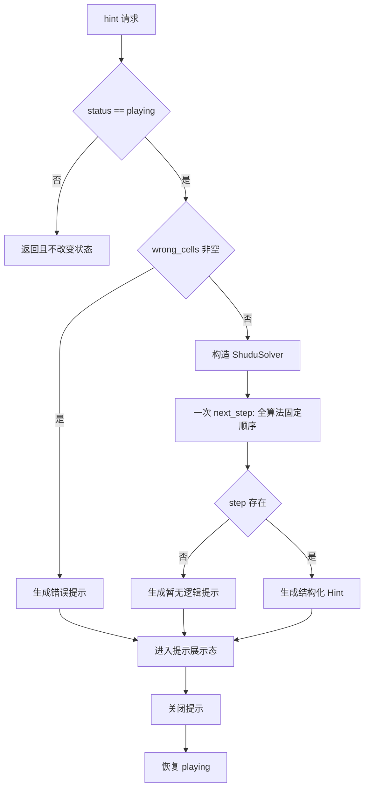

# 联合方案决策草案：提示推荐与自动完成配置解耦

- 状态：草案，方向已闭合，待最终确认
- 日期：2026-10-05
- 仓库：`jaried/shudu`
- 分支：`main`
- 事实基线 HEAD：`6c53c2b06eb2956872f6bed76a787d8121a7f65d`
- 本轮范围：提示/推荐与自动解决算法配置解耦；形成原子 Issue 草案、DAG、三图、ADR 修订草案
- 本轮动作：维护草案；不登记正式 Issue，不修改 Sprint tracker，不发布 canonical 方案，不进入设计或实施

> 仓库在本轮前不存在 `docs/01_sprint记录`。本目录仅作为首个 docs Sprint 的草案命名空间 `sprint01` 使用；正式 Sprint tracker 与正式 Issue 编号继续等待后续明确授权。

## 1. 决策结论

1. 提示/推荐固定使用项目支持的全部逻辑算法，按稳定优先级从简单到复杂返回第一条可解释逻辑步骤。
2. 自动完成只执行用户勾选的 `auto_techniques`，该集合继续由 `UserSettings` 持久化。
3. 提示只以当前正式棋盘和错误状态作为步骤选择输入；`Game.notes` 不参与推荐步骤选择，也不表示推荐进度。
4. 玩家只修改候选笔记、未改变正式数字时，再次提示允许返回同一逻辑步骤。
5. 自动完成真实改变正式棋盘后，后续提示根据新棋盘重新计算。
6. 提示继续只读，不填数、不删笔记、不使用完整求解或回溯。

## 2. 事实闭包

### 2.1 当前正式架构

- `ADR-002`：solver 拥有算法事实，`ShuduSolver.next_step()` 返回完整 `LogicStep`；Hint 只做语义适配；用户笔记不是 solver 推理前提。
- `ADR-003`：九种逻辑算法的核心计算使用 Numba 位掩码；提示不进入回溯。
- `ADR-005`：自动算法逐项勾选由本地偏好保存；算法目录是名称、顺序、标签与自动默认集合的元数据真源。
- `docs/codebase-design-review.md` 当前仍记录“跳过玩家已经手工完成的合法排除”，正式批准后需按本决策修订为现行语义。

### 2.2 当前代码根因

```text
设置 -> auto_techniques
       -> Game.set_auto_technique()
       -> Game.auto_solve_enabled()
       -> ShuduSolver.solve_techniques_result(selected)
       -> Game.notes = solver 最终候选

提示
       -> Game.hint()
       -> make_hint(board, notes, wrong)
       -> pending_step(board, notes)
       -> ShuduSolver.next_step()
       -> already_noted(step, notes)
       -> 可能跳过该逻辑步骤
```

`ShuduSolver.next_step()` 本身已经使用全部逻辑算法。耦合发生在 Hint 层：可见 `Game.notes` 同时可能来自截图、玩家手工笔记、自动笔记和自动算法候选投影，却被 `already_noted()` 当作“逻辑步骤已经完成”的判断依据。自动算法配置因此可以通过候选重算间接改变推荐结果。

### 2.3 关卡 119 复现证据

正式棋盘：

```text
7183..459
6924..738
453879126
2...3.9..
...6...7.
5......82
.....7.4.
146583297
........3
```

基础候选：

- R6C2 = {3,6,7}
- R6C7 = {3,6}
- 第 6 行数字 3 与 6 仅出现在这两格

因此当前稳定顺序下第一条有效逻辑步骤是 **Hidden Pair 3/6**，删除 R6C2 的候选 7。截图中 R6C2 已显示 {3,6}，当前 `already_noted()` 会把该消除视为已完成并继续扫描，最终可能得到“暂无逻辑提示”。

### 2.4 测试缺口

已有测试覆盖提示只读、无回溯、自动算法逐项配置和持久化、截图导入以及架构依赖方向。当前缺少：

- 默认自动集合未勾 Hidden Pair 时，关卡 119 仍推荐 Hidden Pair；
- 自动集合为空时仍推荐同一 Hidden Pair；
- 同一正式棋盘下改变 `Game.notes` 不改变推荐步骤；
- recommendation 只请求一个 next-step capability。

## 3. 业务目标与验收

提示稳定优先级沿用当前项目：

1. Hidden Single
2. Naked Single
3. Naked Pair
4. Hidden Pair
5. Naked Triple
6. Pointing Pair
7. Box-Line Reduction
8. X-Wing
9. XY-Wing

必须满足：

- 关卡 119 默认自动配置下提示 Hidden Pair。
- 自动算法全部关闭时，同一棋盘仍提示 Hidden Pair。
- Hidden Pair 未勾选时，提示仍可推荐 Hidden Pair。
- `UserSettings.auto_techniques` 只影响自动执行，不成为提示输入。
- 任意 `Game.notes` 内容不改变同一正式棋盘的推荐步骤。
- 提示保持只读，无回溯。
- 自动完成继续只执行用户勾选算法。
- recommendation 最多请求一次 `next_step()`。
- 读取、计算、副作用、子进程和远端调用执行面不扩大。

## 4. Module → Interface → Seam → Adapter → 文件布局

### 4.1 Module：项目级逻辑求解

**Module**：`ShuduSolver`

**Interface**：

`next_step() -> LogicStep | None`

合同：

- 输入只来自当前正式棋盘和 solver 内部候选状态；
- 使用全部逻辑算法稳定顺序；
- 返回第一条有效逻辑步骤；
- 不读取自动完成配置；
- 不读取可见 notes；
- 不调用回溯。

**Seam**：根级 `shudu_solver.py` 现有项目 solver seam。

**Adapter**：`shudu/sudoku_hints.py` 消费 `LogicStep`。

### 4.2 Module：提示/推荐语义适配

**Module**：`shudu/sudoku_hints.py`

**Interface**：

`make_hint(board, wrong) -> Hint`

行为：

- wrong cells 存在时返回错误提示；
- 正常状态构造项目 solver 并只请求一次 `next_step()`；
- `LogicStep` 转换为 `Hint`；
- 不读取 notes，不维护逻辑进度，不复制算法识别。

**Seam**：`Game.hint()` -> Hint Module。

**Adapter**：Hint Module 本身继续是 `LogicStep -> Hint` Adapter；当前只有一个真实 Adapter，不增加注册表或 Protocol。

### 4.3 Module：自动执行

现有 capability：

- `Game.auto_solve_enabled()`
- `ShuduSolver.solve_techniques_result(names)`
- `UserSettings.auto_techniques`

Interface：

- 输入为用户勾选集合；
- 只执行该集合；
- 持久化只保存自动执行偏好；
- 自动执行产生的候选投影继续服务自动完成功能。

### 4.4 文件布局

不新建生产 deep Module，不做目录迁移：

```text
shudu/
  sudoku_hints.py
  sudoku_game.py
tests/
  test_sudoku_hints.py
  test_auto_technique_settings.py
docs/
  README.md
  codebase-design-review.md
  02_架构决策记录/
    ADR-002-共享规则内核与求解器公共接口.md
    ADR-005-本地自动算法偏好与完成动画.md
```

现有 Numba 核心、截图识别、View、用户设置存储不增加依赖。

## 5. 业务流程图

这张图回答：用户点击提示后如何得到下一条推荐，以及自动完成配置在哪个流程生效。



闭合：正常、错误、无逻辑步骤都有明确出口；自动配置不进入 recommendation selector。

## 6. 数据流程图

这张图回答：推荐、自动完成、笔记分别以什么数据为真源。



闭合：

- recommendation 算法真源是 solver/Numba；
- auto preference 真源是 UserSettings；
- notes 是可见笔记状态，不进入 recommendation 选择。

## 7. 逻辑设计图

这张图回答：正常、错误、无逻辑步骤如何到达确定结果。



本地纯计算没有远端失败面；异步、流式、队列、批量、指数退避和抖动不适用。相同正式棋盘与错误状态得到确定的推荐结果。

## 8. 防回归矩阵

| 行为 | 当前证据 | 新测试责任 | 完成证据 |
|---|---|---|---|
| 提示只读 | `test_hint_round_trip_preserves_all_play_data` | 保留 | focused + full pytest 通过 |
| 提示不回溯 | `test_hint_never_calls_full_solver_or_backtracking` | 保留 | 同上 |
| 自动算法只执行选择集合 | `test_solver_selection_reaches_each_algorithm` | 保留 | 同上 |
| 自动配置持久化 | `test_setting_change_is_saved_immediately` 等 | 保留 | 同上 |
| screenshot notes 能恢复 | `test_screenshot_import_preserves_preferences_and_rebinds_view` | 保留 | 同上 |
| 默认配置未勾 Hidden Pair 仍可推荐 | 缺失 | 关卡 119 回归 | `step.name == "Hidden Pair"` |
| 自动集合为空仍可推荐 | 缺失 | 同盘面对照 | 与默认集合相同 |
| notes 不影响 recommendation | 缺失 | 同 board / 不同 notes | 返回同一步 |
| recommendation 只请求一次 next_step | 缺失 | 调用计数回归 | 计数 = 1 |
| 架构依赖仍为 Hint -> ShuduSolver | `test_architecture.py` | 保留并增强 | architecture tests 通过 |

测试门禁：

1. 新关卡 119 回归在基线先真实 RED；
2. 实施后目标测试 GREEN；
3. focused：
   `uv run python -m pytest -q tests/test_sudoku_hints.py tests/test_auto_technique_settings.py tests/test_screenshot_import_menu.py tests/test_architecture.py`
4. full：`uv run python -m pytest -q`
5. GUI/Tk 相关门禁必须在可运行环境真实执行；环境 skip 不作为通过。
6. 不新增 DataFrame 路径；Numba 核心不改。

## 9. ADR 动作

正式批准后修订现有 ADR：

- `ADR-002`：Hint recommendation 的输入闭集改为正式棋盘与错误状态；notes 不参与步骤选择；删除“玩家手工完成合法排除后自动跳过”的现行描述。
- `ADR-005`：`auto_techniques` 只控制自动执行；提示推荐固定使用全算法策略。
- `docs/codebase-design-review.md`：同步 Hint Module 责任与执行面。
- `README.md`：用户可见说明明确提示与自动解决勾选独立。

不新增平行 ADR。

## 10. 原子 Issue 草案

### BUG-D01：提示推荐使用全算法且与自动完成配置解耦

- 类型建议：BUG
- 优先级建议：P1
- 点数建议：3
- Blocked by：None

**What it delivers**

关卡 119 以及其他需要未勾选高级算法的盘面，点击提示时都能按全部逻辑算法稳定顺序得到下一步；自动解决的用户配置只控制自动执行。

这是一个窄的端到端行为切片，代码、测试和文档一起落地即可独立验收；不拆水平 Issue。

## 11. Implementation Items 草案

### I01 — 固化关卡 119 回归

- `objective`：在最高可观察 seam 复现当前故障并锁定目标 Hidden Pair。
- `owner_surface`：`Game.hint -> Hint recommendation`
- `allowed_scope`：提示行为测试；使用关卡 119 正式数字和必要 notes 状态，不调用 OCR。
- `completion_evidence`：基线新增测试真实 RED；期望 Hidden Pair 删除 R6C2 的 7。
- `required_behavior_checks`：
  - 默认自动集合未含 Hidden Pair；
  - 推荐仍返回 Hidden Pair；
  - 自动集合为空仍返回相同步骤；
  - 提示不修改 board/notes/history。
- `item_dependencies`：[]

### I02 — 推荐选择 seam 解耦

- `objective`：将推荐输入收缩为“正式棋盘 + 错误状态 -> 第一条全算法 LogicStep”。
- `owner_surface`：`shudu.sudoku_hints.make_hint/pending_step` 与 `Game.hint`
- `allowed_scope`：移除 notes 作为 recommendation 输入；删除 `already_noted` 和多步跳过循环；保留 Hint 文案/视觉 Adapter 与 solver 算法实现。
- `completion_evidence`：I01 GREEN；相同 board 下改变 notes 或 auto_techniques 不改变推荐步骤；solver 只请求一次 `next_step()`。
- `required_behavior_checks`：
  - 全算法顺序保持；
  - 无回溯；
  - wrong-cell 提示保持；
  - 只读行为保持；
  - notes 仍可正常显示和被自动算法维护；
  - 自动完成仍只执行选择集合。
- `item_dependencies`：[I01]

### I03 — 文档/ADR 迁移与完整门禁

- `objective`：让 README、ADR、codebase-design review、架构测试与最终行为保持单一现行语义。
- `owner_surface`：`docs + architecture regression`
- `allowed_scope`：修订 ADR-002、ADR-005、README、codebase-design-review 与相关测试。
- `completion_evidence`：focused 与 full pytest 真实通过；GUI 测试未由环境 skip 代替；文档 readback 与实现一致。
- `required_behavior_checks`：
  - 推荐全算法固定策略；
  - 自动配置仅控制自动执行；
  - Hint 不复制算法识别；
  - recommendation 只请求一次 next-step capability；
  - 无新增远端/IO/子进程执行面。
- `item_dependencies`：[I02]

## 12. Issue DAG、并行组、关键路径

Issue DAG：

```text
BUG-D01
```

- 并行组 P0：`{BUG-D01}`
- 关键路径：`BUG-D01`
- 串行 Issue 边：无

Issue 内 Item DAG：

```text
I01 -> I02 -> I03
```

串行关系来自真实 TDD 证据依赖：先证明失败，再实现，再迁移文档与完成全量回归。

## 13. Deep Module / 执行面检查

- 依赖面：Hint 继续只依赖 `ShuduSolver` 的结构化步骤 Interface。
- 读取面：recommendation 只读取正式棋盘与错误状态，不读取配置文件和 notes。
- 计算面：从最多 `len(CELLS) * 9` 次逻辑 transition 收缩为一次 `next_step()`。
- 副作用面：提示仍为只读。
- process / remote：0。
- Python 热计算：继续使用现有 Numba 位掩码 finder，不引入 DataFrame 或新的 NumPy 投影层。

## 14. 工程原则审查结论

- 原子化：一个可独立验收的业务 Bug，不拆水平票。
- KISS/YAGNI：不增加推荐进度状态。
- DRY：继续共享 solver 算法实现，不复制“推荐算法”。
- Deep Module：调用方只请求下一步 capability，不调用 solve-to-fixed-point。
- 最小改动：不改 OCR、View 布局、持久化格式、Numba finder、完整解算法。
- 性能：依赖面和计算面同时收缩。
- 测试：迁移与行为测试同步，完整门禁不可用 skip 替代。

## 15. 待确认状态

方向树已闭合，没有剩余业务、架构、范围或验收选择。当前仍是方案决策草案；正式登记 Issue、发布 canonical 方案、修改现行 ADR 和进入后续阶段继续等待明确授权。
