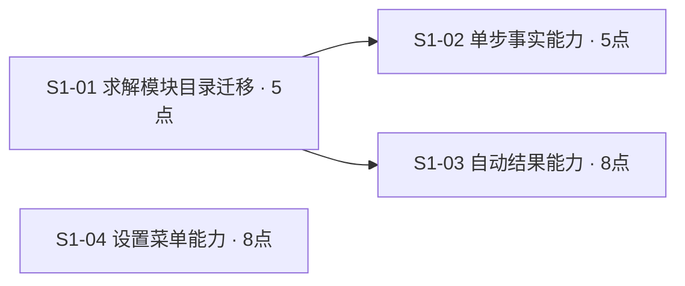

# 正式Issue DAG与并行组

四票均为方案已决策，版本和依赖来自已提交canonical及当前tracker的HOST读回。

| 并行组 | Issue | 成立条件 |
|---|---|---|
| 第一组 | S1-01、S1-04 | 对应阶段获得授权，所需门禁满足 |
| 第二组 | S1-02、S1-03 | 上游S1-01完成对应阶段里程碑；两票各自真实测试和接口依赖满足 |

并行组表示依赖层次；S1-01满足门禁即分别续派S1-02、S1-03，S1-04仍在运行时可有三个并发分支，各票无需等待同组全体完成。

关键路径为S1-01→S1-03，估算13点；另外两条为S1-01→S1-02（10点）和S1-04（8点）。点数用于相对工作量比较，实际耗时尚未测量。总点数26，最长真实依赖链为2票。

方案设计依赖上游design-completed，实施依赖上游implementation-delivered。当前design-plan ready为S1-01、S1-04；用户已进一步授权编排全部四票至待验收；按当前依赖、真实测试门禁及阶段完成事件续派。

各票由独立gpt-5.6-luna负责本票允许scope、测试和验收；跨票集成、真实里程碑核验与关键路径协调由主Agent/HOST负责。

读回：[正式DAG与状态证据](证据/正式DAG与状态读回.json)。
