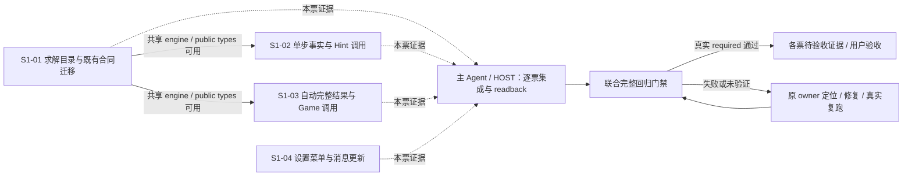
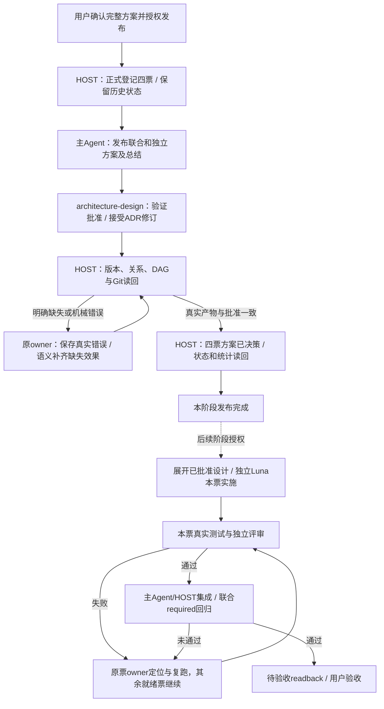
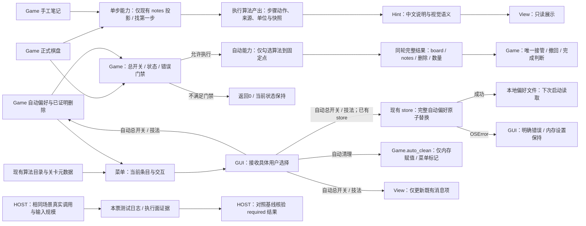
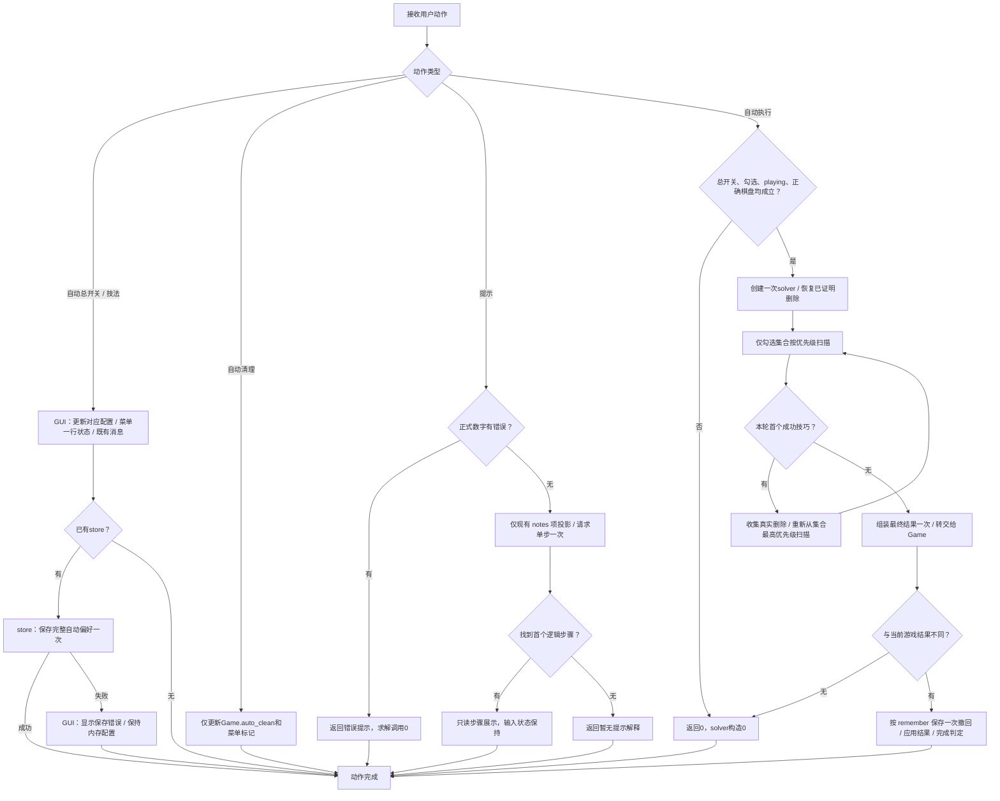

~~~toml
artifact_kind = "joint_solution"
artifact_version = "joint-solution-a4d73c79de3338c3"
frozen = true
approval_state = "approved"
approval_locator = "docs/01_sprint记录/sprint01/00-联合方案决策/2026-10-06/发布批准记录.md"
request_binding = "d6e6cdbe-416c-4105-a1d5-64a536c6ffea"
member_solution_versions = ["S1-01-solution-v1","S1-02-solution-v1","S1-03-solution-v1","S1-04-solution-v1"]
~~~
# Shudu 联合方案决策：收窄求解与设置能力

状态：用户已确认并授权正式发布；四个原子Issue与本联合方案绑定，代码迁移及真实运行验收由后续阶段完成。

## 1. 真正需求、范围与完成标准

玩家继续得到相同的提示、自动求解和设置行为；维护者修改这些行为时，只需理解对应 capability，其实现知识集中在负责该能力的 deep Module 内。优化消除跨调用方的求解结果组装、日志驱动事实和设置菜单中间表示，实际计算面同时收缩。

发布对象：四个正式Issue、各票方案与总结、完整联合方案、ADR-002/003/005修订、关系/依赖和方案已决策状态；发布批准见[批准记录](发布批准记录.md)。

本方案覆盖三个扫描候选。目标态由四个可独立验证的纵向切片到达，新增代码属于目标目录和目标职责。方案设计只展开本方案已批准的决定，实施按冻结工程表达执行；新事实引出的业务取舍交回方案决策。

最高约束：每次调用只执行所请求 capability。优化后 read、compute、effect、process、remote 的范围、调用次数和输入规模均不超过该 capability 的当前基线；次数比较使用相同盘面、笔记、勾选集合和操作序列，增加结果包装不构成扩大执行面的理由。

完成标准：三候选均有唯一正式承接；Module → Interface → Seam → Adapter → 文件布局闭合；四票具备独立方案与完整六字段 Item；DAG 每条串行边有真实依据；三图和防回归矩阵可逐项走查；事实、推断、未知和后续用户批准分别可定位。

## 2. 当前事实与来源闭包

设计基线沿证据目录保存的真实源码和运行记录；本次正式登记、版本、Git范围和状态事实由HOST保存于[发布读回](证据/正式发布读回.json)。当前正式工作分支为Sprint01，沿用仓库实际Sprint目录和Git路径。

| 来源 | 本轮实际读取 | 事实及对方案的影响 |
| --- | --- | --- |
| 原始请求 | 本 chat 的联合草案请求及“不能扩大计算面”补充 | 三候选同时优化，完整草案先交付；后续 grilling 与正式发布分别授权 |
| 优化候选 | `D:/temp/architecture-review-20261006-170844.html` 中 01 / 02 / 03，重新读取当前代码 | HTML 是扫描快照，尚无正式 candidate_id；本次用标题及来源定位映射，保留未批准身份 |
| 当前tracker | docs/00_待办列表/Sprint待办列表/Sprint01.md | 四票已正式登记；方案发布完成后逐票读回方案已决策 |
| 历史联合方案 | 上一日期目录的 `联合方案决策草案.md:3,10-17,43-89` | 文档自述“方案已决策，实施已提交，待本地回归验收”；提示全算法、逐格 notes、一次 next_step 与配置解耦已实现 |
| 历史原子草案 | `BUG-D01-提示推荐与自动完成配置解耦/方案决策草案.md:3,8-58` | 来源标识是历史草案 locator，非当前 tracker 登记票；本轮保护其业务内容和状态声明 |
| ADR-001 | 共享回溯兜底求解器，接受状态 | 完整 CLI 求解的 fallback 沿用共享能力；提示与自动逻辑维持现有非回溯路径 |
| ADR-002 | 共享规则内核与求解器公共接口，接受状态 | 规则、算法证据、notes 语义、project seam 和 Hint 职责是硬约束；目录与能力入口已接受本次修订 |
| ADR-003 | Numba 位掩码逻辑核心，接受状态 | 保留 `_masks`、十种 finder、两种 Single 优先级；编排目录变化已接受本次修订 |
| ADR-004 | 截图输入深模块，接受状态 | 保留截图刚导入时 notes，不自动覆盖；输入识别、取消和失败语义沿用 |
| ADR-005 | 本地自动算法偏好与完成动画，接受状态 | Game 拥有自动门禁，GUI 拥有 store，View 拥有动画；自动结果和菜单执行路径已接受本次修订 |
| 求解实现 | `shudu_solver.py:23-172`、`shudu/sudoku_logic.py:42-159,225-247,347-431`、`shudu/sudoku_step.py:15-52` | 自动结果只有数量/删除，Game 另读 solver；单步事实依赖旁路字段与日志；Hidden Single 重复来源计算 |
| 调用方 | `sudoku_game.py:223-305,348-376`、`sudoku_hints.py:49-112`、`logical_solver.py:11,115` | 两种求解语义独立；Game 门禁在创建 solver 前；Hint 仅投影现有 notes 并取一次步骤 |
| 设置与绘制 | `sudoku_gui.py:121-130,252-307`、`settings_popup.py:60-91,139-169`、`sudoku_view.py:293-307,382-389` | Menu → Tcl 反查 → ttk 二次呈现；自动总开关/技法选择经过完成扫描和整盘重绘；自动清理只改内存；控制启用状态不依赖自动设置 |
| 测试 | architecture、hints、auto_simple、auto_technique_settings、njit_core、logical_solver、GUI、截图、动画及其 fixtures | 原行为断言保持；实现位置和控件索引断言随迁移改为能力与业务条目证据 |
| 遗留记录 | 对 docs、任务记录与文件名的 Legacy / 遗留 / LEG 检索 | 没有发现正式遗留记录；本轮新增的真实 Tk 门禁观察单独列为待承接事实，既有遗留不被假定为已关闭 |

现有 `CONTEXT.md` 未发现。本方案沿用当前领域词：正式棋盘、手工笔记、算法候选、已证明删除、一步提示、自动固定点、自动偏好、完成单位。拓扑属于 rules；算法候选属于 solver；手工笔记与撤回属于 Game；界面瞬态属于 View/菜单；持久偏好属于 store。

历史方案中的九项顺序早于 Hidden Triple 追加；当前 ADR-003、目录和测试已确认为十项。本方案消费当前目录，历史文档保持原记录。

## 3. 可由事实确定的业务规格

1. 玩家点击提示或按 H，得到当前盘面与当前笔记下的第一条逻辑提示，正式棋盘、notes、撤回和错误次数保持不变。
2. 同一 board + notes 得到相同提示，独立于自动总开关和算法勾选。
3. 有非空笔记的空格按该格已有候选参与提示；无笔记或空候选集合项沿用当前基础候选语义。已填格的 notes 不参与投影。提示不补齐整盘笔记。
4. 有错误大数字时先返回警告，求解实例、基础候选、finder 调用均为零。
5. 没有逻辑步骤时返回当前“暂无逻辑提示”解释；找到一步即停止，保持当前全部十项稳定优先级。
6. 自动总开关关闭、勾选集合为空、状态不为 playing 或棋盘含错误时，自动入口返回 0，在创建 solver 前结束。
7. 自动执行只运行勾选算法，每次成功后回到该集合的最高优先级，直至完整一轮无进展；保留已经证明的删除，推理输入保持与手工 notes 独立。
8. 自动结果包含该次执行最终正式棋盘、合法非空算法笔记、真实删除和填入数量。Game 一次应用这一份结果，保留原撤回、消息和完成判定语义。
9. 关闭自动求解时显式“自动笔记”仍生成基础候选；截图导入时保留识别得到的 notes，后续正确填数才按已有规则触发自动能力。
10. 自动求解总开关与技法勾选仅改变配置和原设置消息，已有store时即时保存一次；自动清理仅修改当前Game.auto_clean与菜单勾选标记，其消息更新、文件保存和游戏计算次数均为0。棋盘、笔记、撤回、提示结果和完成动画保持原状态。
11. 设置子菜单保持悬停展开、连续勾选、键盘操作、Esc/外部点击/焦点移出关闭、多显示器工作区定位和关闭后资源释放。
12. 自动求解偏好保存失败保持当前内存配置并显示原错误提示。下一次自动总开关或技法选择按完整当前自动偏好尝试保存；已有store时每次该类选择save一次，无store时save为0，沿用当前同步原子替换。
13. 行列宫完成动画继续只由真正改变游戏状态的操作产生，定时器和颜色归 View，关闭或换局释放资源。
14. `python sudoku_gui.py`、`python shudu_solver.py`、`python logical_solver.py` 等五个根入口继续有效；现有项目 solver 的公开方法、返回行为及 legacy CLI 日志/回溯保持兼容。

这些是事实、现行 ADR 与用户最高约束能够确定的展示项。测试已经证明的业务行为继续保留；内部结构变化不重新询问业务。

## 4. Module → Interface → Seam → Adapter

### 4.1 逻辑求解 deep Module

概念 Module：逻辑求解。它拥有候选状态、技巧执行、单步事实和自动结果组装；`next_hint_step` 与 `solve_auto` 是两个独立 capability，共享现有 engine，但各自只执行自己的工作。

公开入口：`shudu/logic_solver/__init__.py`。生产 Hint 只导入 `next_hint_step` 与结果类型，Game 只导入 `solve_auto` 与必要类型。根入口是 CLI/历史导入 Adapter，继续转出 `ShuduSolver`、`NumbaLogicSolver`、`LogicStep`、`SimpleSolveResult` 等当前确实使用的名字；实现类位于 internal 文件。

| Interface | 输入与顺序 | 输出及所有权 | 错误与成本 |
| --- | --- | --- | --- |
| `next_hint_step(board, notes) -> LogicStep | None` | 复制当前 9×9 正式棋盘；仅遍历现有 notes 项做投影；调用项目 `next_step()` 一次 | 沿用不可变步骤快照：message、placements、eliminations、sources、units、candidates；补充明确的技巧身份 | 原有有效输入范围；未找到返回 None；输入保持只读；找首个步骤即结束 |
| `solve_auto(board, names, proven_eliminations) -> AutoSolveResult` | names 仅取显式勾选集；恢复既有删除；循环到该集合固定点 | 自包含的最终 board、notes、placements 和本轮 eliminations；唯一所有权从内部 solver 转给调用 Game | 未知名称沿用 ValueError；输入保持只读；每次最多一个 solver；保留 Game 外层门禁 |
| 现有 `ShuduSolver.next_step()` | 项目全算法顺序 | 与现有公共一步结果语义相同 | 仅单步；实例自身推进保持现有契约 |
| 现有 `solve_techniques_result / solve_simple_result / solve_simple` | 现有选择和兼容顺序 | 沿用原 SimpleSolveResult/数量返回 | 元数据调用只生成其原来需要的元数据；不借道带最终 notes 的生产 capability |

`AutoSolveResult` 是冻结字段绑定的 envelope；board 为该轮 solver 独占的列表网格，notes 为该轮新建集合字典。它们在返回后由 Game 唯一拥有，内部 solver 不再持有可被外部访问的长期别名。Game 直接接管并应用，撤回时沿用现有 Snapshot 冻结。该选择省去“先复制为不可变棋盘，再由 Game 复制回列表”的额外整盘工作；不把 envelope 宣称为深度不可变结果。独立运行结果互不别名，输入 board/notes 保持原值。

Seam：Hint → 单步能力；Game → 自动固定点能力；CLI → 当前实例能力。必要 Adapter：现有 Hint 的事实到中文/视觉语义适配，以及两个真实项目/legacy CLI 入口。候选算法实现仍唯一，沿用当前 Numba finder。

Depth 的收益是调用方不再构造 solver 候选状态、不再双通道读取结果；Locality 是同一目录内维护事实和结果；Leverage 是现有调用方通过所需能力获得完整行为。共享 engine 是 internal 协作，不产生公开的全量执行入口。

### 4.2 一步事实的内部执行合同

1. 单步执行前只保存现有必要的候选快照；技巧身份来自该次已选择的算法名称，事实 message 在原日志生成时直接保留，不通过格式化日志重新解析。
2. 单步采集范围只在 `next_step()` 的动态调用期开启，并在成功、无进展、异常三个出口清理。自动固定点和 legacy 完整 solve 维持各自原计算范围；新的单步候选快照/完整 LogicStep 在这两条路径上的创建次数为 0。
3. `_evidence.py` 集中项目 Hidden Single 的解释选择与来源计算，读取执行前候选，按宫 → 行 → 列优先找唯一位置，找不到时沿用 finder 命中单位；来源格仍以当前正式数字对该单位其他空格的约束定义，保持次序与去重。
4. 项目单步路径在落子前完成一次所选解释的来源计算，取代“基础来源 + 项目二次来源”；legacy 及自动路径保留其原日志所需信息。其余九项的来源、单位、删除与快照结果完全匹配当前测试。
5. `LogicStep` 在现有六字段后追加可选 `technique_name`，默认空；`name` 对 solver 新产物直接返回这个明确身份，对既有手工构造结果沿用 message 名称兼容解释。生产 solver 每个结果都填该字段，中文 Hint 映射保持当前名字，特别是 `Box-Line`。
6. 技巧应用仍在 engine；计算差异和输出组装属于单步 internal。相同输入的 finder 顺序/次数、候选转换、棋盘扫描和传播范围均不增加。

### 4.3 自动结果的内部执行合同

1. `Game.auto_solve_enabled` 先完成原门禁，再调用一次 `solve_auto`；Game 消费结果，不持有 solver。
2. 自动一轮扫描只在开始时复制一次 9×9 掩码；遇到首个成功技巧时，用前后掩码得到真实删除，包括落子约束传播造成的删除；无成功时结束。失败技巧之间不转换 Python 候选集合。
3. 差分 helper 位于本 Module 的 `_diff.py`，使用 `@njit(cache=True)` 对 81 个整数掩码和至多 9 个数字位扫描，按行/列/数字升序产出删除数组；Python 只做结果 tuple 转换。固定点循环保留本轮首次出现顺序的删除去重。
4. `placements` 仍为执行前后非零格数量之差。最后只构造一次合法非空 notes，与当前 `_solver_notes()` 的格子选择完全相同；空候选不产生字典项，已填格不产生 notes。
5. 原 Game 中的 `_solver_notes` 与 solver/result 双参数路径在新结果测试通过后删除；Game 的 `_remember`、配置 gate、累计删除合并、active_digit、消息和 `_check_finished` 原位保留。
6. 私有差分 helper 只由自动路径按需导入/调用；实际 finder 不变。单步路径不为复用它启动自动循环，也不预编译未请求能力。

### 4.4 设置菜单 deep Module

概念 Module：设置菜单。公开入口 `shudu/settings_menu/__init__.py`；内部拥有条目构造、状态标记、悬停、焦点、grab 与屏幕定位。

公开 Interface：`SettingsPopup(root, state, on_action, on_close, font)`、`post(x,y)`、`close()`。`state` 为 `SettingsMenuState(auto_solve, techniques, auto_clean, levels)`：沿用 Game 当前提供的十项名称/标签/状态及现有 PUZZLES；无 board、notes、solver、store 输入。

`on_action` 只接受 `SettingAction` 的闭集：`auto_solve(enabled)`、`auto_technique(name,enabled)`、`auto_clean(enabled)`、`import_screenshot`、`restart`、`choose_puzzle(puzzle)`、`help`。字段采用这些实际业务对象；校验在入口按当前条目集合完成。开关操作保持弹层，其他命令先关闭再回调，沿用当前顺序。

Tk/ttk 是当前唯一生产 Adapter，测试通过真实控件事件与窗口生命周期验证，不新增可替换渲染注册体系。菜单更新一行 checked 标记后发送业务动作；窗口从 Game 与 store 处理动作。持久化失败在 GUI 由当前 messagebox 提示，弹层显示内存状态。

菜单打开时可读取当前设置快照、现有关卡元数据和显示器工作区；逐次勾选只更新对应行，不重建全部菜单、重新读取配置或请求游戏状态。关闭操作幂等：资源已释放时直接结束；首次关闭按当前 on_close、grab 释放和销毁责任清理，重复关闭不再调用 on_close。

GUI 的配置动作按当前业务分支执行：`auto_solve` / `auto_technique` 调用对应Game setter、一次 `view.update_message()` 和既有 `_persist_auto_settings()`；后者在已有store时save一次，无store时直接结束。`auto_clean` 仅赋值Game.auto_clean，其message更新、store访问、save、完成扫描、绘制和动画调用次数均为0。`update_message()` 只更新普通画面既有消息项的text：`_draw_footer` 为该项添加稳定tag；当前没有此项时直接结束。其他游戏操作继续沿现有 `_apply_game_change` 检测完成事件。

界面可达性沿当前合同：提示画面的任意Canvas点击关闭提示，本次点击只完成关闭；后续正常画面可打开设置。完成态仍可打开设置，完成文案、只读按钮和动画进度保持。直接调用已有设置函数的Hint测试路径保留原提示结果，并增加控件identity保持的资源保证；这项保证属于本次优化的验收目标。依据见[grilling业务事实核验](证据/grilling-业务事实核验.md)。

## 5. 文件布局与迁移责任

每个本轮加深的 Module 一个目录、一个公开入口，internal 文件按共同变化的知识组织。拓扑、Numba finder、截图输入和偏好 store 是现有独立真源，原位复用；本轮不扩展其目录治理范围。

```text
shudu/
  logic_solver/
    __init__.py       # 唯一公开入口；按请求能力局部导入 _single / _auto
    _engine.py        # 现有 NumbaLogicSolver、技巧应用、legacy 完整 solve
    _project.py       # ShuduSolver 项目优先级与既有方法
    _results.py       # LogicStep、SimpleSolveResult、AutoSolveResult 与结果类型
    _single.py        # 单次 next_step 的 notes 投影及步骤组装
    _evidence.py      # 执行前来源和解释单位
    _auto.py          # 自动固定点与最终结果所有权转交
    _diff.py          # 自动掩码差分的 njit helper
  settings_menu/
    __init__.py       # 唯一公开入口
    _model.py         # 具体设置状态与动作闭集
    _popup.py         # 原 Tk 生命周期与直接 ttk 条目构造
    _position.py      # 原显示器工作区与定位
  sudoku_rules.py     # 保留拓扑真源
  sudoku_njit_core.py # 保留全部十种 finder
  sudoku_hints.py     # 事实 → Hint 中文语义
  sudoku_game.py      # 游戏状态、门禁、撤回及能力调用
  sudoku_view.py      # 原绘制与增量消息更新
  user_settings.py   # 现有原子保存
```

根目录五个入口保持；`shudu_solver.py` 从公开入口转出既有名字并保留 CLI，`logical_solver.py` 保留其旧公开 helpers/类名。现有 `sudoku_logic.py`、`sudoku_step.py`、`settings_popup.py` 的实现随各自迁移票纳入目标目录，所有直接调用与测试同步更新后删除旧内部文件。执行时由 HOST 核对实际 Git root、真实路径、引用和影响文件，不使用历史路径推断操作范围。

公开入口仅导出 Interface 与类型；每个 capability 在函数内部导入自己的 internal。导入求解能力时只定义必要类型和现有 engine，不创建 solver、生成候选、运行 finder、读取 store、建 Tk 窗口或编译所有能力。CLI helpers 不被 Hint/Game 的公共入口反向加载。

迁移采用最小目标态 prefactor：S1-01 机械迁移现有实现和全部直接引用，完成即可保持旧业务运行；S1-02/S1-03 分别完成目标能力。根入口是有真实用户和 CLI 的长期 Adapter；旧内部文件没有新的双重实现真源。

## 6. 执行面回归合同

基线由 [调用计数探针](证据/shudu-execution-surface-baseline-20261006.py) 实际运行产生，结果见 [执行面观察](证据/shudu-execution-surface-baseline-20261006.json)。它记录调用次数和输入形状，不是时间基准。Game 创建时求唯一解是既有行为，自动禁用测量明确从 Game 创建后开始。

| capability / 场景 | 当前实际观察 | 目标范围 / required 检查 |
| --- | --- | --- |
| 错误棋盘提示 | 无 masks / finder / next_step 调用 | 仍全为 0，返回同一警告 |
| 自动总开关关闭 | Game 创建后无求解调用，返回 0 | solve_auto、solver 构造、finder、候选投影均为 0 |
| 空盘，只选 Hidden Triple | 该 finder 1 次、候选集合/冻结各 1 次 | 只该 finder 1 次；其他 finder 0；不调用单步能力 |
| 空盘，全部十项自动，无进展 | 各 finder 1 次；候选集合/冻结各 10 次 | finder 序列保持；一轮 mask snapshot ≤1；metadata 兼容调用的 Python 集合/单步输出为 0 |
| 空盘提示，无 notes，无进展 | next_step 1，十种 finder 各 1，candidate_sets 2 | next_step 1；序列相同；notes 项遍历 0；候选转换≤2；自动循环/回溯 0 |
| 关卡119现有 notes，Hidden Triple | next_step 1；前六种 finder 各 1，剩余四种 finder 0；candidate_sets 3 | 同一路径及六条删除；后续 finder 不调用；转换≤3；notes 遍历规模为既有 notes 项数 |
| Hidden Single 提示 | finder/传播各 1；基础及项目来源各 1；候选集合 3 | finder/传播各 1；所选解释来源计算总计1；转换≤3；输出单位和来源保持 |
| 一次技法勾选，已有store | completed_units 2、整盘 draw 1、动画入口 1、save 1 | completed_units / 整盘 draw / 动画 / solver /候选扫描均0；既有消息项更新≤1、save1 |
| 一次自动清理开关 | 当前GUI回调仅赋值Game.auto_clean，相关源码核验见grilling记录 | 保持只修改内存和菜单标记；message更新、store访问、save、完成扫描、draw、动画、求解均0 |
| 自动成功并应用 Game | 原位读取最终 board、候选并生成 notes | 一个求解实例；board 所有权转交不额外整盘复制；最终 notes只组装一次；完整单步事实生成0 |
| 菜单打开/关闭 | 创建条目、定位、grab/focus、释放 | 只读取设置与现有关卡元数据/显示器；关闭效果一次；菜单不读 board/notes、store，不触发 solver |

统一实际执行面检查：

- read：记录输入对象、notes 遍历项数、已选算法集合、候选格数、配置 load/save 次数。请求类型及数据规模与旧实现相同。
- compute：记录每个 finder 的有序调用、9×9 shape、候选集合转换、棋盘/候选扫描、传播、事实采集、完成扫描、Canvas redraw。对同一操作序列逐项比对，而非只看最终结果。
- effect：Hint 输入只读；自动仅在原门禁和 Game 应用路径改变状态；配置只改变配置/消息/一份原子存储；菜单释放既有资源。
- process / remote：产品路径新增子进程和远端调用次数为 0。测试 harness 的探针与命令由 HOST 运行，属于证据采集而非产品执行。
- import：公开入口按本次请求的 capability 在函数内局部导入；单步请求执行单步实现及必要共享逻辑，自动请求执行自动实现及必要共享逻辑。算法编译、步骤采集和候选投影在对应能力实际需要时执行，验收记录本次请求的真实导入与执行集合。

Python 数值路径延续十种 njit finder；新的掩码差分选择 njit 整数数组扫描，避开 Python set 网格热循环。NumPy 仅承接已有矩阵/数组转换；中文文案、资源释放和控件操作保留 Python。当前没有 DataFrame 计算需求。

## 7. 原子 Issue、Implementation Items 与 DAG

本联合方案绑定四个正式Issue。各票保存独立方案切片与完整六字段Implementation Item，后续设计负责正式机器Item身份物化。

| 当前方案 | 纵向交付 | 真实实施前置 | 独立完成证据 |
| --- | --- | --- | --- |
| [S1-01 求解模块目录迁移](../../S1-01/S1-01_方案决策.md) | 根入口、Hint、Game 和 legacy 继续运行，共享实现集中于目标目录；迁移测试同步保持保障 | 无 | 目录/依赖检查、项目与 legacy 行为、当前 Hint/自动结果及 GUI 导入 smoke，计算计数不增加 |
| [S1-02 单步事实能力](../../S1-02/S1-02_方案决策.md) | 玩家通过现有 notes 得到同一步、同证据；Hint 只请求该 capability，来源计算集中 | S1-01 的目录与公共载体 | 一次 next_step、十种算法输出、Hidden Single 解释、notes 规模、只读与执行面计数 |
| [S1-03 自动结果能力](../../S1-03/S1-03_方案决策.md) | 仅所选算法到固定点，Game 从一份结果恢复棋盘/notes/已证明删除和撤回 | S1-01 的共享 engine 与类型入口 | 独立 capability、alias 隔离、删除差分、无进展/禁用、Game 撤回与元数据兼容路径 |
| [S1-04 设置菜单能力](../../S1-04/S1-04_方案决策.md) | 直接构造设置弹层、连续勾选即时保存、消息增量更新；游戏和提示状态保持 | 无 | 实际 Tk 事件/生命周期、多显示器、save失败、配置动作零扫描/零整盘重绘 |



并行组 G0：S1-01 + S1-04；S1-01 本票产出完成即续派 S1-02 + S1-03，S1-04 仍运行时三个分支可同时推进。S1-02/S1-03 共享 `_project.py`、`_results.py`、公开入口和 architecture 测试文件，但修改不同函数/类型/断言；同文件只需写入协调。S1-04 只修改 settings、GUI 设置函数与 View 消息函数，与求解票无数据依赖。

| 串行边 | 必需产出 | 解除证据 / 有限核验 |
| --- | --- | --- |
| S1-01 → S1-02 | 目标 engine、project 类和结果类型入口，保留旧行为 | 主 Agent/HOST 读回对应提交、目录与类型 identity；运行单步/notes既有 smoke，通过后执行 S1-02 Item |
| S1-01 → S1-03 | 相同共享状态和结果类型入口，当前自动基础行为 | 主 Agent/HOST 读回对应产出并运行选择/基础自动 smoke，通过后执行 S1-03 Item |

S1-02 与 S1-03 没有互相等待边。每票评审和交付独立进行；主 Agent/HOST 处理并行函数补丁合并、范围验证和整仓回归，Luna 不负责其他票的集成。图中联合回归是最终交付证据汇聚，不是 ready 工作启动屏障。

关键依赖链为 S1-01 → S1-02、S1-01 → S1-03，长度均为2；S1-04 长度1。没有排期和运行时工时证据，时间关键路径未测定。S1-01 是两个求解分支的真实前置产出，其失败时 S1-04 可继续；HOST 合并冲突以本轮获批函数职责恢复，不让各 Luna 互相统筹。Tk 门禁异常只影响需要真实 GUI 完成证据的收尾，语义审查不改写测试结果。

## 8. 三图与闭合走查

### 8.1 业务流程图

本阶段从已批准联合方案到正式发布读回闭合；后续交付按对应阶段授权执行。



正常走查：批准→登记→方案及ADR→产物和Git验证→方案已决策→阶段完成。异常走查：读回原效果，只补明确缺失动作，保存遗留；原测试门禁由后续真实运行证明。后续真正状态/接口依赖沿DAG放行，同文件不同函数只协调写入。

### 8.2 数据流程图

这张图回答“优化后的提示、自动结果和设置状态来自哪里，证据如何核对”；范围为目标产品数据及其验证记录，退出结果包括一步/无步骤、自动结果/门禁返回、保存成功/明确错误。



正常走查：Hint 只消费该次步骤事实，自动只消费自己完整结果，设置只消费快照并发出业务动作；候选、Game状态、偏好文件各有唯一 owner。异常走查：Game门禁直接返回、单步无结果由Hint解释、保存失败明确提示；测试日志独立证明实际结果。数据真源、生产者和消费者闭合；新增公开入口不让一种能力执行另一种投影。

### 8.3 逻辑设计图

这张图回答“一个用户动作如何只执行所需能力并处理终止和失败”；范围为设置、提示和自动三个实际分支，不包含新的后台调度。



正常走查：勾选仅设置分支；自动成功循环明确以整轮无进展终止；Hint找到一步即退出。异常走查：错误棋盘和禁用自动均零求解调用；保存错误有明确终点。结果应用是内存同步操作，在成功返回前不异步交错；CLI/基础门禁语义保持。执行面与 Interface 一致，图示闭合不替代真实测试。

## 9. 测试、防回归及证据

### 9.1 当前真实运行结果

| 运行 | 实际结果 | 保存的原始证据 |
| --- | --- | --- |
| 全量基线首次 | 237 passed，1 error，39.20s；Tk setup 加载 vistaTheme.tcl 失败 | [首次日志](证据/shudu-joint-decision-baseline-20261006.txt) |
| 失败测试独立进程 | 1 passed，1.46s | [隔离复跑](证据/shudu-joint-decision-tk-isolation-20261006.txt) |
| 全量基线再次 | 237 passed，1 error，27.36s；另一 GUI test setup 加载 defaults.tcl 失败 | [再次日志](证据/shudu-joint-decision-baseline-rerun-20261006.txt) |
| 执行面探针 | 退出0；记录8个场景的真实调用次数及9×9 shape | [探针结果](证据/shudu-execution-surface-baseline-20261006.json) |

解释边界：两次错误均发生在创建 Tk 的 fixture setup，出错测试和被报无法读取的文件不同；vistaTheme.tcl 当前实际存在。原因尚未定位，不能据此归因于产品逻辑，也不能声称全量套件通过。单测隔离通过不替代完整门禁。本轮生产代码与测试均未修改。

### 9.2 防回归矩阵

| 当前方案 | 原需求 / 旧有效测试 | 新 Interface 保障 | required 完成证据 |
| --- | --- | --- | --- |
| S1-01 | `test_root_only_keeps_executable_python_entries`、两种 Single 顺序、候选快照、legacy fallback、Hint现有notes | 根名/类型identity保持；外部只导入公共入口；规则与kernel仍独立 | 真实依赖检查、项目/legacy/Hint/自动回归、GUI入口smoke、迁移前后同场景计数 |
| S1-02 | `test_existing_notes_are_projected_per_cell`、一次next_step、关卡119 Pair/Triple、只读、无回溯 | 同一步message/动作/来源/单位；技巧身份独立日志编号；单步采集仅动态期启用 | hints + shudu_solver + njit_core + architecture；错误/无notes/部分notes/已有删除/无步骤；调用范围、顺序与输入规模 |
| S1-03 | 自动固定点、真实 Pair/Triple/Pointing 删除、跨solver累计删除、最终notes、关闭总开关 | 自包含结果和独占所有权；Game一次应用；只选算法；metadata调用无最终notes | auto_simple + auto_technique_settings + shudu_solver + architecture；diff helper nopython；结果别名/异常/无进展/撤回与计数 |
| S1-04 | 连续鼠标/键盘选择、Esc/焦点/外部关闭、监视器范围、自动偏好即时保存、继承设置、完成动画 | 业务条目寻址；配置动作零完成扫描/零重绘/零求解；自动清理零消息更新/零store/零save；提示点击关闭与完成态行为保持；close幂等 | auto_technique_settings + screenshot_import_menu + completion_view + sudoku_gui + user_settings；真实Tk事件、Canvas项和直接Hint设置回调控件保持 |

现有实现位置断言迁移规则：S1-01 将 root 出现私有证据字段的断言改为公共结果完整性和公开入口依赖；S1-02 将 Hint 中必须出现 `notes.items()` 的文本断言迁移到能力测试；S1-04 将 `menu.entry1` / `submenu.entry5` 等索引寻址改为业务 action/name 寻址。每个替换在同票先证明原行为保障，再移除对应旧断言，逐条写入测试映射；保留行为 fixture 和原验收数据。

执行环境复用项目 `.venv/Scripts/python.exe`，pytest、Numba和真实Tk按当前锁定依赖运行。各票 required 测试见正式独立方案。主 Agent/HOST 在逐票集成后执行本次影响范围检查，并在联合收尾保留原 `.venv/Scripts/python.exe -B -m pytest -q` 完整门禁：所有用例真实通过、退出0、无非批准skip/error才具备联合交付证据。新增能力必须有真实 RED→GREEN 及回归日志；测试环境异常保留原失败并定位，不用语义判断、跳过或隔离单测替代。

### 9.3 新发现的待承接技术事实

标准遗留 `Tk重复初始化门禁异常`：两次全量运行 setup 错误、单独复跑通过；定位证据见上表。S1-04 是相关GUI证据承接Issue，负责在后续获批范围内复现、区分环境与测试资源生命周期，并取得本票真实 required 通过证据。跨票全量回归和运行环境协调由主 Agent/HOST负责。若根因要求修改本机共享环境或其他仓库，形成具体影响及新的批准对象；当前可完成的求解票继续各自测试。原始失败只在真实解决并有完整复跑证据后更新 closure 结论。

此项不是已登记 Legacy，也未宣称关闭；后续正式登记时由 Legacy owner 材料化真实编号和唯一承接关系。

### 9.4 发布期间的确定性合同缺口

共享Runtime的关系编号、路径scope、task record ownership和Legacy authority存在实际错误。原副作用已读回并复用；缺失文件、关系、记录和Git范围按当前批准对象语义补齐。原错误、影响、责任和关闭条件保存在[S1-01标准遗留](../../S1-01/S1-01_遗留问题.md)及发布证据。标准记录当前保持open，后续由Runtime所属项目承接真实修复与验证；当前产品方案和测试门禁沿本规格执行。

## 10. 历史关系、候选映射与 ADR

历史与正式Issue的双向关联见[正式来源关系](正式来源关系.md)及每票关联载体。历史BUG-D01业务正文和状态保持原记录，新增工作由四个正式Issue承接。

| 扫描候选 | 本方案方向 | 唯一承接 |
| --- | --- | --- |
| 01 自动求解完整结果 | 4.1 / 4.3 / 6 自动结果合同 | S1-03；S1-01仅为真实目录前置 |
| 02 单步推理事实集中 | 4.2 / 6 单步合同 | S1-02；S1-01仅为真实目录前置 |
| 03 设置菜单构造与交互 | 4.4 / 6 配置合同 | S1-04 |

没有正式候选生命周期 Markdown，不生成 candidate_id 或关闭状态。后续正式绑定只消费已经存在的真实 candidate identity 与批准方案 readback。

ADR-001/004沿用；ADR-002修订目录、能力入口和项目兼容seam，ADR-003修订编排目录与按需掩码差分，ADR-005修订自动结果、菜单直接构造和按设置动作区分的执行面。三项修订均已按批准对象完成architecture-design生命周期和PublicIoGovernance校验，现行正式ADR为后续设计与实施真源。

已接受的正式ADR及生命周期结果：

- S1-01：[ADR-002 已接受修订](../../../../02_架构决策记录/ADR-002-共享规则内核与求解器公共接口.md)。
- S1-03：[ADR-003 已接受修订](../../../../02_架构决策记录/ADR-003-Numba位掩码逻辑核心.md)。
- S1-04：[ADR-005 已接受修订](../../../../02_架构决策记录/ADR-005-本地自动算法偏好与完成动画.md)。

architecture-design已消费成功drafted结果、完整方案及明确发布批准，完成approval_final/revise；最终请求保留原批准草案的source、目录和文件定位，并通过完整生命周期字段及PublicIoGovernance校验。正式生命周期结果见[ADR读回](证据/ADR正式发布读回.json)。

## 11. 机制适用性、工程原则与阶段交接

| 机制 | 本方案采用的实际动作 / 依据 |
| --- | --- |
| 本地优先 | 当前数组计算、Tk交互、原子本地偏好存储；产品无远端依赖 |
| 事件 | 复用 Tk 鼠标/键盘事件和 View 原 after 动画；只在实际用户动作时触发所需能力 |
| 幂等 | 菜单close资源释放一次；重复设置同值沿用Game语义；HOST未知提交先readback实际结果 |
| 批量 | 自动能力只批量处理本次勾选集合到固定点；GUI保存一份完整已有配置；HOST整批核验真实证据 |
| 异步/流式/队列 | 当前同步的9×9计算和即时本地保存满足需求；保持现有事件循环，不新增执行路径 |
| 远端解耦/退避重试+抖动 | 产品调用无远端失败场景；保存沿用一次尝试及明确错误，后续用户操作才再次保存 |

工程原则已逐票应用：结果闭合收缩Game知识；单步身份和执行前证据集中；菜单吸收中间表示；目录迁移是后两票共同真实前置。结果采用唯一所有权以避免额外整盘复制；数值差分使用现有整数表示；公开入口按需执行；测试经过相同Interface和真实Tk交互。直接修改的现有主要生产/测试文件物理总行数均小于1000，因此有效代码行数必低于该审查阈值，HOST上限数据见仓库事实；不以行数另加治理票。

局部 code-craft 结论：既有算法/拓扑/store 原位复用，类型与helper只承载本次真实结果、数据所有权、按需差分和菜单动作；函数保持各自既定owner。移除旧内部实现与被替代断言时以新行为证据和引用清单为条件，当前文档只表达目标态。

| 阶段 | 输入标准 | 输出标准与 owner | 真实门禁 |
| --- | --- | --- | --- |
| 当前正式方案 | 用户确认与明确发布批准、事实闭包及四票 | 完整规格、独立切片、Items、三图、已接受ADR及方案已决策 | 正式元数据、关系、DAG、状态统计与Git范围读回 |
| 内容确认 | 完整草案与事实/推断展示 | 用户已明确确认整体理解并继续授权发布 | 确认记录、发布批准及内容哈希 |
| 正式登记/发布 | 用户明确授权的对象和动作 | HOST分配正式Issue、canonical、版本与关系；architecture-design接受获批ADR | 每票正式材料/状态/Git/批准定位readback |
| 方案设计 | 已批准完整合同及正式ADR | 各票owner展开具体实现和测试表达，零新增业务/架构取舍 | 设计与Item职责完全一致，独立设计评审 |
| 实施与评审 | frozen设计与本票required检查 | Luna独立本票代码/测试/证据；Reviewer独立评审 | 实际RED/GREEN、回归、计算面与资源证据 |
| 集成与交付 | 本票实际结果与真实依赖产出 | 主Agent/HOST逐票合并、续派和联合核验；用户验收 | required测试、精确Git和各票待验收readback |

运行/提交结果未知时先核对原效果；已发生效果复用，证明未发生才重做对应动作。恢复沿原owner及批准范围，不修复共享Skill Runtime。required测试失败保留真实错误，相关owner完成定位/获批修复/复跑；可执行独立范围继续。

## 12. 正式发布与后续交接

用户已明确确认整体理解并授权发布。完整决定、四个独立切片、六字段Items、两条真实依赖和三图为后续设计与实施的固定输入。后续新业务取舍由承接遗留进入方案决策，其余已批准范围继续。

正式登记、版本、ADR验证、关系、状态及Git证据见[发布读回](证据/正式发布读回.json)。当前目标实现的计数、alias隔离和GUI事件仍待真实验证；Tk全量错误保留在S1-04标准遗留中，共享Runtime观察保留在S1-01标准遗留中。
