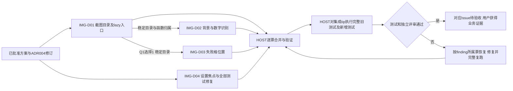

# 截图导入 Issue DAG 草案

共同规格：[联合方案](截图导入联合方案决策草案.md)。当前locator均为草案身份，正式编号由后续登记产生。

选择Q1=2时删除IMG-D03节点及其边，其他边与行为保持。三票必需：IMG-D01/02/04。IMG-D04由“所有测试必须修复”明确纳入，两个条件方案均包含。

## 原子节点及并行

| 节点 | 方案切片 | 开始条件 | 解锁或独立验证 |
| --- | --- | --- | --- |
| IMG-D01 | [目录能力](01-原子Issue草案/IMG-D01-截图能力目录/方案决策草案.md) | 本轮同方向ADR-004已生效、设计已冻结并有实施授权 | 原三项截图、架构迁移与import执行面通过，完整集合绿；机器readback释放D02/03 |
| IMG-D02 | [识别修复](01-原子Issue草案/IMG-D02-背景与数字识别/方案决策草案.md) | D01产出已读回 | 原图81格/空笔记、浅色值、原笔记与执行面防回归 |
| IMG-D03 | [错误位置](01-原子Issue草案/IMG-D03-失败位置/方案决策草案.md) | Q1=1，D01产出已读回 | 按首失败格补位置，原因链、旧Game与偏好保持 |
| IMG-D04 | [焦点与测试](01-原子Issue草案/IMG-D04-设置弹层回归/方案决策草案.md) | 现有settings_menu产出已存在，设计冻结/实施授权 | 瞬变、真实失焦、重复close/回调清理及原失败测试RED/GREEN |

第一并行组：IMG-D01、IMG-D04。第二就绪组：IMG-D02及条件IMG-D03，IMG-D04如果尚未完成则继续。D02修改foreground，D03修改cells的错误包装，D04修改popup；它们函数范围互不重叠。现有共同测试文件的不同测试函数仅需写入协调。

## 每条真实依赖

| 边 | 前置产出与适用Item | 有限验证动作和完成证据 | 解除条件 |
| --- | --- | --- | --- |
| ADR-004正式修订→D01 | 与草案相同的包路径/lazy入口决定；D01迁移Item | HOST公开ADR读回及实际批准locator | 修订accepted且范围一致；此边是阶段前置，不编造Issue号 |
| D01→D02 | 目标_foreground文件、_cell_binary函数归属和公共入口；D02修复Item | 包导入、符号/path真实事实、截图基线、import执行面、Git tree | D01对应实施产出通过并已集成/readback；迁移与修改同一函数，真实实现前置 |
| D01→D03 | 目标_cells._read_cells及其既有返回/失败合同；D03错误Item | 相同公开入口/返回类型、按行列顺序、迁移GREEN | D01稳定产出已读回且Q1=1 |
| 各票→HOST集成验证 | 各自commit、required/完整结果、评审证据 | 按归属逐票合并并读回；保持其他并行修改 | 单票满足门禁即时续接，其他票继续；最终共同tip全量验证完成 |

S1-01…04为已满足产出或历史来源，关系标注保持状态，构成零新增实施依赖。D02和D03之间没有数据、接口或状态后置条件。D04与截图目录没有相互依赖。

主Agent/HOST拥有跨票合并、机器事实、完整全仓回归和正式发布，luna只拥有分配的原子票。没有新设“全批研发结束才能续接”的屏障；同一最终集成tip的完整门禁是交付所需证据。单票终点均为待验收，用户判断沿验收阶段执行。

## 关键路径与恢复

依赖最长链为D01→D02；Q1=1时另有D01→D03。长度为两个Issue节点。D04为独立一节点链。没有可靠工时估算，时间关键路径未测定，不能用节点数或历史点数推算工期。

1. D01中断：HOST读回已存在的commit/tree/测试，恢复同一票；D04保持就绪。前置未通过时D02/03保留等待该真实产出。
2. 某票测试失败：该票沿ADR和冻结合同修复、完整复跑；其余已满足自身门禁的票继续。全部测试修复是联合完成标准。
3. 合并或提交结果未知：HOST先核对实际HEAD、parents、tree、路径及效果，确认后续接一次相同动作。
4. Runtime异常：保存真实错误和“需要优化Rust或TypeScript代码”承接记录，在已批准范围取得等价机器事实及原测试证据；Runtime修复独立授权。

以上恢复规则不增加业务取舍；正式发布读取用户最终批准的对应分支。
