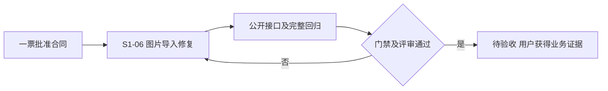

# 图片导入 Issue DAG

当前有效方案：[一票方案](联合方案决策.md)，活动票：[S1-06](../../S1-06/S1-06_方案决策.md)。

活动Issue节点一个，Issue依赖边为空，最长链一个节点；现有截图Module和GUI产出已具备。并行组仅S1-06，时间关键路径未测定。

S1-05、S1-07、S1-08保留登记历史并取消本轮执行；S1-01…04保持待验收，仅追加关系。当前发布完成状态为方案已决策，后续阶段按授权和真实门禁执行。
