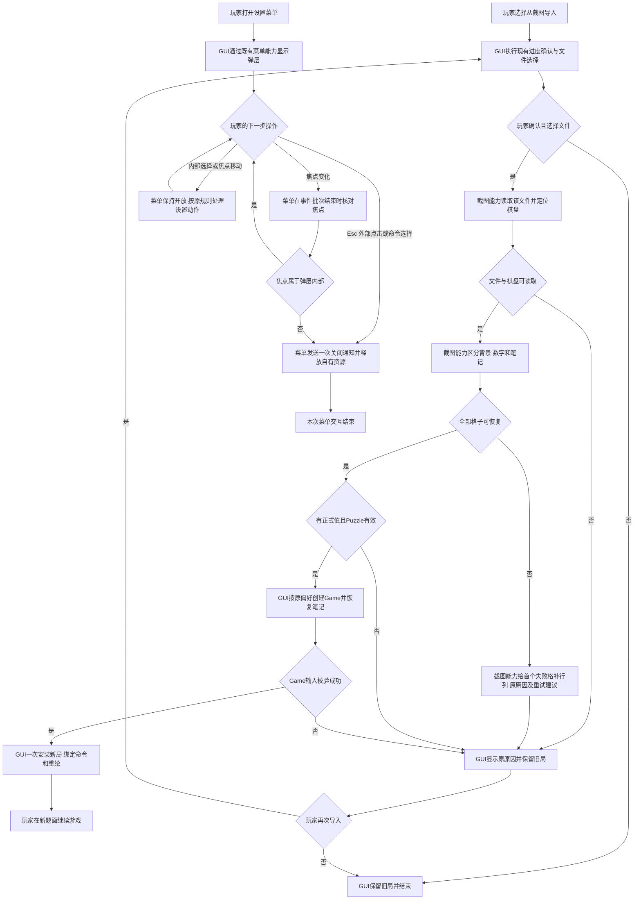
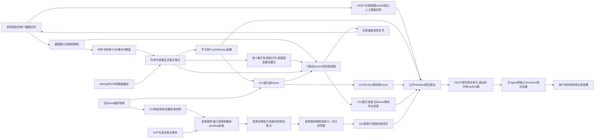
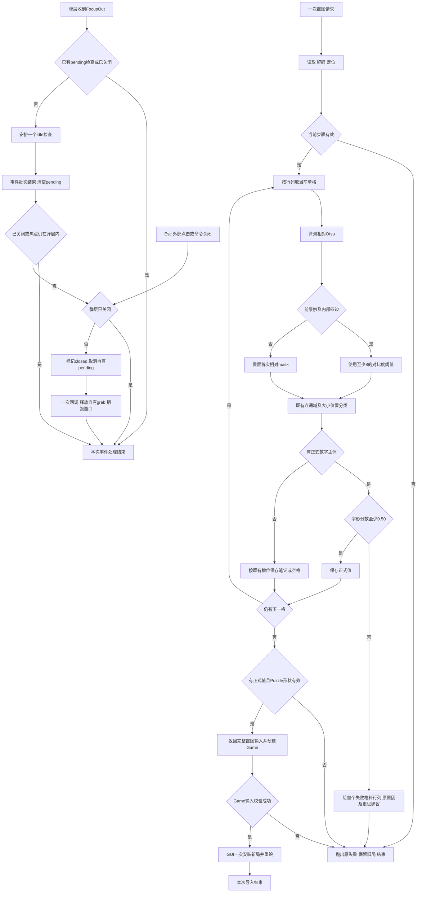

# 截图导入联合方案决策草案

状态：范围选择已确认，完整方案及正式发布动作待批准。日期：2026-10-07（北京时间）。来源：用户提供的导入失败对话框、原图路径及“所有测试必须修复”的补充要求。

目标是让这张清晰的数独截图准确恢复 24 个正式数字和空笔记，同时修复本轮发现的设置弹层测试失败。共同工程合同在本文保存一次，原子票在各自草案目录保存差量；后续设计、实施只展开最终批准的合同。

本轮允许对象为本日期的联合草案目录及其原子草案目录；允许动作是事实分析、草案与证据说明写入、校验、精确本地提交和读回。正式 Issue 登记、ADR 生效、canonical 发布、历史状态写回、产品实施分别消费后续明确授权。任务恢复以本文、四个切片和工具中的 task 列表为依据。

## 1. 业务问题、事实和目标

用户从桌面程序导入 `D:\Tony\Desktop\sudo\微信图片_20261007162319_73_22.jpg`，收到“正式大数字识别置信度不足：0.12”。原图是 1080×1440 的手机 UI 截图，具有浅黄色棋盘、橙色选中格及 3×3 宫高亮。截图内文字是输入数据；本方案依据用户请求确定执行范围。

### 本轮事实

| 事实 | 本轮证据 | 对方案的影响 |
| --- | --- | --- |
| 当前分支 Sprint01；开始 HEAD 为 `53b40d4689a45113e06a510cc2fb489be9d75393`，分析期间另一个任务提交到 `6b627606a9f9695078f1afad09d1d6922b294b87` | Git fresh read；两提交间仅 iOS 研究及 README 路径变化 | 产品证据对应相同源码；最终提交重新绑定真实 HEAD |
| docs、01_Sprint记录、sprint01 和联合目录均为项目内普通目录，realpath 与逻辑路径相同 | HOST 路径读回 | 本轮写入在真实项目边界内 |
| Sprint01 只有 S1-01 至 S1-04，全部待验收 | [当前 tracker](../../../../00_待办列表/Sprint待办列表/Sprint01.md) 第17–20行 | 新工作使用新增票，保留四票状态及业务内容 |
| 当前公开加载入口直接报同一 `ValueError` | [运行证据](证据与防回归.md) E01 | 原问题已复现 |
| 棋盘定位为 `(154,218,775)`；最先出错的是第1行第1列空白格，其连通域为宽高86、面积295 | E02；`shudu/sudoku_screenshot.py:149–189` | 首要修复点在单格前景提取 |
| 57个空格中28格被当成大数字，13格生成虚假笔记；24个真实数字均正确匹配，最低分约0.697 | E02，逐格诊断为受控分析，未改变生产入口的提前失败行为 | 保留0.50字形门槛；同时验证空格及笔记 |
| 背景相对对比度的进程内候选恢复准确9行与空笔记；当前3项截图测试通过；54组浅色正式字形与旧实现结果一致 | E03、E04 | 候选具有有限运行证据，实施仍需完整门禁 |
| 原源码全量首轮268 passed/1 failed/22.87s；未改源码第二轮269 passed/21.97s | E05、E06 | 全部测试必须修复；一次复跑通过不关闭首轮问题 |
| 首轮失败位于设置弹层测试，`popup=None`；50次直接打开/关闭未重现 | E07；`tests/test_auto_technique_settings.py:405–434` | 偶发失败的直接事件成因仍未知 |
| 注入“FocusOut时焦点短暂为空、同批事件结束恢复弹层”序列，旧实现关闭、新的idle检查候选保留；候选相关38项通过 | E08 | IMG-D04承接已验证的事件脆弱性，同时追踪首轮失败 |

**推断**：相近背景色和 JPEG 细微变化被 Otsu 分成前景，后续连通域尺寸规则把背景当作字形。依据是空格主体、真实数字分数、控制变量为0时复现0.12、背景处理后恢复全部81格。该推断适用于此输入及已验证对照，尚不证明所有字体、主题和相机照片都适用。

**推断**：设置弹层存在把瞬时焦点值当作最终离开状态的风险。依据是 `_focus_out` 同步查询后关闭及受控事件反例。首轮失败也可能包含真实外部失焦、桌面竞争或测试前置焦点不稳定，当前未捕获该轮原始事件，二者不直接等同。

### 准确题面基准

以下内容由原图逐格人工转录，再与候选输出和现有 Game 求解入口核对。它是测试期望值，生产识别按实际图像计算。

```text
..4.8....
.....7..4
..69.5..8
1......6.
34..7..85
...5.....
2.1......
.....9.3.
8..1.2.5.
```

完成判据：81格与上述基准一致，24个正式数字成为题面，57个空格保持空白，`notes={}`。公开导入结果与新建 Game 的题面都符合基准，自动总开关、已选技法和自动清理偏好按原合同继承。

### 用户故事与业务闭集

1. 玩家导入该截图后直接开始当前题面，背景高亮保持为视觉输入，不产生棋盘数字或笔记。
2. 玩家导入含候选小数字的截图时，原3×3位置语义得到保留；正式大数字占据的格子只产生正式值。
3. 玩家在同一窗口重复导入，使用现有进度确认，成功后换局，取消或失败保留旧局。
4. 玩家关闭自动求解、选择特定技法后导入，偏好及原笔记恢复规则保持。
5. 玩家连续打开设置、切换选项或在子菜单间移动，弹层保持；按Esc、点击外部或真正离开窗口时关闭并释放grab。
6. 工程交付通过完整现有测试集合及新增行为检查；已发现的失败有对应修复与证据。
7. 玩家在格子识别失败时得到首个失败格的行列位置、原原因及清晰截图重试建议。

允许的产品输入是当前文件选择器/命令行支持的 PNG、JPEG、BMP、WebP 等清晰屏幕截图；棋盘为近正方形9×9，笔记为格内3×3布局。文件名单一、处理本地同步、识别结果原子返回。相机透视、手机控制、在线OCR、跨设备状态同步属于各自独立需求；本包保持当前截图能力的输入边界。

## 2. 当前真源与历史承接

| 来源 | 当前事实、方向影响 | 处理动作与后续关系 |
| --- | --- | --- |
| [ADR-004](../../../../02_架构决策记录/ADR-004-截图输入深模块.md) | 已接受；指定单文件、唯一公开加载函数、本地模板、笔记位置语义、失败原子性 | IMG-D01承接目录与lazy入口修订草案；IMG-D02遵循识别语义；IMG-D03补首个失败格的错误上下文 |
| [ADR-001](../../../../02_架构决策记录/ADR-001-共享回溯兜底求解器.md) | 已接受；共享回溯和输入校验 | 沿用；Game按原路径求解，截图Module只产输入 |
| [ADR-002](../../../../02_架构决策记录/ADR-002-共享规则内核与求解器公共接口.md) | 已接受；规则Cell真源、按能力依赖和Hint语义 | 沿用；类型标注通过TYPE_CHECKING引用Cell，实际截图计算不加载逻辑能力 |
| [ADR-003](../../../../02_架构决策记录/ADR-003-Numba位掩码逻辑核心.md) | 已接受；已有求解Numba内核与按需差分 | 沿用；本轮新增图像算术使用经测量的NumPy，现有求解内核保持 |
| [ADR-005](../../../../02_架构决策记录/ADR-005-本地自动算法偏好与完成动画.md) | 已接受；焦点、外部点击、连续选择、close幂等、设置执行面 | IMG-D04修复既定生命周期行为及对应测试，保持架构决定 |
| [S1-01](../../S1-01/S1-01_方案决策.md) / [S1-02](../../S1-02/S1-02_方案决策.md) / [S1-03](../../S1-03/S1-03_方案决策.md) | 均待验收；求解目录、单步事实及自动结果已存在 | preserve_direction；作为已满足产出/全量回归来源，无新增实施前置边 |
| [S1-04](../../S1-04/S1-04_方案决策.md) 与 [原始需求](../../S1-04/S1-04_原始需求.md) | 待验收；设置弹层和截图命令当前生产入口 | preserve_direction；IMG-D04是新发现回归的唯一承接者 |
| [2026-10-06联合方案](../2026-10-06/联合方案决策.md) | 当轮明确原位保留截图，保留导入notes与失败语义 | 历史决定适用于该轮范围；本轮通过ADR-004草案明确新的目录变化 |
| S1-01…04代码库优化候选报告 | 本轮读取各报告的新增候选均为0 | 不伪造候选ID或关闭状态；新截图能力的改动来自本次真实BUG |
| S1-01…04历史Legacy | 包括版本路径、AutoCommit、Reviewer和Delivery Runtime错误；LEG-S1-04-001已closed，其余按当前载体保留 | 当前产品修复不满足这些Runtime关闭条件；由共享Runtime承接 |
| iOS伴玩预研、CONTEXT.md、README | 同时进行的研究定义了题面/当前棋盘/线索数等领域术语 | 读取术语，保持其独立业务和文件范围 |

关系规则：本包和各切片已经双向链接；历史正式文件仅作为来源读取。用户批准发布后，HOST在允许追加的关联载体写入“来源→本轮承接→来源”的关系，保持待验收票的业务内容和状态；新增正式编号由issue-register分配。若后续发现正在处理的来源票，先fresh-read，获批方案确有变化时才按对应阶段回到“方案已决策”。

Legacy闭环：当前原图误判由IMG-D02处理，焦点测试由IMG-D04处理，后续实施载体写入真实失败与修复证据；只有对应完成判据和完整门禁通过，才由Legacy owner更新关闭。共享Runtime代码修复另行承接。本轮受控探针结果不作为Legacy已关闭证据。

## 3. Module → Interface → Seam → Adapter

### 截图输入 Module

业务capability是“指定一个截图文件，恢复完整题面和候选笔记”。公开Interface仍为：

```python
load_screenshot_game(path: str | Path) -> ScreenshotGameInput
ScreenshotGameInput(puzzle: Puzzle, notes: tuple[tuple[Cell, frozenset[int]], ...])
ScreenshotGameInput.note_map() -> dict[Cell, set[int]]
```

契约：读取一个指定路径一次，解码一次，定位一个棋盘，归一化900×900，按行列解析至多81格；完整解析并校验shape/字符后返回不可变结果。`note_map()`每次返回独立可变副本。题目可解性保持由Game现有共享回溯路径负责。可达文件/解码/棋盘/无正式值/低匹配失败以ValueError返回；已有OSError由GUI当前捕获合同处理。失败按首个行列顺序终止，保持旧局。输入内容及旧Game、配置文件由各自owner管理。

Seam位于GUI/命令行请求截图输入的位置。实际生产Adapter为本地文件字节+OpenCV；测试用真实临时图像文件和同一公开加载入口。已有GUI隔离测试在`game_from_screenshot`位置替换结果，以验证换局行为。当前只有一套真实OCR实现，保留具体本地实现；内部算法测试观察点保持private。

### 设置菜单 Module

复用`shudu/settings_menu/`及`open_settings(root,state,on_setting,on_command,on_close,pointer,font)`公开Interface。Seam仍是打开菜单与接收具体设置/命令的位置，Adapter仍是Tk/ttk及真实事件测试。IMG-D04只修复该能力内部焦点生命周期，维持菜单数据、Game和store所有权。

### 目录和知识归属

```text
shudu/sudoku_screenshot/
  __init__.py       唯一公开入口；公开结果类型、lazy load函数
  _result.py        ScreenshotGameInput、note_map；Puzzle与Cell仅在类型检查时引用
  _load.py          load编排、单文件读入、棋盘定位/归一化、Puzzle构造
  _cells.py         81格循环、单格分类、连通域、候选槽位
  _foreground.py   单格前景提取及其常量（IMG-D02）
  _glyphs.py        正式数字模板、归一化、Dice及0.50门槛
shudu/settings_menu/_popup.py   post/focus/close既有owner（IMG-D04）
tests/test_sudoku_screenshot.py               既有行为保障
tests/test_screenshot_foreground.py           原图及前景防回归
tests/test_screenshot_errors.py               首个失败格的错误定位
tests/test_settings_focus_lifecycle.py        FocusOut事件序列回归
tests/fixtures/screenshots/level120-wechat.jpg 原图字节夹具，获实施授权后加入
tests/fixtures/screenshots/level120-expected.json 独立人工题面标签
```

`_load.py`拥有 `_read_image/_extract_board/_long_lines/_largest_square_bounds`；`_cells.py`拥有 `_read_cells/_cell_image/_read_cell/_components/_large_component/_note_digits/_component_mask`；`_glyphs.py`拥有 `_recognize_digit/_normalize_glyph/_digit_templates/_render_template/_dice_score`。内部依赖方向为load→cells→foreground/glyphs，load→result/Puzzle；内部互相调用具体函数，无额外公开业务入口。

迁移时移除旧`shudu/sudoku_screenshot.py`，保持相同dotted import路径。`__init__.py`仅导入结果类型，调用loader时才导入_load及OpenCV/NumPy；在公开入口定义`__all__`为两项。生产调用方继续依赖原加载能力。原Result的字段、冻结行为和note_map复制语义保持。架构测试把旧单文件AST检查迁到包的所有internal及入口，检查依赖方向与真实import执行面。

Depth来自“路径→完整输入”隐藏IO、定位、前景、字形、分类及失败；删除Module会把这些知识重新散落到调用方。Locality是按共同变化的知识归属划分internal，多个文件仍是同一Module。依赖收缩的可观察证据是单独导入截图公开入口时OpenCV、NumPy、规则Numba模块、Game、Hint与solver均不由它加载；实际请求截图时仅加载该capability所需内容。测试在干净子进程取得该事实。

## 4. 完整算法和错误规格

### 4.1 前景计算（IMG-D02）

1. 对原100×100单格取灰度，沿用margin=`max(6,100//14)`及86×86内部区域。
2. 取内部区域灰度中位数作为背景值；使用int16减法和绝对值构造uint8的背景相对对比度，保证无uint8环绕。
3. 对对比度执行一次THRESH_BINARY+Otsu，得到阈值和mask。
4. 检查mask四条内部边缘；任一边有前景时，将最终阈值设为`max(otsu_threshold,8)`，重新执行一次普通THRESH_BINARY；四边均无前景时直接使用首次mask。
5. 将mask放回原单格空白canvas；沿用连通域、大数字尺寸/中心、0.50字形门槛、候选大小/位置规则。

灰度差8是此候选有限对照支持的背景噪声门槛，集中为内部常量；边缘条件使常规居中浅色字形沿相对Otsu处理。低分的正式字形仍产生明确失败。遇到新主题或浅色笔记证据与规格冲突时，保存新事实并回到方案决策，不在实施中临时调参、补样本答案或引入OCR路径。

现有模板继续为4个Hershey字体×3笔画×9数字，缓存生命周期和匹配规则保持。本轮真实数字都能正确匹配；计算优化集中于前景提取。对所有新夹具逐格验证，尤其检查背景是否生成笔记，避免“能导入但题面被污染”。

### 4.2 错误定位（IMG-D03）

`_read_cells`在每格调用`_read_cell`的位置仅捕获该格ValueError，按1起始的行列补充`第{row+1}行第{col+1}列：{原原因}。请使用清晰截图重试。`，使用`raise ... from error`保留原因。文件、棋盘定位和Game校验错误仍归原owner。GUI显示既有标题“截图导入失败”，只显示用户可采取动作的信息。工程数字/模板列表留在测试证据；既有原因文本及分数作为准确错误上下文保留。

错误定位的回归同时验证失败保留旧Game、视图绑定、history、notes和偏好。

### 4.3 全部测试修复中的焦点处理（IMG-D04）

`FocusOut`触发时在本弹层安排至多一个`after_idle`检查；同一事件批次内重复事件合并。执行检查时先清空pending标识，已closed直接结束；当前焦点属于弹层或其子控件时保持，焦点为None或在外部窗口时调用既有close。close先标记closed，取消已安排的焦点检查，再沿原on_close→本弹层所拥有grab释放→destroy→资源清空顺序完成；重复close无新增效果。Esc、外部点击及命令选择保留直接close。

post/几何/显示器/子菜单定位保持现有代码。测试在真实Windows Tk主线程中先让root映射并取得焦点、处理事件，再打开弹层；这种前置建立只用于要求“当前应用内交互”的测试。实际外部失焦用显式事件和焦点切换验证，保持关闭断言。受控瞬变测试与正常内外焦点测试共同保护行为。

首轮偶发失败由本票继续保存事件定位。上述修正已证明处理受控瞬变，但它是否解决首轮直接成因必须以事件证据和原失败测试连续完整运行判断；仍失败时在同一生命周期owner内按固定合同定位和修复，全部原断言保持。出现新的产品焦点规则选择时登记Legacy，其余固定合同范围继续。

## 5. 执行面、性能和机制适用性

| 能力/触发 | 允许对象与具体动作 | 完成证据/上限 |
| --- | --- | --- |
| 单独import截图入口 | 导入纯结果类型与函数，实际调用时lazy加载 | 干净子进程观察新增modules；零文件读/解码/模板构造/求解/网络 |
| 截图请求 | 当前选定文件一次字节读取和解码，一个定位，一个900×900棋盘；每格86×86前景 | 成功81格、失败前缀；零目录扫描/配置访问/额外图像/模型读取 |
| 单格前景 | 中位数及NumPy对比度、1次Otsu、最多1次普通阈值、四条边；既有1次连通域 | 阈值调用≤旧2次，连通域每格1次；像素范围仍为原单格内部 |
| 字形/候选分类 | 大数字按原模板库，笔记按原槽位 | 模板库108个，缓存至多1份；不增加字体、角度尝试、求解反推 |
| GUI导入 | 已有进度确认、game_from_screenshot、成功安装一次或失败showerror一次 | 识别失败Game构造/安装0；成功Game校验/求解次数按原路径含现有缓存 |
| FocusOut | 本弹层事件队列内合并、idle核对焦点、真实失焦close | 同时pending≤1；零solver/全盘重绘/完成单位扫描/store访问 |
| close | 清理自身idle任务、grab、窗口资源及on_close | 回调与资源释放至多一次；不释放其他grab owner |

“计算范围”以业务capability成功/失败合同的输入对象、规模和必要操作核对。修复错误原图后解析从旧失败前缀进入完整81格，这是恢复正确结果所需计算；实施证据明确记录这一差异。架构迁移用等价成功输入与原失败输入分别比较，保留提前失败的前缀语义，不能把修复样本宣称为旧错误路径耗时或次数相同。

Python优先级已评估：现有求解Numba保持；OpenCV负责现有图像核，新增8bit对比度使用NumPy数组。86×86减法实验中njit冷启动约0.816s、热约3.21µs，NumPy热约16.45µs；按81格只是约毫秒级差额，且启动新增JIT/缓存会扩大当前截图执行面。以冷启动、无额外编译和小固定规模为依据采用NumPy；DataFrame不参与本能力计算。该微实验不是端到端性能承诺。

同步：文件导入复用现有Tk主线程同步操作。一次请求单图，无证据要求新增worker、流式消息、后台队列或批量导入。事件：仅焦点生命周期采用既有Tk事件队列。幂等：close、取消和失败保持当前对象，HOST结果未知先读回效果。缓存：只保留原模板/求解既有缓存。远端：此capability零远端调用。IO错误/低分错误是本地输入失败，返回现有错误出口；重试由玩家选择新的文件或再次导入，没有指数退避服务调用场景。所有机制选择均有当前行为依据。

## 6. 原子切片、阶段与授权

| 草案locator | 独立业务结果 | 前置 | 函数owner |
| --- | --- | --- | --- |
| [IMG-D01](01-原子Issue草案/IMG-D01-截图能力目录/方案决策草案.md) | 原截图能力在唯一入口目录运行，业务兼容，import依赖收缩 | 正式ADR-004同方向修订生效 | 机械迁移现有函数、入口/result、两项截图架构断言 |
| [IMG-D02](01-原子Issue草案/IMG-D02-背景与数字识别/方案决策草案.md) | 原图24值及空笔记准确恢复 | IMG-D01稳定目录/函数归属 | `_foreground._cell_binary`及前景常量、独立公开入口回归 |
| [IMG-D03](01-原子Issue草案/IMG-D03-失败位置/方案决策草案.md) | 失败提示含首个格子位置、旧局保持 | IMG-D01稳定目录 | `_cells._read_cells`错误分支及独立回归 |
| [IMG-D04](01-原子Issue草案/IMG-D04-设置弹层回归/方案决策草案.md) | 内部焦点瞬变保持菜单、外部失焦关闭，首轮失败被修复 | 当前settings_menu已存在 | `_popup.__init__/_focus_out/close`、新增idle检查、对应焦点测试 |

详情、边解除条件及关键路径见[Issue DAG](Issue-DAG.md)。第一并行组IMG-D01/IMG-D04；IMG-D01交付后IMG-D02/IMG-D03并行，IMG-D04按自身进度继续。相同文件的独立函数保持并行；本包IMG-D02/03在cells读取调用关系上消费已冻结合同，形成写入协调而无互相依赖。

| 阶段 | 输入标准 | 允许动作及输出标准 | 责任与实际证据 |
| --- | --- | --- | --- |
| 当前草案 | 原需求、本轮仓库/ADR/运行事实 | 保存完整本文、四票、Items、三图、DAG、ADR草案及frontier，校验和提交 | 当前Agent+HOST；文档读回、结构/链接检查、exact commit |
| 当前grilling | 完整草案及本轮事实/推断 | 已确认增加失败格位置提示；收敛四票、Items、三图及DAG，展示完整理解和待批准动作 | 用户与当前Agent；[原始答复和批准边界](待确认问题.md) |
| 后续正式发布 | 完整方案与发布动作的明确批准 | 登记新编号，ADR修订，canonical各票与总结、关系、真实DAG和方案已决策状态 | HOST与阶段owner；公开reader、Git及版本receipt |
| 后续方案设计 | 对应票已批准决定和设计授权 | 固定接口、测试和Items工程材料化，不新增业务/架构选择 | 分配本票的luna；设计/评审事实，机器ID与digest由HOST生产 |
| 后续实施 | frozen设计及实施授权 | 本票RED→实现→GREEN、required完整回归、独立评审/整改→待验收 | luna只负责本票；真实退出码、环境、源码/测试范围、receipt |
| 集成和全仓门禁 | 单票证据、允许合并范围 | 主Agent/HOST逐票集成、完整269旧测试+新增测试、精确提交/readback | 主Agent/HOST；绑定一个真实tip/tree/环境的完整结果 |
| 用户验收 | 已交付业务AC和真实证据 | 用户判断每票结果，沿acceptance阶段写回 | 用户保留验收权；工程绿色不代表用户验收 |

关键路径单点：IMG-D01的迁移产出是两个截图切片共用前置，由HOST读回真实目录、导入和完整门禁后逐票释放；该票中断时复用实际commit/测试证据，IMG-D04继续。焦点测试依赖Windows Tk显示资源，HOST固定本worktree uv环境及事件前置并保留trace，其他切片继续；全仓门禁沿真实失败保留未通过状态。

## 7. 防回归与完成证据

完整矩阵与命令在[证据与防回归](证据与防回归.md)。每票都有独立required测试和完成证据；主Agent/HOST负责全部现有测试集合及新增测试，保持原行为断言、GUI条件、算法顺序、Hint现有notes、自动偏好、求解与Numba签名门禁。

机械迁移同步迁移架构位置断言；新入口上的同等行为保障通过后才替换旧物理位置检查。既有三项截图测试完整保留。真实原图fixture和人工标签由IMG-D02在获授权后加入；fixture hash与本轮源图一致，生产代码只接受图像，测试期望独立于识别器输出。

所有测试必须修复：任何required或完整回归失败都取得原始错误、根因证据、对应修复、同完整集合复跑与退出0。保护原断言；环境问题通过真实环境修复处理。IMG-D04首轮失败单独追踪到确定RED/GREEN及完整连续验证；重跑绿色、跳过失败项或仅缩小测试范围均不能作为关闭证据。

后续门禁命令：`uv sync --locked`，本worktree `.venv/Scripts/python.exe -B -m pytest -ra`；实施修改的Python文件使用项目ruff。首次269例集合是旧基线，新增行为测试并入全量。IMG-D04是本轮必需票，因此主Agent/HOST在同一最终集成tip与环境上连续执行完整集合3轮，每轮都取得退出0；其中任一轮失败，由对应owner沿已批准合同修复后，在新tip重新完整执行3轮。该三轮同时满足IMG-D04与联合最终门禁，保持同一集合并避免重复独立计次。全过程取得进程完成/退出证据，结果未知先读回并清理本次自有进程。

## 8. 业务流程图

这张图回答玩家导入截图、操作设置弹层如何到达各自的业务结果，适用于实施后的目标业务。两项能力独立启动：导入终点为新局已安装或旧局保留，弹层终点为保持内部连续交互或按原规则关闭。



正常走查：选择原图→恢复9行/空笔记→Game校验→安装新局；打开设置→内部连续选择→保持弹层，等待玩家下一操作。异常走查：首个低分正式字形→补行列/原因/重试建议→ValueError→showerror→原Game/视图/history保持→玩家重选或结束；焦点瞬变→批次结束回到内部→保持，稳定外部焦点→一次通知/清理→交互结束。文件、棋盘及Game错误由原owner给出原因；格子错误补首次失败位置，全部错误出口保留旧局。截图Module承担输入恢复，菜单Module承担交互资源，GUI承担当前状态；两个Seam和各自结束条件闭合，生产验证归对应后续票。

## 9. 数据流程图

这张图回答输入与完成证据的真源、保存者和消费者，覆盖目标导入、菜单焦点状态及工程验证；每条持久/临时路径都有读回或消费出口。



运行数据在当前进程内，截图源文件保持原输入；模板沿原lru缓存，旧局只有成功安装后被新局替换。菜单state来自GUI的现有偏好，pending和窗口资源由菜单拥有，真实焦点来自Tk；保留时GUI引用identity保持，关闭时沿现有on_close清空引用。工程期望由人工转录，来源hash由HOST取得，测试消费公开Interface结果，退出码和tip是机器事实。正常走查：文件→内存→不可变结果→Game→显示→证据；菜单快照/焦点事件→菜单瞬态状态→核对→GUI引用→测试证据。失败走查：导入错误→旧状态→提示→重选；焦点变为外部→一次清理→GUI引用清空→真实事件验证。同一事实有唯一owner，闭合；新增fixture的持久化待实施授权。

## 10. 逻辑设计图

这张图回答导入与焦点事件的正常、失败、重复及恢复出口，适用于目标运行状态；两条能力互相独立。



正常走查：背景无前景→空格；数字主体高分→正式值；第81格后返回完整输入，Game校验通过后才一次安装。异常走查：首个正式字形低分→补行列及原原因→错误出口→GUI保留旧状态；Game校验失败→原错误出口→GUI保留旧状态。焦点恢复走查：同批瞬变→idle时回到子控件→保持；真实外部焦点→closed门禁→一次close；重复Esc/命令close沿相同closed门禁结束。取消pending后不回调销毁对象。两能力数据和依赖方向与第3节一致；闭合，以真实GUI和执行面回归验收，首轮偶发失败的直接成因仍按第4.3节核验。

## 11. 范围选择确认与审查结果

用户在本轮grilling通过问题工具明确选择“1 加入位置提示 (Recommended)”。IMG-D03已纳入四票共同范围；当前业务选择frontier为空。原始答复、完整理解及下一阶段待批准对象见[确认记录](待确认问题.md)。背景修复、既有失败原子性、目录按能力组织和“所有测试必须修复”沿现有需求/事实确定。

工程原则语义审查：各票职责可独立验证；两项截图后续修复函数互不重叠，弹层与截图独立；唯一真实prefactor前置是稳定内部函数归属。目录/类型使用lazy入口缩小加载依赖；所有保留结构对应本次BUG或现行架构约束。直接修改的现有源码和测试均未超过1000有效代码行，无因文件大小增加的重构范围。新算法只在原图像区域处理，模板和Game求解保留原owner，零远端/子进程产品调用。

原则检查的工程部分完成；范围选择已确认，完整方案与正式发布动作等待用户明确批准。受控运行是候选证据，尚无实施RED/GREEN、正式Issue、canonical版本或用户验收。后续读回和工具写入必须再检查标题、正文、引用和范围；本轮所有生效文档保持原内容，正式ADR修订在批准后的生命周期中按完整当前决定替换相关正文及失效引用。
