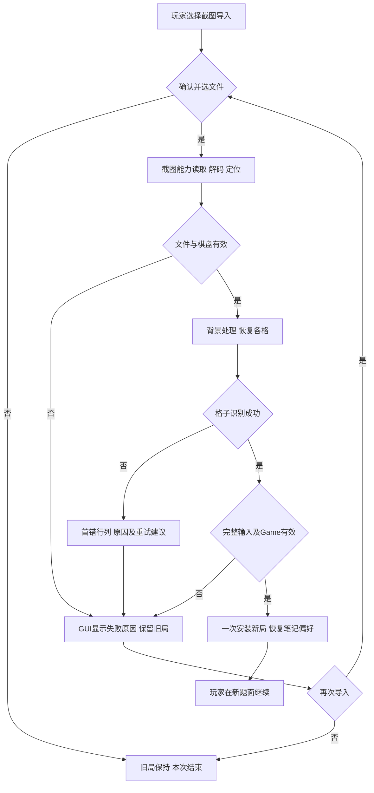
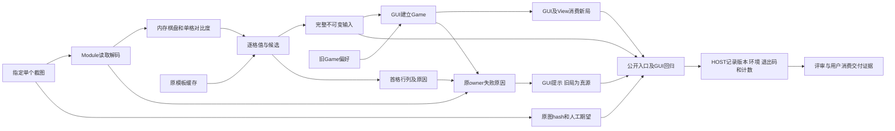
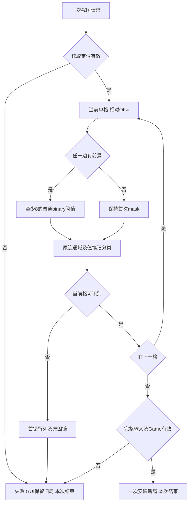

# 图片导入方案决策：S1-06

状态：已批准，发布阶段。日期：2026-10-07。当前范围为一张图片导入BUG Issue；批准来源见[范围修订记录](范围修订记录.md)。正式切片：[S1-06方案](../../S1-06/S1-06_方案决策.md)，[原始需求](../../S1-06/S1-06_原始需求.md)。

## 1. 目标、事实和验收

目标：指定截图准确恢复题面和笔记；格子识别失败时显示首个格子的行列、原原因和清晰截图重试建议，当前棋局保持可用。

事实：原图公开loader报0.12，首错为第1行第1列空格；24个真实数字均匹配，最低分约0.697；57个空格中28格被当成大数字、13格生成虚假笔记。背景相对对比度候选恢复全部81格和空笔记，原3项截图测试及54组浅色正式字形对照通过。原源码完整测试首轮268通过/1失败，第二轮269通过，首轮弹层失败直接事件原因尚未捕获。证据见[运行记录及防回归](证据与防回归.md)，候选验证与实施完成分别记录。

推断：背景/JPEG微小差异被阈值处理放大并进入前景，是本输入的主要故障机制。依据为空格误判、真实数字分数和控制变量探针，适用范围为当前输入及已验证对照。

原图D:/Tony/Desktop/sudo/微信图片_20261007162319_73_22.jpg，1080×1440、93546字节；SHA256：5c98f1e3405225167fdf4d7ea935d7a9748bbb854a7ad3c28929a0faff3388ee。独立人工期望：

```text
..4.8....
.....7..4
..69.5..8
1......6.
34..7..85
...5.....
2.1......
.....9.3.
8..1.2.5.
```

验收：81格全部一致，24个正式值、57个空格、空notes；公开loader及真实Game消费符合。成功继承自动偏好和笔记合同；失败/取消保留old Game、view绑定、board、notes、history和偏好。

## 2. Module → Interface → Seam → Adapter → 文件布局

| 层次 | 固定决定 |
| --- | --- |
| Module/capability | 现有截图输入：指定一个本地截图，恢复完整题面和候选笔记 |
| Interface | load_screenshot_game(path: str/Path)→ScreenshotGameInput；完整、不可变puzzle/notes及note_map独立副本；本地同步单图、首失败终止、文件/定位/识别失败的ValueError/OSError合同；详见第1、3、4节 |
| Seam | GUI/CLI请求截图输入、GUI消费完整结果与失败的位置 |
| Adapter | 现有本地截图Implementation满足公开Interface；OpenCV是内部依赖。测试使用真实/临时图像调用同一Implementation，GUI消费隔离使用现有game_from_screenshot替换点 |
| 布局与owner | shudu/sudoku_screenshot.py::_cell_binary及_read_cells的格子ValueError上下文，及其直接回归 |

现有Module隐藏图像内部复杂度，调用方只消费截图恢复能力。沿用现行ADR-004的单文件、本地模板、正式值/3×3笔记、中文路径和失败原子性；ADR-001/002/003/005既有行为保持。本次是内部BUG修复，公开依赖与布局保持。

## 3. 固定算法和错误合同

1. 沿用100×100单格、margin=max(6,100//14)及86×86内部灰度区域。
2. 取内部中位数为背景，以int16减法和绝对值生成uint8相对对比度，避免环绕。
3. 执行一次THRESH_BINARY+Otsu得到阈值和mask。
4. 任一内部边缘有前景时，以max(otsu_threshold,8)再执行一次普通THRESH_BINARY；四边均无前景时使用首次mask。8集中为内部常量。
5. 将mask放回原尺寸空白canvas，沿用原连通域、大小/中心判断、108项模板、0.50门槛及3×3候选槽位。

_read_cells按原row-major顺序，只包装当前_read_cell的ValueError；1起始行列固定文案：“第{row+1}行第{col+1}列：{原原因}。请使用清晰截图重试。”，raise from保留原因链。文件、棋盘、无正式值和Game校验错误沿原owner。GUI一次显示既有“截图导入失败”对话框，完整成功后才安装新局。

## 4. 执行面和机制

指定文件读取/解码各一次，一个定位、一个900×900棋盘、至多81格；首错前缀立即结束。每格原86×86范围、一次连通域、最多两次阈值，模板与缓存保持。位置包装仅增加错误上下文。正确恢复原错误图需要解析全部81格，该差异按成功和失败输入分别记录。

复用现有本地同步单图导入、OpenCV和模板缓存。新增计算使用NumPy数组：86×86探针njit冷启动约0.816秒、热3.21微秒，NumPy热16.45微秒，固定小规模采用现有NumPy路径；DataFrame不参与。产品新增配置/目录扫描、图像读取、模型、求解、子进程和远端调用均为零。重试由玩家重新选择图片。

## 5. 一票责任、测试与阶段

S1-06独立完成前景修复、位置提示和完整防回归。luna只负责本票；主Agent/HOST负责机器事实、全仓门禁、评审及交付。三个六字段Items在正式切片保存。

required：.venv/Scripts/python.exe -B -m pytest -ra tests/test_sudoku_screenshot.py tests/test_screenshot_import_menu.py tests/test_architecture.py tests/test_screenshot_foreground.py tests/test_screenshot_errors.py。使用本worktree锁定uv环境；修改Python文件运行项目ruff。原图字节夹具与独立人工标签一致；覆盖旧有效字形/笔记、高亮、中文路径、低分、无棋盘、Game失败及旧状态identity。

完整门禁：原269项及新增测试在最终集成版本同环境连续三轮通过；任一失败，修复真实根因后在新版本重新完整运行三轮，保持原断言和验收语义。首轮弹层失败持续追踪。要求应用内焦点的测试先建立真实root映射/焦点，真实外部失焦保持关闭断言。生产菜单生命周期仅在完整回归确实定位到既有合同缺陷时修复，按ADR-005的内外焦点、连续选择、close幂等及原执行面验收。

已验证的FocusOut瞬变合同：至多一个after_idle检查，重复事件合并；检查先清pending，closed结束，内部焦点保持，稳定None/外部焦点沿close。close先标记closed并取消自有pending，再一次on_close、自有grab释放、destroy及资源清空；Esc、外部点击、命令选择继续直接close。实际根因落入该场景时按此固定合同修复并取得事件及真实Tk证据。

| 阶段 | 输入 | 输出和完成判据 |
| --- | --- | --- |
| 当前发布 | 发布授权与一票范围修正 | S1-06需求/冻结方案/总结、真实状态与取消票记录、精确本地提交读回 |
| 后续设计 | 已批准合同及设计授权 | 三个Items工程材料化和独立评审，固定业务与架构语义 |
| 后续实施 | 冻结设计及实施授权 | 公开入口RED→修复→GREEN、完整门禁、评审整改与待验收 |
| 用户验收 | AC和真实业务证据 | 用户判断，经验收阶段写回 |

## 6. DAG、历史和遗留

活动DAG只有S1-06，现有截图Module和GUI消费产出已具备，新增Issue依赖为空；并行组仅本票，最长链一个节点，工时未测定。见[当前DAG](Issue-DAG.md)。

S1-01…04的待验收状态与业务正文保持，关联载体追加双向来源。S1-05、S1-07、S1-08未设计/实施，范围修正后已取消，保留原需求与登记轨迹；位置提示和测试要求由S1-06承接。Runtime错误见[S1-06遗留](../../S1-06/S1-06_遗留问题.md)，后续独立处理；产品BUG只凭真实修复和完整门禁关闭。

## 7. 业务流程图



正常：原图→正确81格/空笔记→Game校验→安装。异常：首错→位置/原因→旧局→重选或结束；文件及Game错误使用原原因。

## 8. 数据流程图



源图只读，中间图像归Module，当前Game归GUI；期望人工转录，机器事实HOST取得。正常及失败均进入回归和交付证据，唯一owner闭合。

## 9. 逻辑设计图



固定像素范围及分类顺序，首失败结束；第81格后完整校验才换局，正常/异常出口闭合。

## 10. 工程原则和边界

沿现有Deep Module能力接口修复单格前景知识，调用方、语言、布局及状态owner保持。一个BUG覆盖同一导入流程的准确恢复、错误说明及完整防回归，独立验收。当前发布完成后结束本阶段，设计和实施消费对应授权。

| codebase-design检查 | 结论和依据 |
| --- | --- |
| Depth/Leverage | 一个路径参数得到完整题面和笔记；删除Module会把文件、定位、前景、模板、slot及失败知识重新分散到调用方。GUI/CLI共享同一修复。 |
| Locality | 背景知识与逐格失败上下文分别留在现有_cell_binary/_read_cells，GUI继续只消费结果及错误。 |
| Interface | 第1、3、4节共同冻结输入、完整返回、值/笔记不变量、顺序、失败、状态保持及执行面。 |
| Seam/Adapter | 复用现有公开加载位置及GUI消费位置，只有一套真实截图Implementation，按当前实际差异测试。 |
| Test surface | 原图、有效字形/notes、失败位置及执行面回归调用load_screenshot_game；GUI回归走原消费Seam。私有函数探针只提供诊断依据。 |
| 文件布局及ADR | Skill中的Module尺度不绑定文件。当前为既有Module内部BUG修复，沿用ADR-004现行布局；原目录迁移属于已撤出本轮的架构优化。 |

上述是当前方案符合性结论。实际实现符合性由后续公开Interface回归、原验收语义及执行面证据验证。
