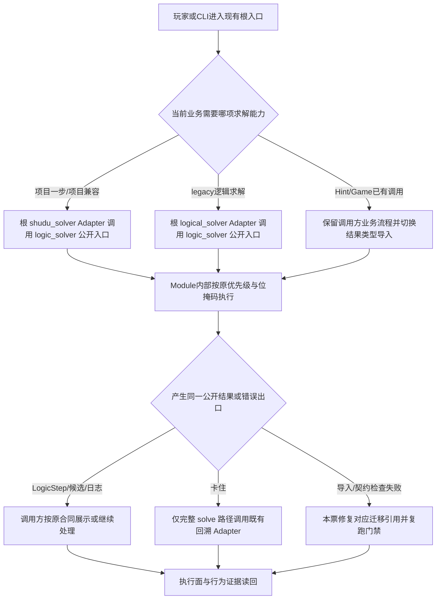
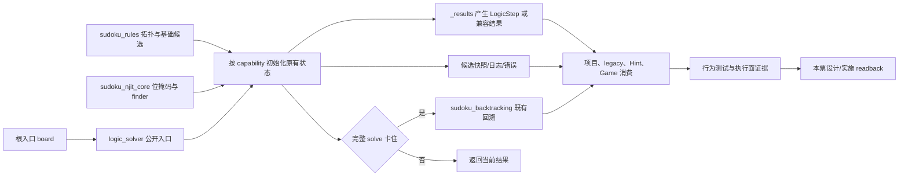
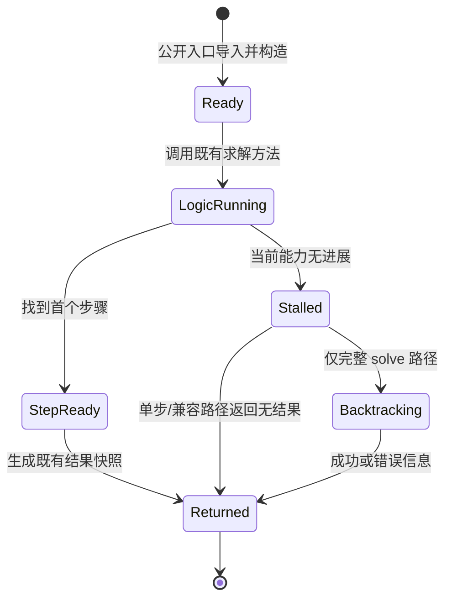

~~~toml
artifact_kind = "design"
issue_id = "S1-01"
solution_version = "S1-01-solution-v1"
design_version = "S1-01-design-v2"
artifact_version = "S1-01-design-v2"
status = "completed"
frozen = true
approval_state = "approved"
approval_locator = "docs/01_sprint记录/sprint01/00-联合方案决策/2026-10-06/发布批准记录.md"
request_binding = "d6e6cdbe-416c-4105-a1d5-64a536c6ffea"
~~~
# S1-01 方案设计：求解模块目录迁移

## 1. 批准方向与设计目标

本设计消费 [S1-01 方案决策](S1-01_方案决策.md)、已接受的 [ADR-002](../../../02_架构决策记录/ADR-002-共享规则内核与求解器公共接口.md)、[ADR-003](../../../02_架构决策记录/ADR-003-Numba位掩码逻辑核心.md) 和 [联合方案](../00-联合方案决策/2026-10-06/联合方案决策.md)。目标是把当前共享求解实现集中到 `shudu/logic_solver/`，保留五个根入口的可执行和历史导入合同，并让现有项目、legacy、Hint、Game 以及测试通过同一个公开入口取得求解类型和能力。

本票只完成目录、导入和既有接口的目标态迁移。`next_hint_step` 的单步能力由 S1-02 实施，`solve_auto` 的自动结果能力由 S1-03 实施；本票为两票提供真实目录和共享类型前置。S1-04 与本票没有数据、状态或接口依赖，可以并行推进。

设计完成标准：

1. 一个 deep Module `shudu.logic_solver` 通过一个 `__init__.py` 公开入口提供当前实际调用所需的类、结果类型和兼容名称。
2. 根目录继续保留 `logical_solver.py`、`shudu_solver.py`、`solver.py`、`sudoku_gui.py`、`techniques.py` 五个可执行 Python 入口；根 Adapter 负责 CLI 和历史导入，内部求解知识归属 Module 目录。
3. 既有算法优先级、候选位掩码、步骤证据、日志、回溯 fallback、输入只读和结果所有权保持；本票的迁移不增加读取、计算、文件副作用、子进程或远端调用。
4. 旧测试的行为保障在新 Interface 上完成迁移映射，路径断言只保留目标职责证据；真实测试门禁、真实 Tk smoke 和执行面比较由实施阶段取得。

## 2. 业务流程设计与闭合证明

本票业务流程从现有根入口或项目调用方开始，以迁移后的相同求解行为和测试证据结束。S1-01 处理的是知识归属，业务结果仍由原调用方消费。



闭合走查：触发入口是五个根入口、项目求解、legacy 求解和现有 Hint/Game 导入；每个入口只选择当前已经存在的类或结果能力；`logic_solver` 内部使用已有 `sudoku_rules`、`sudoku_njit_core`、`sudoku_backtracking`；输出仍是原 `LogicStep`、`SimpleSolveResult`、候选快照、日志或错误；卡住出口只存在于完整 `solve()`；迁移引用、行为测试和执行面检查提供最终证据。导入错误回到对应 Adapter/公开入口，门禁失败回到本票 owner，恢复后重新完成同一出口，因此流程首尾闭合。

## 3. 业务逻辑设计与闭合证明

受影响路径按真实生产 caller 展开：

| 触发/状态 | 当前 capability | 关键分支 | 必填字段及来源 | 生产入口与行为检查 |
| --- | --- | --- | --- | --- |
| CLI 或项目需要项目顺序的逻辑步骤 | `ShuduSolver.next_step()` | Hidden Single → Naked Single → 其余 finder；首个命中返回 | `board` 来自调用方；`_masks` 由 Module 初始化；`LogicStep` 由执行算法构造 | `shudu_solver.py`；项目顺序、步骤动作、来源、单位和快照检查 |
| legacy 需要 legacy 顺序的步骤 | `LogicSolver._apply_next_step()` / legacy 公开方法 | Naked Single → Hidden Single，保留 legacy 顺序 | `board` 和候选掩码来自 legacy Adapter；日志和候选快照由 Module 保持 | `logical_solver.py`；legacy 顺序、日志和 fallback 检查 |
| 完整 CLI solve 卡住 | `NumbaLogicSolver.solve()` | 逻辑技巧无进展后调用既有 `DEFAULT_BACKTRACKING_SOLVER` | `board` 和原 solver 状态由 Module 持有；回溯结果由既有 Adapter 返回 | `logical_solver.py` / `shudu_solver.py`；回溯只在完整求解路径检查 |
| Hint 使用现有 notes | 现有 `pending_step`/`make_hint` 路径 | Hint 继续生成一次项目步骤并投影现有 notes | board、notes 由 Hint caller 提供；结果类型从公开入口取得 | `shudu/sudoku_hints.py`；已有 notes、一次调用、输入只读检查 |
| Game 使用自动结果 | 现有 Game 自动路径 | 本票只迁移类型和入口；算法选择与结果组装由 S1-03 处理 | Game 当前参数和结果类型来源保持原 owner | `shudu/sudoku_game.py`；现有自动行为回归由后续票承接 |

正常路径是根入口加载公开入口、实例化原类、通过原方法产出同一结构；异常路径是导入或目录门禁发现旧内部引用，修正本票的迁移引用并重新运行相关测试；完整求解卡住时仍按 ADR-001/既有实现进入回溯。S1-01 不创建新的求解分支、结果重组或调用链。

## 4. 数据流与数据闭环

数据真源保持现有 owner：拓扑和基础候选属于 `shudu/sudoku_rules.py`，Numba 位掩码与 finder 属于 `shudu/sudoku_njit_core.py`，逻辑编排属于 `logic_solver` Module，回溯属于 `shudu/sudoku_backtracking.py`，项目和 legacy 的入口语义属于各自根 Adapter，Hint/Game 的界面状态继续由调用方拥有。



输入由现有 caller 生产，Module 只读取当前 capability 所需的 board、notes 或已证明删除；内部 `board` 副本、`_masks`、steps、`_last_sources` 和 `_last_units` 的生命周期仍由原 solver 负责。输出通过公开入口交给原 caller，结果快照在 `_results.py` 形成一次，调用方不重新扫描候选。测试消费同一公开入口并验证真实结果，HOST 保存路径、symbol、退出码和执行面回读。每条数据从既有 producer 到现有 consumer 有单一 owner，未引入新缓存、全量投影、队列或外部存储，因此数据闭环成立。

## 5. 状态流与控制流

Module 内部状态沿用当前同步生命周期：构造 → 位掩码初始化 → 当前 capability 执行 → 结果快照/日志 → 返回；完整 `solve()` 在逻辑无进展时转入既有回溯，再返回成功或错误。`next_step()` 仅推进调用方要求的一步；S1-02/S1-03 会在各自票中进一步收窄调用能力和执行范围。



状态变化由原调用方控制，S1-01 的目录迁移不改变 Game 状态、Hint 状态、撤回、配置或 GUI 事件。未知只表示 HOST/Runtime 机器结果尚未读回；恢复动作是读取原动作效果，确认未发生后继续当前设计发布，确认已发生后复用既有结果。设计文档本身不把未知映射为测试通过。

## 6. Module / Interface / Seam / Adapter / 文件布局

### 6.1 Module 与公开 Interface

`shudu.logic_solver` 是一个能力级 deep Module，一个目录，一个公开入口 `shudu/logic_solver/__init__.py`。调用方按现有业务需要导入名称或 capability；统一入口不等于统一执行。公开入口只导出确有 caller 或兼容测试使用的名称：

| Interface | 现有使用方 | 输入、输出与不变量 |
| --- | --- | --- |
| `NumbaLogicSolver` | legacy/project 基类与兼容测试 | 接收 board，维护原 `_masks` 和步骤状态；保留原 finder、优先级辅助、完整 solve、候选快照、日志和错误语义 |
| `LogicSolver` | `logical_solver.py` 根 Adapter 与 legacy 测试 | 物理类体继续留在根文件，保持 `LogicSolver(NumbaLogicSolver)`、构造参数、legacy Naked Single → Hidden Single 顺序、公开 helpers 与完整 fallback 兼容身份；算法行为由 Module 基类提供 |
| `ShuduSolver` | 项目根入口、Game、Hint | 保留项目 Hidden Single → Naked Single 顺序、`next_step()`、`simple_techniques()`、`solve_simple_result()`、`solve_techniques_result()`、候选消除与结果所有权 |
| `LogicStep`、`Change`、`SimpleSolveResult` | Hint、Game、根入口和测试 | 保留不可变步骤/变更/自动结果字段、快照值义和构造生命周期；结果由执行算法产生 |
| `capture_candidates`、`step_changes` | 项目兼容方法和迁移后测试 | 只提供当前既有结果构造所需的纯数据转换，不新增调用方扫描 |

`next_hint_step`、`solve_auto` 属于批准方案的目标 capability，但由 S1-02/S1-03 在本票目录基础上实施。本票设计允许其 internal 文件位置和公共入口预留，不在本票实现其新结果合同。

### 6.2 Seam 与 Adapter

- 外部 seam 位于 `shudu/logic_solver/__init__.py`；项目、legacy、Hint 和 Game 通过它取得迁移后的基类、项目类与结果类型。
- 根 `logical_solver.py` 是 legacy CLI/历史导入 Adapter，并继续物理拥有 `LogicSolver` 这个仅作兼容的 pass 子类；它保留 parse、print、unit helpers、legacy CLI 和名称/类 identity。类体不承载独立算法，基类 `NumbaLogicSolver` 从公开入口取得。
- 根 `shudu_solver.py` 是项目 CLI/历史导入 Adapter；项目实现迁入 `_project.py`，根入口继续提供已有 `ShuduSolver` 名称和调用合同。
- `shudu/sudoku_hints.py` 是 Hint 业务 Adapter，继续负责 notes 投影、中文解释和视觉上下文；本票只切换结果类型导入。
- `shudu/sudoku_game.py` 是 Game 业务 Adapter，继续负责门禁、撤回、状态应用；本票只切换结果类型导入。
- `sudoku_rules`、`sudoku_njit_core` 和 `sudoku_backtracking` 是已有内部依赖；它们不反向依赖 Game、GUI 或根入口。

### 6.3 目标文件布局

```text
repository/
├── logical_solver.py       # 根 Adapter；helpers、CLI 与 LogicSolver 兼容子类
├── shudu_solver.py         # 根 Adapter；项目入口与历史导出
└── shudu/
    └── logic_solver/
        ├── __init__.py     # 唯一公开入口
        ├── _engine.py      # NumbaLogicSolver、位掩码编排、finder调用、日志与完整solve
        ├── _project.py     # ShuduSolver、项目优先级、项目兼容方法
        └── _results.py     # LogicStep、Change、SimpleSolveResult及快照构造
```

目标态还为 S1-02/S1-03 预留 `single`、`evidence`、`auto`、`diff` 的 internal 归属；这些文件由对应后续票在真实 capability 需要时新增，本票不创建 placeholder，也不提前实现。目录服务 locality；架构概念由 Module/Interface/Seam/Adapter 定义，internal 文件只承载共同变化的知识。迁移后的 `__init__.py` 不预热全部 capability、不执行棋盘扫描、不创建全量结果包装。

## 7. 输入输出与字段值义

### 7.1 Producer / consumer 对齐

| 字段 | producer | 构造责任与生命周期 | consumer 不变量 |
| --- | --- | --- | --- |
| `board` | Game、CLI、测试 fixture | caller 提供 9×9 整数网格；solver 构造时按原语义复制；一次调用期间只读输入 | 调用方原 board 不被修改；solver 内 board 由原方法推进 |
| `_masks` | `masks_from_board` / `candidate_masks` | Module 构造时初始化；finder 调用和放置/删除沿原路径更新 | 仍是热路径候选状态；Python set 只在现有兼容读出、日志或快照位置生成 |
| `LogicStep` | 执行算法与 `_results` | 命中技巧时由算法填充动作、来源、单位、候选和技巧身份；返回前冻结快照 | Hint 只翻译，不重识别算法；调用方不依赖私有 finder |
| `Change` | `_results` 或既有步骤变更构造 | 保留单个放置/删除的坐标和数字值义 | Game/Hint 按现有状态语义消费 |
| `SimpleSolveResult` | 项目结果构造 | 保留 `placements`、`eliminations` 等原字段与 tuple/set 快照语义 | Game 一次应用当前结果；S1-03 后续可消费统一结果 |
| `steps`、`step_no`、`elim_count` | `_engine` | 每次原有日志/步骤推进更新；迁移保持编号和文字 | CLI 日志与既有测试保持一致 |
| `fallback_used`、`error_message` | `_engine` | 仅完整 solve 失败/回溯路径更新 | CLI 继续展示原成功或错误出口 |

### 7.2 边界值

- 空盘、无步骤、非法盘面、已有候选删除和完整 solved board 沿现有方法返回值和错误语义；设计阶段保留真实测试结果，不预先改写行为。
- Hidden Single 的项目/legacy 优先级是 Interface 不变量；十种 finder 的顺序和 Hidden Triple 位置消费 ADR-003。
- 输入 board、notes 和测试 fixture 使用现有 9×9 数据；本票不新增业务数据、配置项、网络数据或 DataFrame 计算。

## 8. 并发、异步、事件、队列、幂等与恢复

产品求解是同步的 9×9 内存计算；当前能力没有远端调用、子进程、网络队列或需要异步化的等待。目录迁移保持同步执行，事件循环和 Tk 事件由现有调用方继续管理。S1-01 不新增线程、队列、缓存、重试或抖动。

同一输入的重复构造产生同一行为结果；输入仍由 caller 持有，Module 内部状态按原 solver 生命周期释放。设计发布、状态变更和提交由 HOST 按 request binding 幂等处理：未知结果先 readback，已发生的文件效果复用，未发生的当前动作按同一批准范围恢复。已有 S1-01 遗留记录保留 Runtime 缺口，当前票只记录其 locator，不修改共享 Runtime。

## 9. 迁移与兼容设计

迁移顺序固定为：先建立 `logic_solver` 目录和公开入口，再迁移结果类型和基础 solver 实现，随后更新根 Adapter、Game/Hint 结果导入、测试 alias 和 architecture 断言；每一步均可由 import 和 focused pytest 验证。

直接引用迁移表：

| 当前位置 | 目标位置/动作 | 兼容要求 |
| --- | --- | --- |
| `shudu/sudoku_logic.py` | `_engine.py`，实现类和 helper 迁移 | `_masks`、finder 顺序、日志、完整 solve 与回溯保持 |
| `logical_solver.py` | 保留根 Adapter 及物理 `LogicSolver` pass 子类；仅把 `NumbaLogicSolver` 基类改为从公开入口取得 | `LogicSolver.__module__`、名称、构造参数、继承关系、parse、print、legacy 优先级和 CLI 继续有效；类体不复制算法 |
| `shudu_solver.py` | 保留根 Adapter；`ShuduSolver` 及项目兼容方法归 `_project.py`，结果从公开入口取得 | 项目优先级、simple 结果、next_step 和 CLI 保持 |
| `shudu/sudoku_step.py` | `LogicStep`、`Change`、快照/变更 helper 归 `_results.py` | 既有构造字段、不可变快照和消费方式保持 |
| `shudu/sudoku_hints.py` | 结果类型从 `logic_solver` 公开入口导入；业务逻辑保留 | Hint 只读、一次步骤和中文/视觉适配保持 |
| `shudu/sudoku_game.py` | 结果类型和项目 solver 从公共入口或根 Adapter 按现有合同取得 | Game 门禁、撤回和状态应用保持 |
| `tests/conftest.py` | aliases 指向新 Module internal/public 路径 | 保持测试对项目包导入的兼容作用 |
| `tests/test_architecture.py` | 路径断言改为公共入口、目录归属和依赖方向 | 只断言目标架构和公开行为 |
| `tests/test_njit_core.py`、`test_shudu_solver.py`、`test_logical_solver.py`、`test_sudoku_hints.py`、`test_auto_simple.py` | import 从目标公开入口取得；行为 fixture 保持 | 原优先级、候选、日志、fallback、Hint、自动结果逐项映射 |

迁移完成后，对 `shudu/sudoku_logic.py`、`shudu/sudoku_step.py` 的有效生产和测试直接引用执行精确扫描；根五个入口的文件名保留，`logical_solver.py` 的 `LogicSolver` 兼容子类继续作为根 Adapter 的物理 owner。仅当新公开入口测试和真实行为检查通过后，才移除被替代的旧实现文件及旧路径断言。

## 10. 测试设计与测试计划

测试跨越新公开 Interface；internal 文件只用实现所需的现有测试入口，不建立绕过 Interface 的长期测试面。使用最小现有 fixture：默认 `Game()` 盘面、`LEVEL119_PUZZLE`、`AUTO_NOTES_PUZZLE`、全零 9×9 掩码、合成 Pair/Triple 掩码和既有 hardest puzzle。测试数据固定且来源于当前测试，不读取变化中的业务数据。

### 10.1 RED → GREEN → regression

1. RED：迁移前保存目标行为的 focused 测试与当前 architecture 引用结果，明确旧路径和新公开入口的预期差异。
2. GREEN：完成目录、公开导出、根 Adapter 和测试 alias 迁移，运行 S1-01 required 命令，修复本票范围内的导入、identity、优先级和结果问题。
3. regression：按下表运行本票测试，运行真实 Windows Tk import/create/draw/close smoke，并执行相同输入执行面探针；任何失败保留真实退出码和错误，修复对应 owner 后重新运行。

### 10.2 测试与证据映射

| 行为/证据 | 最小测试与真实入口 | 保障内容 |
| --- | --- | --- |
| 目录和依赖 | `tests/test_architecture.py` | 五个根入口、一个公开 Module 入口、rules/kernel 依赖方向、旧内部引用清零 |
| Numba 与共享核心 | `tests/test_njit_core.py` | 十个 finder 的 nopython 签名、两个 solver 共享新核心、两种 Single 优先级 |
| 项目 Interface | `tests/test_shudu_solver.py`、`tests/test_auto_simple.py` | `next_step`、候选快照、项目优先级、simple 结果、已证明删除和日志/结果值义 |
| legacy Interface | `tests/test_logical_solver.py`、`tests/test_njit_core.py` | legacy 优先级、逻辑求解、fallback、错误盘面、根 CLI helpers，以及 `logical_solver.LogicSolver` 的名称/模块 identity、构造和 `issubclass` 关系 |
| Hint Adapter | `tests/test_sudoku_hints.py` | 既有 notes 投影、一次步骤、只读输入、来源/单位/消息、禁止完整求解/回溯 |
| 真实 GUI 入口 | `.venv/Scripts/python.exe` 运行 `sudoku_gui.py` 的 import/create/draw/close smoke | 根入口与迁移后公开导入在真实 Windows Tk 中可用；保存实际退出码 |
| 实际执行面 | 复用证据目录的执行面探针，使用同一盘面、notes、勾选集合和操作序列 | read、compute、effect、process、remote 次数与输入规模不超过基线；新增产品 IO/子进程/远端调用为零 |

required 命令固定为：

```text
.venv/Scripts/python.exe -B -m pytest -q tests/test_architecture.py tests/test_njit_core.py tests/test_shudu_solver.py tests/test_logical_solver.py tests/test_sudoku_hints.py tests/test_auto_simple.py
```

现有全量基线是 237 passed、1 个 Tk fixture setup error；设计阶段不把该结果写成目标实现通过。实施阶段必须保存 RED、GREEN、回归和执行面原始结果；全量门禁继续保留真实 Tk 错误，只有实际修复并复跑后才能更新结论。

## 11. Review Focus

- Module 的一个公开入口是否只导出当前 caller 实际需要的名称；是否因统一入口触发全量导入、候选扫描或 solver 预热。
- `_engine`、`_project`、`_results`、`_single`、`_evidence`、`_auto`、`_diff` 的职责是否遵循 locality；root、Game、Hint、GUI 依赖方向是否保持单向。
- 项目和 legacy 的 Single 优先级、步骤来源/单位、候选快照、日志、fallback 是否由执行 Module 继续拥有。
- `sudoku_rules`、`sudoku_njit_core`、`sudoku_backtracking` 的真实调用面是否保持；是否出现额外全量投影、复制、IO 或子进程。
- 旧测试是否逐条映射到公开 Interface，路径断言是否在行为证据后迁移，是否保留所有有效验收语义。
- five root entry、Hint/Game import、真实 Tk smoke 和全量基线错误是否按实际结果报告。

## 12. 实施计划

实施由 S1-01 worker 在现有 Sprint01 分支按以下顺序执行，每一项均在本票内独立形成证据：

1. 读取当前 S1-01 frozen decision、ADR 和工作树，建立迁移前 import/reference 与 focused 测试记录。
2. 创建 `shudu/logic_solver/` 和唯一公开入口，迁移结果类型、engine、project 及批准的 internal 职责；保持旧算法代码语义。
3. 更新根 Adapter、Hint/Game 类型导入和 `tests/conftest.py` alias，完成所有直接引用迁移。
4. 迁移 architecture 与行为测试断言，先运行 focused RED/GREEN，再执行 required pytest。
5. 运行真实 Tk smoke 和执行面对照，保存路径、symbol、调用次数、输入规模、退出码和输出摘要。
6. 逐条核对 Implementation Items、引用扫描和旧测试映射，写方案实施总结；把新的取舍写入 Legacy 并保留可继续范围。

S1-02、S1-03 的 design/implementation 只在 HOST 读回 S1-01 对应阶段里程碑后获得 ready；S1-01 不等待 S1-04，也不承担跨票合并和联合全量门禁。

## 13. to-spec

### Problem Statement

求解实现分布在 `sudoku_logic.py`、`shudu_solver.py`、`sudoku_step.py` 和根 legacy 入口，调用方需要知道实现位置和内部结果类型。目录迁移若只移动文件而不迁移测试与公开入口，会丢失优先级、候选快照、步骤证据或 CLI 兼容。

### Solution

把共享求解知识集中在 `shudu.logic_solver` deep Module，通过一个公开入口提供当前实际使用的 solver、步骤和结果类型；根入口继续承担 CLI/历史导入 Adapter，Hint/Game 保留业务 owner，测试改从公开 Interface 验证行为和依赖方向。

### User Stories

1. 作为玩家，我希望提示、自动求解和现有棋盘行为继续一致，以便目录重构不改变游戏结果。
2. 作为 CLI 使用者，我希望五个根入口仍可运行，以便保留已有启动方式。
3. 作为维护者，我希望修改求解算法时只需定位 `logic_solver` Module，以便减少跨文件理解成本。
4. 作为测试维护者，我希望通过公开 Interface 验证步骤、候选、日志和 fallback，以便内部文件移动不改变行为保障。
5. 作为后续 S1-02/S1-03 Worker，我希望获得稳定的共享目录和类型入口，以便各自实现单步和自动 capability。

### Implementation Decisions

- 逻辑求解是一个 deep Module，一个目录，一个公开入口，多份 internal 文件。
- 根 Adapter 保留五个入口和历史导入名称；`logical_solver.py` 继续物理拥有无独立行为的 `LogicSolver` 兼容子类，算法、结果和执行证据归 Module。
- `sudoku_rules`、`sudoku_njit_core`、`sudoku_backtracking` 继续作为既有真源；调用方只通过公开入口取得求解类型。
- 本票保留当前算法和结果语义，不在本票重新定义 `next_hint_step` 或 `solve_auto`。

### Testing Decisions

- 测试以公开 Interface 和真实生产入口为主要 seam，验证外部行为、字段值义、错误和执行面。
- 复用现有固定 puzzle、mask 和游戏 fixture，迁移 architecture、njit、solver、Hint、auto 测试。
- 测试顺序为迁移前 RED/保护记录、最小迁移 GREEN、required pytest、真实 Tk smoke、执行面 regression。

### Out of Scope

- S1-02 的单步事实新合同。
- S1-03 的自动结果组装、按勾选集合固定点和按需差分实现。
- S1-04 的设置菜单、自动偏好和 GUI 交互重塑。
- 规则拓扑、截图输入、store、View 动画和共享 Skill/Runtime 代码修改。

## 14. to-tickets

本票已经是一个可由 gpt-5.6-luna 独立实施、独立测试和独立验收的纵向切片。它覆盖目标目录、公开入口、根 Adapter、结果类型、直接引用和测试迁移；实施不需要跨票集成。内部实施单元按真实函数/职责拆分，允许不同文件或不同函数并行，公共入口导出和最终引用扫描存在真实文件/接口依赖时串行。

| 单元 | 交付 | 依赖 |
| --- | --- | --- |
| I01 | 建立 `logic_solver` 目录、公开入口与 `_results` 结果类型归属 | 无 |
| I02 | 迁移 `_engine` 和 `_project`，保持 finder、优先级、日志、fallback 与兼容方法 | I01 的公开导出名称；不同 internal 函数可并行 |
| I03 | 更新根 Adapter、Hint/Game 结果导入和测试 aliases | I01/I02 的实际导出与 symbol |
| I04 | 迁移 architecture/行为测试并完成引用扫描、五入口检查 | I02/I03 |
| I05 | 执行 required pytest、真实 Tk smoke、执行面对照并保存证据 | I04 |

Issue 级依赖保持：S1-01 无上游；S1-02、S1-03 在 HOST 读回 S1-01 设计/实施里程碑后释放；S1-04 独立。跨票合并由 Leader/HOST 管理。

## 15. Implementation Items

### I01

- objective: 建立一个公开入口的 `shudu.logic_solver` Module，并把 `LogicStep`、`Change`、`SimpleSolveResult` 的结果构造归入同一 Module 的 internal locality。
- owner_surface: `logic_solver.results` 与 `logic_solver.public_entry`。
- allowed_scope: 新建 `shudu/logic_solver/`、`__init__.py`、`_results.py` 及必要的结果/快照迁移；导出当前真实 caller 使用的名称；保留字段、不可变快照和构造值义。
- completion_evidence: 实际 path/symbol/OID 读回；公开入口 import smoke；结果字段和 identity 检查；迁移前结果 fixture 与迁移后结果逐项一致；无全量导入或计算副作用证据。
- required_behavior_checks:
  - `LogicStep`、`Change`、`SimpleSolveResult` 可从批准的公开入口取得，现有构造字段和快照值义保持。
  - 公开入口导入不触发棋盘扫描、finder、文件 IO、子进程或远端调用。
  - 新目录只拥有求解结果和证据知识，rules/kernel 不反向依赖 caller。
- item_dependencies: []

### I02

- objective: 将现有位掩码求解实现和项目/legacy solver 迁移到 Module internal，使根 Adapter 只保留入口与兼容职责。
- owner_surface: `logic_solver.engine`、`logic_solver.project` 的本票迁移职责；`logical_solver.py` 只保留 `LogicSolver` 根 Adapter 类体与 helpers，`shudu_solver.py` 只保留项目入口兼容职责。
- allowed_scope: 迁移 `shudu/sudoku_logic.py` 的 `_engine.py` 实现、`shudu_solver.py` 的 `_project.py` 实现和结果/导入关系；更新 `logical_solver.py` 的基类导入但保留其 `LogicSolver` pass 子类物理 owner。`single`、`evidence`、`auto`、`diff` 由 S1-02/S1-03 后续在真实 capability 需要时新增，本票不创建 placeholder 或提前实现。
- completion_evidence: `NumbaLogicSolver` 与 `ShuduSolver` 的公开 identity/继承关系、`logical_solver.LogicSolver` 的模块/name/构造/继承 compatibility、项目和 legacy 顺序、候选/日志/fallback focused 测试、旧实现直接引用扫描清零、根入口执行 smoke 和执行面比较。
- required_behavior_checks:
  - 项目保持 Hidden Single → Naked Single，legacy 保持 Naked Single → Hidden Single。
  - `NumbaLogicSolver` 继续使用同一 `_masks`、Numba finder 和既有完整 solve fallback。
  - `logical_solver.LogicSolver.__module__` 保持根 Adapter identity，`issubclass(LogicSolver, NumbaLogicSolver)` 和无行为 pass 类体保持。
  - 相同输入的调用次数、输入规模、候选 materialization、IO、子进程和远端调用不扩大。
  - 根 `logical_solver.py`、`shudu_solver.py`、`solver.py` 的历史导入和 CLI 结果保持。
- item_dependencies: [I01]

### I03

- objective: 让 Game、Hint、根入口和测试从新的公开 Interface 获取求解类与结果类型，并保持各自业务 owner。
- owner_surface: `logical_solver.py` 根 Adapter、`sudoku_hints`、`sudoku_game`、其他根入口和 `tests/conftest.py` 的 import seam。
- allowed_scope: 保留 `logical_solver.LogicSolver` 的类 identity、构造和 pass 类体，更新其 `NumbaLogicSolver` 基类及结果类型导入；迁移 `shudu/sudoku_hints.py`、`shudu/sudoku_game.py`、其他根入口和 conftest 中与本票目录有关的 imports/aliases；保持 Hint notes 投影、一次步骤、Game 门禁/撤回/应用和自动业务语义；不实现 S1-02/S1-03 新 capability。
- completion_evidence: 真实 import graph 读回；`logical_solver.LogicSolver.__module__`、name、bases、`issubclass` 和构造 smoke；Hint/Game focused tests；结果 identity 检查；旧包路径 aliases 与生产路径核对；无新增求解调用证据。
- required_behavior_checks:
  - Hint 只通过项目公开结果获得步骤，不读取 Module private finder，不执行完整 solve 或回溯。
  - 根 `logical_solver.LogicSolver` 继续作为名称和类型 identity 兼容 Adapter，类体保持 pass，行为来自新的公开 `NumbaLogicSolver` 基类。
  - Game 既有门禁和状态应用仍由 Game 持有，结果对象只沿当前调用路径传递。
  - 同一 board/notes 下提示结果不受自动偏好改变，输入状态保持只读。
- item_dependencies: [I02]

### I04

- objective: 将旧架构断言和行为保护迁移到新公开 Interface，形成可独立验收的引用闭环。
- owner_surface: `tests/test_architecture.py`、`tests/test_njit_core.py`、`tests/test_shudu_solver.py`、`tests/test_logical_solver.py`、`tests/test_sudoku_hints.py`、`tests/test_auto_simple.py`。
- allowed_scope: 更新测试 imports、conftest aliases、目录/依赖/公开结果断言；保留现有 fixture、数据、行为与验收语义；只有新保护通过后移除被替代的内部路径断言。
- completion_evidence: focused pytest 真实 RED/GREEN 输出；每条旧测试到新 Interface 行为映射；五个根入口集合和旧内部引用扫描；required 命令退出码。
- required_behavior_checks:
  - 十个 finder 的 nopython 签名和两种 solver 优先级继续通过。
  - 项目/legacy 候选、日志、fallback、Hint、自动结果的既有有效行为继续通过。
  - architecture 测试证明 Module 入口、依赖方向、根入口集合和直接引用闭环。
- item_dependencies: [I03]

### I05

- objective: 在真实目标环境中证明迁移后的入口、行为和执行面满足本票验收。
- owner_surface: S1-01 verification surface：required pytest、Windows Tk smoke、执行面探针和发布 readback。
- allowed_scope: 执行批准命令和既有最小 fixture；记录真实测试/退出码、环境、Tk setup 错误、路径/symbol/OID、调用次数、输入规模及产品 IO/进程/远端结果；修复范围仅限本票已批准的迁移问题。
- completion_evidence: required pytest 原始日志、真实 Tk import/create/draw/close 退出证据、执行面前后对比、引用扫描、方案实施总结和 HOST readiness/readback。
- required_behavior_checks:
  - 本票 required pytest 的所有有效测试真实通过，非本票环境错误保留原始失败和定位。
  - 五个根入口在目标环境可用，迁移后的公共入口和结果 identity 与设计一致。
  - 相同场景实际 read/compute/effect/process/remote 执行面不扩大；新增产品 IO、子进程和远端调用为零。
  - 所有 Item evidence 可由独立 Reviewer 和 Leader 从真实文件、测试输出与 readback 复核。
- item_dependencies: [I04]

## 16. Legacy 与关闭条件

本票沿用 [S1-01 遗留问题](S1-01_遗留问题.md) 的 LEG-S1-01-001 至 LEG-S1-01-007，当前均保持 open。设计阶段已观察到 Stage/路径大小写、Goal context 和 RemoteSync 读取缺口；其真实错误和已有等价 Git/元数据核验继续由该记录承接。实施阶段如发现新的业务、Interface、owner、范围或验收取舍，新增标准 Legacy 并继续完成当前唯一确定的迁移范围。

关闭本票设计阶段的证据是：本文与总结使用同一 HOST 设计版本；本票设计文档和总结真实写入并 readback；Reviewer 完成一次独立首评及必要的一次定向整改；HOST 将 Sprint 状态写为 `方案已设计` 并 readback。关闭遗留记录需要对应 Runtime owner 实际修复并有真实验证，本票不以语义判断关闭它们。
