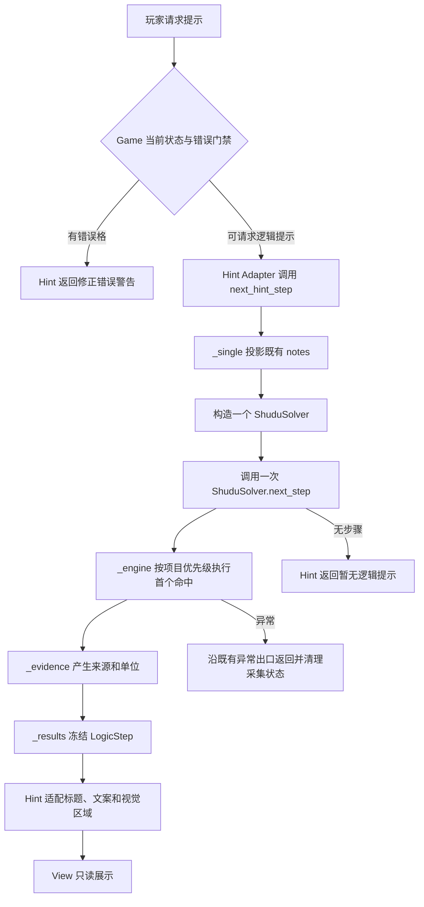
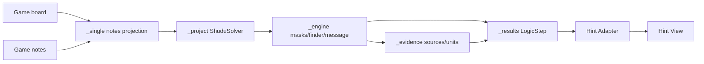
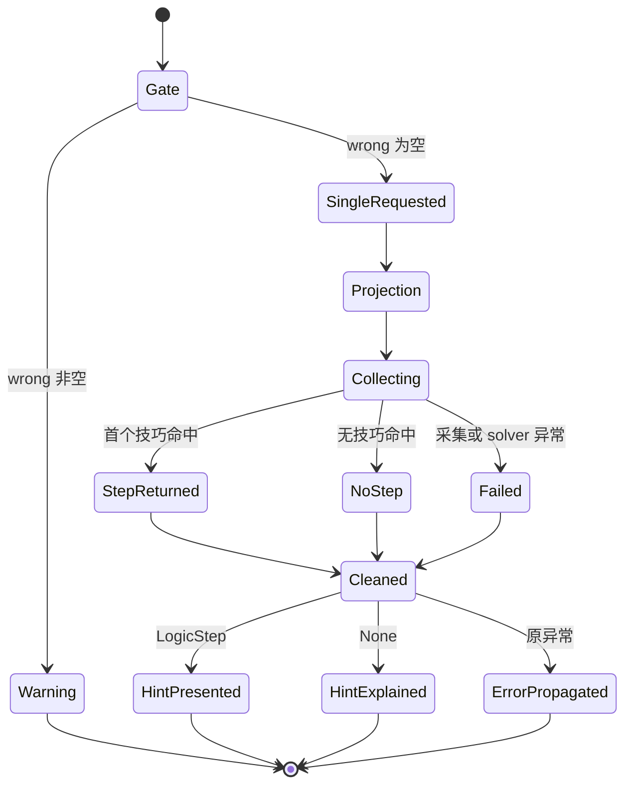

# S1-02 方案设计：单步事实能力

~~~toml
issue_id = "S1-02"
solution_version = "S1-02-solution-v1"
design_version = "S1-02-design-v2"
artifact_version = "S1-02-design-v2"
status = "completed"
frozen = true
stage = "solution-design"
approval_state = "approved"
approval_locator = "docs/01_sprint记录/sprint01/00-联合方案决策/2026-10-06/发布批准记录.md"
request_binding = "d6e6cdbe-416c-4105-a1d5-64a536c6ffea"
~~~

## 1. 批准方向与设计目标

本设计消费以下已批准输入：

- [S1-02 方案决策](S1-02_方案决策.md)，版本 `S1-02-solution-v1`；
- [联合方案](../00-联合方案决策/2026-10-06/联合方案决策.md)，版本 `joint-solution-a4d73c79de3338c3`；
- [S1-01 方案设计 v2](../S1-01/S1-01_方案设计.md)，版本 `S1-01-design-v2`；
- 已接受的 [ADR-001](../../../02_架构决策记录/ADR-001-共享回溯兜底求解器.md)、[ADR-002](../../../02_架构决策记录/ADR-002-共享规则内核与求解器公共接口.md)、[ADR-003](../../../02_架构决策记录/ADR-003-Numba位掩码逻辑核心.md) 和 [ADR-004](../../../02_架构决策记录/ADR-004-截图输入深模块.md)。

目标结果是：玩家请求一次提示时，逻辑求解 Module 直接返回当前棋盘和现有逐格 notes 下的第一步 `LogicStep`。步骤动作、技巧身份、候选快照、来源格和观察单位由执行该步骤的 Module 一次产生；`Hint` 只把事实适配为中文和视觉语义。输入棋盘和 notes 在整个调用中保持调用方所有权，提示结果独立于自动开关和自动技巧勾选。

S1-01 v2 提供本票的目录和公共结果类型前置：`shudu.logic_solver` 是一个公开入口，`_engine.py` 拥有共享位掩码编排，`_project.py` 拥有项目顺序和 `ShuduSolver`，`_results.py` 拥有 `LogicStep` 及快照构造。本票在这些 owner 内补充 `single` 和 `evidence` capability，S1-03 在同一目录补充自动结果 capability。S1-02 的实施 ready 条件仍是 HOST 读回 S1-01 的实际实施 Delivery；本设计的完成只释放本票设计评审。

本票设计范围包含：

- `next_hint_step(board, notes) -> LogicStep | None` 的能力级 Interface；
- `_single.py` 的 notes 投影、一次求解和首步返回；
- `_evidence.py` 的项目 Hidden Single 单次来源选择和来源计算；
- `_project.py` 的项目 `next_step()` 单步事实装配接线；
- `_engine.py` 的按需技巧身份、消息、动作和执行前上下文生产；
- `_results.py` 的可选 `technique_name` 字段和 `name` 兼容属性；
- `shudu/sudoku_hints.py` 的公开能力适配和现有 Hint 文案/视觉投影；
- 针对十种技巧、notes、只读、错误、无步骤、一次调用和执行规模的固定 fixture 测试设计。

S1-03 的 `solve_auto`、自动结果成员和差分函数，S1-04 的设置菜单与 GUI 交互，S1-01 的目录迁移实现，跨票合并和联合全量门禁由各自 owner 与 Leader/HOST 管理。S1-02 只交付本票阶段正文、测试计划、实施 Items 和本票证据定位。

当前仓库事实：迁移前 focused 命令

```text
.venv/Scripts/python.exe -B -m pytest -q tests/test_sudoku_hints.py tests/test_shudu_solver.py tests/test_njit_core.py tests/test_architecture.py
```

真实结果为 `63 passed`。联合方案记录的完整基线为 `237 passed、1 个 Tk fixture setup error`；两项均是设计输入事实。设计阶段不把它们转写为目标实现通过证据。

## 2. 业务流程设计与闭合证明

正常提示流程如下：



闭合走查：玩家请求是唯一业务入口；错误门禁直接返回警告并结束；可行请求进入单步 capability；`_single.py` 只投影调用方已经存在的 notes；`_project.py` 只调用一次项目 `next_step()`；`_engine.py` 首个技巧命中后停止；`_evidence.py` 负责来源和观察单位；`_results.py` 返回完整不可变事实；Hint 只适配事实，View 只消费 Hint。步骤成功、无步骤和异常均有明确出口，所有临时采集状态在出口统一清理。

验收闭合由以下行为组成：

| 业务起点 | capability 与关键分支 | 业务出口 | 证据 |
| --- | --- | --- | --- |
| Hint 请求且存在错误格 | Game/Hint 错误门禁 | 警告；solver 调用数为 0 | `make_hint` wrong fixture、调用计数 |
| Hint 请求且棋盘有效 | `next_hint_step`；notes 投影；项目首步 | 一份 `LogicStep` 或 `None` | public Interface 行为测试 |
| Hidden Single 命中 | 宫→行→列选择单位；执行前一次来源计算 | 单一来源集合、单位和 placement | Hidden Single 固定盘面与来源计数 |
| 其他九种技巧命中 | 使用现有 finder 和 project 顺序 | 原有 message、动作、快照和身份 | 十技巧 fixture 回归 |
| 提示展示 | Hint Adapter | 中文标题、文案、regions/attention | Hint/View 行为测试 |

## 3. 业务逻辑设计与闭合证明

### 3.1 单步 capability

`next_hint_step(board, notes)` 是 `shudu.logic_solver` 的公开能力。它执行下列固定顺序：

1. 以现有棋盘构造一个项目 solver，solver 内部复制棋盘并创建既有位掩码状态；
2. 读取一次算法候选快照，仅用于对每个已有 notes 项应用用户已证明的候选删除；
3. 逐项遍历传入 `notes` 的现有条目。只处理空格和非空可见候选；已填格、空集合和没有条目的格子沿当前基础候选语义；
4. 在同一 solver 上调用一次 `next_step()`；finder 按项目既有顺序运行，首次命中后立即返回；
5. 由执行算法的 Module 产生动作、删除、消息、来源、单位、候选快照和 `technique_name`；
6. 返回不可变 `LogicStep`，没有步骤时返回 `None`；调用方输入仍由调用方持有。

单步 capability 不读取 `auto_techniques`，不创建自动固定点，不调用完整 `solve()` 和回溯，不生成自动结果 envelope，也不为提示创建第二份完整候选投影。错误按现有 solver 构造、候选和 finder 的异常语义传播；结果为空时不返回部分 `LogicStep`。

### 3.2 项目步骤事实

`_project.py` 继续拥有项目优先级、项目兼容方法和 `ShuduSolver`。项目单步顺序保持 `Hidden Single → Naked Single → Naked Pair → Hidden Pair → Naked Triple → Hidden Triple → Pointing Pair → Box-Line → X-Wing → XY-Wing`，实际 finder 名称和 Box-Line 的现有展示名称沿 ADR-003 与现有测试。

`next_step()` 在执行前保存本次单步需要的候选快照，打开单步动态采集上下文，调用 `_engine` 的一步推进，并在成功时一次构造 `LogicStep`。日志继续由原有 `_log` 位置产生，消息内容保持；`technique_name` 从实际命中的算法身份直接传递，不从日志字符串解析。无步骤和异常都经过同一清理出口。

### 3.3 Hidden Single 证据

`_evidence.py` 是项目单步解释事实的唯一 owner。Hidden Single 命中后，在落子前按固定优先级 `宫 → 行 → 列` 选择能唯一保留该数字的单位；无法由该优先级重新确认时沿现有 finder 已记录单位。随后依据执行前棋盘和所选单位计算来源格，来源格仍按当前正式数字对该单位其他空格的约束规则取得，保持当前去重和次序。

来源计算只发生一次。落子后，`_project.py` 不再用候选和日志重新计算 Hidden Single 解释；legacy 顺序、legacy 日志和自动路径保留各自原有事实范围。其他九种技巧沿现有 engine 的 `_last_sources`/`_last_units` 生产路径返回事实。

### 3.4 Hint Adapter

`shudu/sudoku_hints.py` 保留 `Hint` 数据结构、wrong 优先门禁、`NAMES` 映射、中文 `step_message` 和视觉区域计算。`pending_step(board, notes)` 只转交 `logic_solver.next_hint_step(board, notes)`；`make_hint` 在 wrong 非空时直接返回警告，否则请求一次单步并把结果交给现有 `describe_step`。Hint 读取 `LogicStep` 的 `name`、`sources`、`units`、`candidates`、`placements` 和 `eliminations`，不访问 solver 私有 finder、日志列表或临时状态。

## 4. 数据流与数据闭环

### 4.1 数据真源与 producer/consumer

| 字段/状态 | producer 与构造责任 | consumer 与不变量 | 生命周期 |
| --- | --- | --- | --- |
| `board` | Game/根入口生产正式 9×9 棋盘；调用时只读传入 | `_single.py`/`ShuduSolver` 复制为内部棋盘；原对象值保持 | 一次请求 |
| `notes` | Game 的逐格手工 notes | `_single.py` 逐项投影；Hint 不补全 notes | 一次请求；原对象不变 |
| `_masks` | `_engine.py` 由既有 `masks_from_board` 构造 | finder、placement 和传播只消费位掩码 | solver 实例生命周期 |
| 单步候选快照 | `_project.py` 在单步实际需要时从 solver 候选构造 | `_results.py` 冻结为 `CandidatesSnapshot`；Hint 只读 | 返回结果生命周期 |
| `placements` | `_engine.py` 执行前后 board 差异构造 | Hint/Game 只展示提示，不写入 Game board | 返回结果生命周期 |
| `eliminations` | `_engine.py` 由执行前候选与执行后候选差异构造 | Hint 形成 pending 删除和 regions | 返回结果生命周期 |
| `message` | `_engine.py` 原有 `_log` 产生；`_project.py` 读取当前步骤消息 | Hint 取已有 message 的事实部分或按技巧适配中文 | solver steps 与返回结果 |
| `technique_name` | `_engine.py` 在实际 finder 命中处设置 | `_results.LogicStep.name` 优先使用明确身份；Hint 依此映射 | 一步结果；不依赖日志 |
| `sources` | `_evidence.py`/engine 依据执行前事实构造 | Hint 绿色来源、文案和 regions | 一步结果 |
| `units` | `_evidence.py` 选择 Hidden Single 单位；其他技巧沿 engine 事实 | Hint 蓝色观察区域和文案 | 一步结果 |
| Hint 状态 | Game/Hint 生产 `Hint`，View 生产显示状态 | View 只绘制公开 Hint 字段 | 当前提示会话 |

### 4.2 三类数据路径



棋盘与 notes 的真源属于 Game；候选拓扑和位掩码属于 rules/kernel/engine；单步身份、动作、来源、单位和快照属于逻辑求解 Module；中文文案和视觉区域属于 Hint；显示属于 View。每个字段只有一个生产者，消费者只依赖其公开值义，数据通过返回值闭合，不引入文件 IO、网络、子进程、缓存或远程调用。

### 4.3 共享字段的单点约束

`LogicStep` 现有六个位置字段保持顺序：`message`、`placements`、`eliminations`、`sources`、`units`、`candidates`。末尾追加带默认值的 `technique_name: str = ""`，保证既有手工构造仍可工作。`name` 属性在 `technique_name` 非空时返回它，否则沿用 `message` 的冒号前缀。生产 solver 为每个实际输出填入明确技巧身份；旧手工结果继续使用兼容属性。

## 5. 状态流与控制流



单步临时采集上下文只有 `inactive → active → cleaned` 三个状态。`active` 只覆盖 `_project.next_step()` 的实际动态调用期；成功、无步骤和异常都经过 `finally` 清除。自动固定点和 legacy 完整 solve 的采集状态保持原路径，单步 `LogicStep` 和单步候选快照在这两条路径上的新增数量为 0。

控制流是同步的。Hint 请求不改变 board、notes、history、mistakes、自动偏好或 Game status；Game 仅按现有提示会话规则记录 `hints_used` 和显示状态。wrong 门禁在构造 solver 前完成，错误提示的求解和回溯调用数为 0。

## 6. Module / Interface / Seam / Adapter / 文件布局

### 6.1 Module 与 Interface

Module 是 `shudu.logic_solver`，公开入口为 `shudu/logic_solver/__init__.py`。本票新增的最小公开能力为：

```python
def next_hint_step(board, notes: dict[Cell, set[int]]) -> LogicStep | None:
    """返回当前 board 与既有 notes 下的第一条项目逻辑步骤。"""
```

Interface 包含以下行为事实：

- `board` 是 9×9 正式数字网格，调用方保持其所有权；
- `notes` 的 key/value 是现有 Cell 与候选集合，调用方保持其所有权；
- 返回值为不可变 `LogicStep` 或 `None`；
- 单次调用构造一个项目 solver，并请求一次 `next_step()`；
- 技巧按项目顺序首次命中即返回；
- 输入只读，自动偏好、日志编号和完整回溯结果不属于 Interface 输入；
- 既有 solver 构造、候选和 finder 错误沿原异常出口传播；
- 公开能力不产生产品 IO、进程、远端调用或异步任务。

现有 `ShuduSolver.next_step() -> LogicStep | None` 继续是项目实例 Interface；它由 `_project.py` 拥有，供公共 capability 内部调用和现有兼容入口使用。`LogicStep`、`Change` 和快照类型由 `_results.py` 拥有并从公开入口按 caller 需要导出。

### 6.2 Seam 与 Adapter

- 外部 Seam：`shudu/logic_solver/__init__.py`，对 Hint 暴露 `next_hint_step` 及 `LogicStep` 类型；按需导入 `_single`，不预热全部 capability。
- 单步内部 Seam：`_single.py` 调用项目 `ShuduSolver` 的 `next_step()`，隐藏 notes 投影和请求次数。
- 证据内部 Seam：`_evidence.py` 接收执行前候选、board、所选 unit 和 target，返回来源/单位事实；不拥有 solver 生命周期。
- 项目 Adapter：根 `shudu_solver.py` 保留历史名称、CLI 和兼容导出；算法实现由 `_project.py` 承担。
- Hint Adapter：`shudu/sudoku_hints.py` 只适配事实、中文和视觉语义；它不重新识别技巧。
- View Adapter：`shudu/sudoku_hint_view.py` 继续消费 Hint 公开字段。

当前只有一个真实单步生产实现，因此不新增抽象基类、注册表或可替换 provider。内部 helper 可按职责拆分，外部 Interface 保持一个 capability。

### 6.3 目标文件布局

```text
shudu/
└── logic_solver/
    ├── __init__.py       # 公开入口；按请求导出 next_hint_step 和结果类型
    ├── _engine.py        # S1-01 迁入；finder、位掩码、消息、按需单步上下文
    ├── _project.py       # S1-01 迁入；ShuduSolver、项目优先级、next_step
    ├── _results.py       # S1-01 迁入；LogicStep、Change、快照和 technique_name
    ├── _single.py        # S1-02；notes 投影、单 solver、一次 next_step、首步返回
    └── _evidence.py      # S1-02；Hidden Single 单次单位选择与来源计算
```

本票修改的现有 Adapter 是 `shudu/sudoku_hints.py`；根 `shudu_solver.py` 只承担兼容入口接线。S1-03 的 `_auto.py`/`_diff.py`（具体文件以其冻结设计为准）拥有自动结果成员和差分逻辑；S1-02 不扩展其 owner。

## 7. 输入输出与字段值义

### 7.1 `next_hint_step` 输入输出

| 项目 | 值义 |
| --- | --- |
| `board` | 当前正式棋盘；9×9 数字网格；调用方保持原值 |
| `notes` | 当前手工逐格 notes；只读取已有条目，空格和非空集合按当前规则投影 |
| `LogicStep.message` | 执行算法原有 `_log` 产生的步骤事实和说明 |
| `LogicStep.placements` | 该步骤填入的 `(row, col, digit)`，与现有 placement 差异语义一致 |
| `LogicStep.eliminations` | 该步骤实际证明的候选删除，沿现有顺序和去重规则 |
| `LogicStep.sources` | 对当前解释成立的来源格，Hidden Single 由执行前事实一次计算 |
| `LogicStep.units` | 当前观察单位；Hidden Single 按宫→行→列选择 |
| `LogicStep.candidates` | 该步骤所需的不可变候选快照；仅单步结果实际需要时构造 |
| `LogicStep.technique_name` | 实际命中的英文技巧身份；生产输出非空；旧手工构造默认为空 |
| 返回 `None` | 当前 board 与 notes 下没有首步；采集状态已清理 |

`Hint` 的 `title` 使用既有 `NAMES` 映射；`message` 继续由 `step_message` 使用步骤字段生成；`sources`、`units`、`regions` 和 `pending_eliminations` 直接来自步骤事实与现有适配计算。Hint 文案不成为算法身份真源。

### 7.2 错误和边界

- wrong 集合非空：`make_hint` 返回“请先修正错误”，`step=None`，solver/回溯调用为 0；
- notes 为空：使用棋盘基础候选，仍只请求一次 `next_step`；
- notes 有已删除候选：投影后不补回，后续步骤不重复返回已删除候选；
- notes 包含已填格：该条目不参与投影；
- notes 项为空集合：保留基础候选语义；
- 没有步骤：返回 `None`，Hint 返回现有“暂无逻辑提示”说明；
- board/notes 触发既有输入错误：保留原异常类型和消息，临时采集状态完成清理；
- Hidden Single 无法重新确认优先单位：使用执行 finder 已记录单位，保持结果可解释性；
- 采集期异常：沿原异常传播，不返回半个 `LogicStep`，再次调用建立新的干净 solver 状态。

## 8. 并发、异步、事件、队列、幂等与恢复

产品单步计算是同步的 9×9 内存流程。单步 capability 不创建线程、队列、缓存、重试、抖动、文件 IO、网络或子进程；Tk 事件循环仍由现有 GUI 调用方拥有。

同一 board + notes 在相同算法目录和规则内核下产生相同步骤事实。调用方输入不被 capability 持有或异步使用，solver 内部临时对象在返回或异常后释放。Hint 重新打开时沿现有 Game 生命周期再次请求同一能力，结果由当前输入重新产生。

设计文档和提交动作由 HOST 依据 `request_binding`、阶段 `actionKey` 和 expected HEAD 处理；未知写入结果先 readback。Stage 固定路径 helper 的真实失败由本票 Legacy 承接；本文使用实际 Git 路径读取已提交 solution 版本，再由公开 `nextVersion` 和 metadata materializer 形成同一设计候选。

## 9. 迁移与兼容设计

实施前置是 S1-01 v2 的实际 Delivery readback，需证明 `logic_solver` 目录、公开入口、`_engine`、`_project`、`_results` 和结果 identity 已成立。S1-02 实施顺序如下：

1. 在 `_results.py` 末尾增加带默认值的 `technique_name`，更新 `name` 兼容属性，并保留六个旧字段位置；
2. 在 `_engine.py` 的单步上下文生产处增加当前技巧身份，调整 Hidden Single 为执行前一次单位/来源生产，并保留 legacy/自动路径的既有 owner；
3. 新增 `_evidence.py`，集中项目 Hidden Single 的宫→行→列解释选择和来源计算；
4. 新增 `_single.py`，把现有 Hint notes 投影和一次项目步骤请求收回单步 capability；
5. 在 `_project.py` 接通单步采集生命周期、步骤字段和 `next_hint_step` 所需的项目 `next_step`；
6. 从 `shudu/logic_solver/__init__.py` 导出单步 capability和当前 caller 所需结果类型；
7. 将 `sudoku_hints.py` 的 `pending_step` 改为公共 capability Adapter，保留 wrong、文案、视觉和 Hint 状态；
8. 在公开 Interface 上迁移行为测试、架构断言和执行面探针，完成引用扫描与本票 required 命令。

兼容要求：

- 根 `shudu_solver.py` 的 `ShuduSolver` 名称、构造和 CLI 入口保持；
- `ShuduSolver.next_step()` 的项目顺序、消息、动作、来源、单位和快照保持；
- `LogicStep` 旧六字段位置、手工构造和 `name` 使用保持；
- `sudoku_hints.pending_step` 和 `make_hint` 的参数保持；
- `NAMES` 的十种技巧名称和 `Box-Line` 展示保持；
- Game 的 hint 状态、输入只读、错误门禁和回溯隔离保持；
- S1-03 的自动函数与结果成员沿各自 owner 实施，S1-02 不修改其实现或承担跨票合并。

## 10. 测试设计与测试计划

测试通过公开 `next_hint_step`、`ShuduSolver.next_step()` 和真实 Hint 入口证明行为；internal helper 只作为必要的局部故障定位面。测试数据固定在当前版本化测试 fixture 中，使用 `tests/test_sudoku_hints.py` 的 `LEVEL119_PUZZLE` 与 `SCREENSHOT_NOTES`、现有默认 `Game()` 盘面、`tests/test_logical_solver.py` 的 `SECOND_PUZZLE` 和固定的全零 9×9 盘面。实施时保留关卡119与截图 notes 的数值和预期删除，测试不从变化中的关卡文件、运行时业务数据或随机输入取样。

### 10.1 最小固定 fixture 与行为映射

| fixture | 预期事实 | 对应检查 |
| --- | --- | --- |
| 默认 `Game().board`，notes 为空 | 项目第一步为 Hidden Single；输入不变；技巧身份为 `Hidden Single` | project/public step、只读、单位/来源 |
| `LEVEL119_PUZZLE + SCREENSHOT_NOTES` | 第一条为 Hidden Triple；六项删除保持 `(3,5,1)…(4,5,4)`；来源三格和宫单位保持 | notes 投影、Hidden Triple、Hint 文案/视觉 |
| `LEVEL119_PUZZLE + {(5,1):{3,6,7}, (5,6):{3,6}}` | Hidden Pair；只删除 `(5,1,7)`；自动关闭/开启结果相同 | notes 与自动偏好解耦、已删候选不补回 |
| `LEVEL119_PUZZLE + {(5,1):{3,6}}` | 不重新产生 `(5,1,7)` 删除；无步骤或后续既有步骤均保持 | 删除回归 |
| `SECOND_PUZZLE` 固定逻辑路径 | 十种技巧名称、动作、来源/单位、候选快照和消息保持；XY-Wing 路径继续可观察 | 十技巧和 legacy 行为映射 |
| 全零 9×9 盘面，notes 为空 | `next_hint_step` 返回 `None`；board 不变 | 无步骤出口 |
| Game 错误格 fixture | `make_hint` 返回警告；step 为空；solver、finder、回溯调用为 0 | 错误门禁与执行面 |

十种技巧的回归集合按当前项目 finder 顺序固定为：`Naked Single`、`Hidden Single`、`Naked Pair`、`Hidden Pair`、`Naked Triple`、`Hidden Triple`、`Pointing Pair`、`Box-Line`、`X-Wing`、`XY-Wing`。每条产物都断言 `technique_name`、`name`、动作、来源、单位、候选快照和现有中文展示；没有独立最小盘面的位置沿已有固定逻辑路径和当前结果 fixture 复用，实施阶段保存实际输入与输出。

### 10.2 RED → GREEN → regression

1. RED：在迁移后的公开入口上先固定 `next_hint_step` 缺失、`technique_name` 默认/生产值、Hidden Single 来源计数、Hint 单次调用和动态清理的预期；当前迁移前 `63 passed` 只作为保护基线，不替代新增合同的 RED。
2. GREEN：完成最小 `_single`/`_evidence`/`_results`/`_engine`/Hint 接线，运行单步行为测试，修复本票 owner 内的字段、调用顺序和异常清理问题。
3. regression：运行本票 required 命令、S1-01 提供的迁移 focused 命令、固定十技巧/notes 场景、真实 Hint 入口和执行面探针；保存原始 stdout/stderr、退出码、测试集合、路径/symbol/OID 和 HOST readback。

required 命令固定为：

```text
.venv/Scripts/python.exe -B -m pytest -q tests/test_sudoku_hints.py tests/test_shudu_solver.py tests/test_njit_core.py tests/test_architecture.py
```

实施测试映射：

| 现有保护 | 迁移后的公开行为 |
| --- | --- |
| `test_existing_notes_are_projected_per_cell` | `next_hint_step` 的 notes 投影按条目生效，其他格沿基础候选 |
| `test_hidden_triple_uses_public_solver_step_and_does_not_repeat_removed_notes` | 单步 capability 的步骤 identity、删除和已删除候选回归 |
| `test_hint_requests_one_all_algorithm_step_with_existing_notes` | Hint → capability 只有一次 `next_step`，首命中停止 |
| `test_pending_step_does_not_mutate_input_board` | 公共 Interface 输入只读 |
| `test_hint_never_calls_full_solver_or_backtracking` | 单步能力不进入完整 solve/fallback |
| `test_hint_is_identical_for_same_board_and_notes_regardless_of_auto_setting` | Hint 不读取自动偏好 |
| `test_first_public_step_uses_hidden_single_when_available` | 项目顺序、`technique_name`、来源和单位 |
| `test_all_core_finders_compile_in_nopython_mode` | S1-02 不改变 Numba finder 实际执行面 |
| `test_hint_recommendation_uses_all_algorithms_with_existing_note_projection` | 架构断言迁移到公开 capability 和 Hint Adapter |

### 10.3 调用规模与实际执行面预算

联合方案的机器基线由
`docs/01_sprint记录/sprint01/00-联合方案决策/2026-10-06/证据/shudu-execution-surface-baseline-20261006.json`
保存，测量合同为 `measurement=call_counts_and_input_shapes`。探针脚本
`shudu-execution-surface-baseline-20261006.py` 的 `record()` 实际生产下列字段：

| 执行面维度 | 真实探针字段 | 字段责任与上限解释 |
| --- | --- | --- |
| board 扫描与 mask 构造 | `masks_from_board`、`array_shapes` | `masks_from_board` 记录从当前 board 建立既有掩码的次数；`array_shapes` 记录被探针看到的数组形状，现有固定场景均为 `[9, 9]`；单步上限沿对应场景基线。 |
| candidate 扫描 | `capture_candidates` | project candidate capture 的调用次数；单步上限沿对应场景基线，自动全十技巧场景为 10，单步 Hint 场景为 1。 |
| candidate 集合与转换 | `candidate_sets` | 既有候选集合构造/转换探针字段；单步上限沿对应场景基线，作为候选转换的实际证据字段。 |
| mask propagation | `apply_placement` | placement 后的既有掩码传播调用次数；没有 placement 的场景按基线字段缺省为 0，Hidden Single 场景基线为 1。 |
| 算法、步骤和来源 | `find_*`、`next_step`、`base_hidden_single_evidence`、`project_hidden_single_evidence` | 保持既有 finder 顺序、首命中停止和 Hidden Single 来源次数；每个字段按同场景 JSON 上限。 |
| 外部执行面 | `io`、`process`、`remote`（由 HOST 执行面探针补齐） | 生产单步 capability、Hint Adapter 和固定 fixture 的上限均为 0；真实探针 readback 负责证明。 |

在相同 board、notes、自动勾选集合和操作序列下，联合基线给出的固定场景上限如下。数值仅取自上述 JSON 的 `calls` 和 `array_shapes`；JSON 未出现的字段保持 0 语义，异常场景在 HOST 补采前保持“待采集”状态。

| 固定场景 | 结果 | board/mask | candidate 扫描与转换 | propagation | 其他真实计数与形状 |
| --- | --- | --- | --- | --- | --- |
| `auto_stalled_all_ten` | `placements=0, eliminations=0` | `masks_from_board=1`；`array_shapes=[[9,9]]` | `capture_candidates=10`；`candidate_sets=10` | `apply_placement` 未出现，按 0 | 十个 `find_*` 各 1，外部 IO/process/remote=0 |
| `auto_stalled_hidden_triple_only` | `placements=0, eliminations=0` | `masks_from_board=1`；`array_shapes=[[9,9]]` | `capture_candidates=1`；`candidate_sets=1` | 未出现，按 0 | `find_hidden_triple=1`，外部 IO/process/remote=0 |
| `hint_stalled_without_notes` | `None` | `masks_from_board=1`；`array_shapes=[[9,9]]` | `capture_candidates=1`；`candidate_sets=2` | 未出现，按 0 | `next_step=1`；十个 `find_*` 各 1；外部 IO/process/remote=0 |
| `hint_hidden_triple_existing_notes` | `Hidden Triple` | `masks_from_board=1`；`array_shapes=[[9,9]]` | `capture_candidates=1`；`candidate_sets=3` | 未出现，按 0 | `next_step=1`；`find_hidden_pair/find_hidden_single/find_hidden_triple/find_naked_pair/find_naked_single/find_naked_triple=1`；外部 IO/process/remote=0 |
| `hint_hidden_single_without_notes` | `Hidden Single` | `masks_from_board=1`；`array_shapes=[[9,9]]` | `capture_candidates=1`；`candidate_sets=3` | `apply_placement=1` | `next_step=1`；`base_hidden_single_evidence=1`、`project_hidden_single_evidence=1`、`find_hidden_single=1`；外部 IO/process/remote=0 |
| `wrong_board_warning` | `请先修正错误` | `array_shapes=[]`，所有 board/mask 字段 0 | `capture_candidates=0`、`candidate_sets=0` | `apply_placement=0` | `next_step=0`、所有 finder/source=0；外部 IO/process/remote=0 |
| 固定有效 board 的采集期异常 | 原异常沿现有出口传播 | 使用同一 `record()` 的 `masks_from_board`、`array_shapes` | 使用同一 `capture_candidates`、`candidate_sets` | 使用同一 `apply_placement` | 当前联合 JSON 尚未包含异常行；HOST 在实施 readiness 前以既有最小固定 fixture 和现有 seam 补采完整 `calls`/`array_shapes`，再把实际 readback 作为 I01 证据。设计不预填异常计数。 |

单步 capability 的总预算因此闭合为：有效 Hint 调用 `next_hint_step` 一次，构造一个项目 solver，调用一次 `next_step`，notes 只遍历传入条目，finder 在首个命中后停止；Hidden Single 来源生产总计一次；自动和 legacy 路径新增单步 `LogicStep` 与候选快照为 0；产品 IO、网络、子进程和远端服务为 0。HOST 必须用同一场景探针同时读回上述 board/candidate/mask 字段、solver、步骤、finder、notes、来源和外部执行面字段，成功、无步骤、wrong、异常和 Hidden Single 均逐项绑定对应固定 fixture。图示与文档走查只说明预期，真实探针和 required 测试形成完成证据。

## 11. Review Focus

- 公开入口是否只导出 `next_hint_step` 和当前 caller 实际需要的类型，且按请求能力局部导入；
- `_single.py` 是否只投影现有 notes、构造一个 solver、请求一次步骤并在首命中停止；
- `_evidence.py` 是否拥有 Hidden Single 单次单位/来源生产，来源是否使用执行前事实；
- `_engine.py` 是否在执行算法处生产 `technique_name`，消息是否继续在原生成位置产生，身份是否脱离日志解析；
- `_results.py` 是否保留旧六字段位置、手工构造兼容和不可变快照；
- `LogicStep`、`Hint` 和 View 的 producer/consumer 字段名称、类型、状态和生命周期是否逐项一致；
- 成功、无步骤、wrong 和异常出口是否都清理单步动态采集状态；
- 自动和 legacy 路径是否保持原执行面，未生成新增单步结果或全量快照；
- 十种技巧、关卡119 notes、截图 notes、只读、偏好独立、无回溯和错误零求解是否都有固定 fixture；
- S1-03 的自动函数、结果成员和 S1-04 的设置文件是否保持本票范围外；
- required 测试、真实执行面和当前 Tk setup error 是否按真实结果分别报告。

## 12. 实施计划

实施在 S1-01 真实 Delivery 读回后进入本票 canonical Issue worktree，按一个完整 Implementation Item 的内部顺序执行：

1. 读取冻结的 S1-02 设计、S1-01 v2 实施结果、ADR 和当前 Issue worktree，记录迁移前路径、symbol、focused baseline 与 dirty 状态。
2. 在 `_results.py` 增加 `technique_name` 兼容字段，并在 `_engine.py` 接通实际技巧身份和单步动态采集清理。
3. 新增 `_evidence.py` 与 `_single.py`，完成执行前 Hidden Single 证据、现有 notes 投影、一次 solver/一次 `next_step` 和公共入口导出。
4. 更新 `_project.py` 与 Hint Adapter，保持根 `shudu_solver.py`、Game、View 和既有兼容入口职责。
5. 先运行新增行为 RED/GREEN，再运行 required focused pytest；按失败 owner 进行最小修复并保留真实失败证据。
6. 使用固定 board/notes 场景运行十技巧、错误/无步骤/输入只读、一次调用和 Hidden Single 来源计数检查。
7. 运行执行面探针，核对 finder 顺序、notes 遍历、候选转换、solver/回溯、IO/process/remote 和动态清理。
8. 迁移旧测试到公开 Interface，执行引用扫描、设计符合性检查，写方案实施总结；新语义取舍进入本票 Legacy，唯一确定范围继续完成。
9. 由 HOST 取得 Item readiness、正式实施 metadata、实施评审和 Delivery；S1-02 不负责 S1-03/S1-04 合并或联合门禁。

## 13. to-spec

### Problem Statement

当前提示流程由 Hint 投影 notes 后调用项目 solver，步骤身份依赖 message 前缀，Hidden Single 来源在步骤执行后由项目 helper 再算一次。调用方因此同时知道 notes 投影、solver 实例和解释来源的内部事实，单步结果容易与日志格式耦合。

### Solution

在 `shudu.logic_solver` 增加一个公开 `next_hint_step(board, notes)` capability，将 notes 投影、一次项目步骤请求、实际技巧身份、执行前来源和步骤快照集中在 Module 内。`Hint` 仅调用 capability 并适配中文和视觉字段；`LogicStep` 通过可选末尾字段保留旧构造兼容并携带明确技巧身份。

### User Stories

1. 作为玩家，我希望在保留手工 notes 时得到当前第一步逻辑提示，以便提示反映真实笔记。
2. 作为玩家，我希望提示与自动开关和技法勾选无关，以便提示行为稳定。
3. 作为维护者，我希望单步动作、来源、单位和技巧身份在一个 Module 内产生，以便修改规则时只维护一个事实源。
4. 作为测试维护者，我希望通过公开 capability 验证十种技巧、输入只读、一次调用和执行规模，以便目录迁移后行为保障保持。

### Acceptance Criteria

- 当前 board + notes 产生原有一步、说明、来源、单位和快照；输入保持原值；
- 单步 capability 只请求一次 `next_step`，首个技巧命中后停止；
- Hidden Single 按宫→行→列选择解释单位，来源计算一次；
- `LogicStep.technique_name` 直接来自实际命中技巧，既有手工构造保持兼容；
- Hint 只适配公共事实，不依赖私有 finder、日志编号或自动偏好；
- 自动和 legacy 路径不生成新增单步采集或完整 `LogicStep`；
- 固定 notes/十技巧/错误/无步骤/只读测试和实际执行面检查具有真实结果。

### Out of Scope

自动固定点、自动结果 envelope、差分 helper、设置菜单、GUI 交互、规则拓扑、截图识别、store、共享 Skill/Runtime 和跨票合并保持各自已批准 owner。

## 14. to-tickets

本票保持一个可独立实施、测试和验收的纵向 ticket，对应一个完整 Implementation Item。内部文件动作按职责顺序执行，属于同一 owner 的实现细节，不形成新的 Issue 或跨票依赖。

| ticket | 交付 | 依赖 |
| --- | --- | --- |
| S1-02-I01 | 在 S1-01 公开求解 Module 上交付单步 notes 投影、Hidden Single 单次证据、技巧身份、`LogicStep` 兼容字段、Hint Adapter、固定行为测试和执行面证据 | S1-01 实际实施 Delivery；S1-03、S1-04 无前置关系 |

S1-02 的 design review 在设计正文/总结提交并读回后进行；implementation 只有 S1-01 tracker 与 merge-base 里程碑真实满足后由 DAG 释放。Leader/HOST 负责 S1-02 与 S1-03 同文件写入协调和跨票集成，S1-02 Worker 负责本票 owner surface。

## 15. Implementation Items

### I01

- objective: 玩家通过当前 board 与已有 notes 得到原有的一步逻辑提示及完整动作、来源、单位、候选快照和技巧身份；Hint 调用只跨一个公共单步 capability，输入保持只读。
- owner_surface: `logic_solver.next_hint_step`；`logic_solver.single`；`logic_solver.evidence`；`logic_solver.project.next_step`；`logic_solver.engine` 单步上下文；`logic_solver.results.LogicStep`；`sudoku_hints` Hint Adapter。
- allowed_scope: 在 S1-01 v2 的 `shudu.logic_solver` 目录和公开入口内新增 `_single.py`/`_evidence.py`，更新 `_engine.py`、`_project.py`、`_results.py` 的单步事实责任，更新 `sudoku_hints.py` 对公共 capability 的调用，以及对应固定行为/架构/执行面测试；保持自动能力、legacy 完整 solve、Game 状态和 S1-04 设置范围的既有 owner。
- completion_evidence: 公开 capability 的真实 RED/GREEN；十种技巧及关卡119/截图 notes 固定 fixture 回归；输入只读、错误/无步骤、一次 solver/一次 `next_step`、首命中停止、Hidden Single 单次来源和动态清理证据；联合基线 `shudu-execution-surface-baseline-20261006.json` 的 `calls`/`array_shapes` 实际字段逐场景 readback，异常场景由 HOST 使用同一 `record()` seam 补采；Hint 依赖面、路径/symbol/OID、required pytest、执行面探针、设计符合性检查和 HOST readiness/readback。
- required_behavior_checks:
  - board 与 notes 输入值在成功、无步骤和异常后保持不变；已有 notes 逐项投影，已删候选不补回，无 notes 格沿基础候选语义。
  - `next_hint_step` 每次构造一个项目 solver、调用一次 `next_step`，首个技巧命中后停止；Hint 不读取自动偏好，不调用完整 solve 或回溯。
  - 十种技巧的动作、`technique_name`/`name`、message、sources、units、candidates 和中文展示保持；Hidden Single 按宫→行→列选择单位并只计算一次来源。
  - `LogicStep` 旧六字段位置和手工构造兼容；生产结果明确填入实际命中的技巧身份，事实不从日志字符串反解析。
  - 动态单步采集在成功、无步骤和异常出口均清理；自动与 legacy 路径新增单步 `LogicStep`/候选快照数量为 0。
  - 关卡119部分 notes 的 Hidden Pair 删除7、截图 notes 的 Hidden Triple 六项删除和后续 Pair 路径保持；提示与自动设置集合无关。
  - 每个固定场景按联合基线实际字段核对 `masks_from_board`/`array_shapes`（board 扫描与 mask 构造）、`capture_candidates`（candidate 扫描）、`candidate_sets`（候选集合/转换）和 `apply_placement`（mask propagation）；上限分别沿同场景 JSON `calls`，形状保持 `[9,9]`。
  - `hint_hidden_single_without_notes` 必须 read back `masks_from_board=1`、`capture_candidates=1`、`candidate_sets=3`、`apply_placement=1`、`base_hidden_single_evidence=1`、`project_hidden_single_evidence=1`、`next_step=1`；`hint_hidden_triple_existing_notes`、`hint_stalled_without_notes`、`auto_stalled_all_ten` 和 `wrong_board_warning` 使用表中实际计数与 0 语义。
  - 成功、无步骤、wrong、异常和 Hidden Single 都通过固定 fixture、同一 probe 字段和 I01 required checks 形成闭合证据；异常行由 HOST 补采后才可写 readiness/readback 结论。
  - 调用次数、finder 顺序、notes 遍历、候选转换和输入规模不超过相同场景基线；产品 IO、子进程和远端调用为 0。
  - required focused pytest、固定 fixture、架构引用扫描和 HOST 执行面/readback 结果可由 Reviewer 独立复核。
- item_dependencies: ["S1-01 实际方案实施 Delivery 与公开 Module/结果 identity readback"]

## 16. Legacy 与关闭条件

设计阶段发现一个确定性 Stage helper 事实：在实际仓库 `D:/Tony/Documents/invest2026/projects/shudu`、`Sprint01` HEAD `bdb144d948c5d4d9d26aca490ea10099477a8971` 上调用 `prepareFormalPublication({issueId: "S1-02", artifactKind: "design", requestBinding: "d6e6cdbe-416c-4105-a1d5-64a536c6ffea"})` 返回 `publication_input_missing:S1-02:solution_version`。原因是 Stage helper 使用固定 `docs/01_Sprint记录/Sprint01/...` 大小写路径读取，而当前 Git 正式路径为 `docs/01_sprint记录/sprint01/...`；通过实际 Git 路径读取的 `S1-02_方案决策.md` 经 `parseSolutionArtifactMetadata` 验证为 `S1-02-solution-v1`，公开 `nextVersion` 以实际已提交 `S1-02-design-v1` 为输入返回本票设计版本 `S1-02-design-v2`。该事实由 [S1-02 遗留问题](S1-02_遗留问题.md) 承接，设计继续使用已批准语义，未修改 Runtime。

本票设计关闭条件：

1. 本文与 `S1-02_方案设计总结.md` 使用同一已材料化 `S1-02-design-v2`、`S1-02-solution-v1` 和 request binding；
2. 三张闭合图、Module/Interface/Seam/Adapter、producer/consumer 字段、状态出口、联合基线实际 counter 字段、固定测试和 RED/GREEN/regression 计划可由 Reviewer 逐项核对；
3. I01 的六字段语义、S1-01 实施依赖、S1-03/S1-04 owner 边界和 required checks 可直接交给 implementation；
4. 本票两份设计文档与首评整改记录精确写入并 readback，完成本票设计提交；
5. Leader 创建全新的 design Reviewer 完成首评；如有 blocker，原 Worker 只做一次批准范围整改，随后同一 Reviewer context 定向复核；
6. HOST 将当前 Issue 状态写为 `方案已设计` 并 readback。生产实现测试、实施评审、Delivery、`待验收` 和用户 acceptance 属于后续阶段。

新业务、架构、Interface、owner、依赖、范围或验收取舍在实施中出现时，按标准 Legacy 记录并继续当前唯一确定范围。现有 Legacy 的关闭需要 Runtime owner 的真实修复和验证，不以本票设计语义判断关闭。
