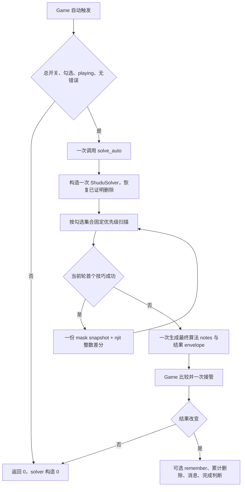
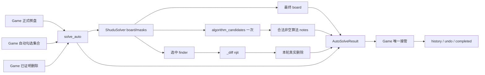
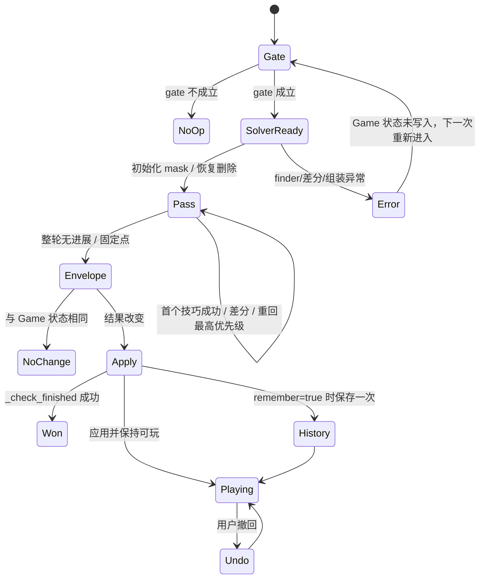

# S1-03 方案设计：自动结果能力

~~~toml
artifact_kind = "design"
issue_id = "S1-03"
solution_version = "S1-03-solution-v1"
design_version = "S1-03-design-v2"
artifact_version = "S1-03-design-v2"
status = "completed"
frozen = true
approval_state = "approved"
approval_locator = "docs/01_sprint记录/sprint01/00-联合方案决策/2026-10-06/发布批准记录.md"
~~~

## 1. 批准方向与设计目标

本设计消费已批准的 [S1-03 方案决策](S1-03_方案决策.md)、[联合方案](../00-联合方案决策/2026-10-06/联合方案决策.md)、[S1-01-design-v2](../S1-01/S1-01_方案设计.md) 及现行 [ADR-002](../../../02_架构决策记录/ADR-002-共享规则内核与求解器公共接口.md)、[ADR-003](../../../02_架构决策记录/ADR-003-Numba位掩码逻辑核心.md)、[ADR-005](../../../02_架构决策记录/ADR-005-本地自动算法偏好与完成动画.md)。设计阶段只展开批准的自动结果 capability；本票实施在 HOST 读回 S1-01 实施交付、canonical target 和 implementation input-gate 通过后开始。

目标是让 `Game` 通过一个公开 capability 请求自动固定点，并从一份 `AutoSolveResult` 接管最终棋盘、算法候选笔记、填入数量和本轮真实删除。`logic_solver` Module 拥有自动算法执行知识，`Game` 拥有门禁、游戏状态、撤回和完成判断。自动能力读取正式棋盘、显式勾选集合和已经证明的算法删除；手工 notes 继续由 Game 拥有并保持独立。

设计目标闭集如下：

1. `solve_auto(board, names, proven_eliminations) -> AutoSolveResult` 只按 `names` 的固定目录顺序执行到固定点，成功后重新从所选集合的最高优先级扫描。
2. 自动每轮最多复制一份 9×9 `int64` mask；失败技巧不生成 Python 候选集合，首个成功技巧由 Numba 整数差分取得真实删除，差分包含落子及其传播删除。
3. 最终结果一次生成合法非空算法 notes；结果与输入及其他调用结果互不别名，Game 直接接管结果 board，保持累计删除、`_remember`、`active_digit`、消息和完成判断。
4. 自动总开关、勾选集合、playing 状态和错误棋盘 gate 在 solver 构造前生效；gate 失败返回 `0`，并保留关闭自动求解时的基础自动笔记行为。
5. 既有 `SimpleSolveResult`、`solve_techniques_result`、`solve_simple_result` 和 `solve_simple` 继续提供原元数据兼容；这些调用不构造最终 notes、`LogicStep` 或单步采集。

当前设计基线为已保存的两次完整 pytest 结果：每次 `237 passed / 1 Tk setup error`；隔离 Tk 用例的通过结果不替代完整门禁。设计阶段没有把该基线写成目标实现通过证据。

## 2. 业务流程设计与闭合证明

### 2.1 自动结果正常流程



触发入口是 `Game.auto_solve_enabled(remember=False|True)`，包括正确填数后的自动执行、启用兼容入口和自动笔记在自动求解开启时的路径。Game 先完成 gate，再一次调用 `solve_auto`。能力成功后始终先生成完整结果并由 Game 比较 `board`、`notes` 和累计 `eliminations`；finder 整轮无进展只表示达到固定点，不直接决定 Game 是否为 no-op。完整结果与当前 Game 三项状态都相同，应用函数返回 `False`，不创建历史记录；若只有 notes 改变，即使 `placements=0` 且 `eliminations=()`，仍按完整应用顺序接管 notes，并保留 `remember`、消息、`active_digit` 和完成判断。

### 2.2 失败与恢复流程

- 总开关关闭、勾选为空、状态不是 `playing` 或存在错误大数字：在 solver 构造前返回 `0`；棋盘、notes、history、累计删除、错误次数和状态保持原值。
- `names` 含未知名称：沿 `validate_auto_techniques` 的现有 `ValueError` 合同传播，不生成可应用的半结果。
- solver、finder、mask 差分或最终 notes 构造抛出异常：`solve_auto` 在 envelope 完成前退出；Game 尚未写入任何状态，因此下一次调用仍从调用前状态开始。
- 自动调用完成后完整结果与当前 `board`、`notes`、累计 `eliminations` 全部相同：不执行 `_remember`、消息更新和完成检查，保持现有无变化语义。
- 自动调用改变结果：Game 按原 `remember` 参数保存一次快照，将结果 board/notes 转为唯一 Game 所有权，合并本轮删除，更新 `notes_mode`、`active_digit`、消息并执行 `_check_finished`。
- 自动调用只有 notes 改变：即使 `placements=0` 且 `eliminations=()`，仍执行结果接管；`remember=True` 只保存一次，消息、`active_digit` 和完成判断按原应用顺序执行，公开返回值仍为 `0`。
- solver、finder、mask 差分或最终 notes 异常：完整 Game 快照中的 `board`、`notes`、`history`、累计 `simple_eliminations`、`status`、`active_digit`、`message` 和完成状态保持调用前值。
- `undo` 和 `erase` 继续由 Game 处理；快照保留 board、手工 notes、selected 和累计算法删除，撤回时恢复这些字段。

闭合证明：业务起点、gate、capability、固定点、完整 envelope、Game 接管和历史恢复均有唯一 owner；每个异常出口都回到调用前 Game 状态或既有撤回出口。自动路径没有回溯和单步采集分支，CLI 完整 `solve()` 的回溯仍由现有 engine owner 管理。

## 3. 业务逻辑设计与闭合证明

### 3.1 受影响路径闭合表

| 路径 | 触发/状态 | capability 与关键分支 | 必填字段来源/构造 | 真实生产入口与 required 行为 |
| --- | --- | --- | --- | --- |
| 自动执行 | `playing`、总开关开启、勾选非空、无错误 | Game gate → `solve_auto` → 所选集合循环 → 固定点 envelope | `board`/`auto_techniques`/`simple_eliminations` 由 Game 提供；solver 复制 board 并恢复 mask；`AutoSolveResult` 由 `_auto` 构造 | `Game.auto_solve_enabled`；一次 capability 调用、只执行勾选算法、无单步/回溯 |
| 固定点无进展 | 同上但所有 selected finder 返回 false | 每轮扫描后无成功，仍组装当前最终 notes，再由 Game 比较完整 envelope | `placements=0`；`eliminations=()`；notes 由当前 mask 一次派生 | 完整结果相同则 no-op；notes 改变则照常应用 |
| 落子与传播 | selected finder 首次成功 | `before_mask` 与 `after_mask` 由 `_diff` 差分；成功后重回首个 selected finder | snapshot 由 `_project` 创建一次；`_diff` 产生行/列/数字升序删除；累积器首次出现去重 | Pair、Triple、Pointing 与 Single 传播删除逐项保持 |
| 结果应用 | envelope 返回 Game | 比较 board、notes、累计删除；变化时一次应用 | board/notes 属于该结果；Game 合并 `simple_eliminations`，不再读取 solver | 撤回、消息、active_digit、完成判断和 notes_mode 保持 |
| Gate 失败 | `auto_solve=False`、空集合、非 playing、wrong | 早返回 | 无 solver、无 capability 结果 | solver 构造与 finder 调用均为 0 |
| 兼容元数据 | 既有 `solve_simple_result` 等 caller | 继续调用项目 solver 兼容方法 | `SimpleSolveResult` 保留 placements/eliminations；不生成最终 notes | 原有 metadata 字段、测试和 CLI 继续有效 |

### 3.2 固定点与差分逻辑

`ShuduSolver.techniques_for(names)` 继续以 `AUTO_TECHNIQUE_NAMES` 的声明顺序返回选中方法；集合输入的迭代顺序不影响执行顺序。每个自动 pass 在尝试所选方法前复制一次 `self._masks`，然后依次调用 selected finder。失败方法不改变 mask，也不调用 `candidate_sets`；首个成功方法停止当前 pass，`_diff` 比较前后 mask 并返回所有从 1 到 0 的数字位，之后从 selected 的最高优先级重新开始。完整一轮没有成功时固定点成立，但仍继续一次最终 notes 构造和完整 envelope 比较。兼容 metadata 路径复用这条 mask 差分执行，不创建 `capture_candidates`、候选 snapshot、`LogicStep` 或 final notes。

`_diff.py` 的数值接口为 `@njit(cache=True) mask_diff(before: np.ndarray, after: np.ndarray) -> (np.ndarray, int)`：返回固定容量 `(81, 3)` 的 `int64` 行、列、数字数组与有效行数。函数按 row、col、digit（1 至 9）顺序扫描，Python 适配器只将有效行转换为 `tuple[Change, ...]`。差分只读取整数 mask；NumPy 负责已有数组组织，当前业务不引入 DataFrame。每轮产生的删除以首次出现顺序进入累积器，并用现有 `dict.fromkeys` 语义去重。

### 3.3 结果与 Game 应用

`_auto.py` 构造一次 `ShuduSolver(board)`，调用 `apply_candidate_eliminations(proven_eliminations)`，再调用既有项目固定点方法。`placements` 仍是执行前后非零格数量之差；固定点完成后调用一次 `algorithm_candidates()`，只为当前空格且候选非空的格子构造 `notes`。不读取 Game 手工 notes，不调用 `next_step`、`LogicStep` 或回溯。兼容 `solve_techniques_result` / `solve_simple_result` 的稳定计数为 `final_notes=0`、`LogicStep=0`、`capture_candidates=0`；自动生产结果路径单独允许最终 `candidate_sets=1`。

`Game._apply_auto_result(result, remember)` 接收完整 envelope。`result.board` 已由本轮 solver 独占，Game 比较后直接接管；`result.notes` 是本轮新建的字典和值集合；本轮 `result.eliminations` 与现有 `simple_eliminations` 合并生成 Game 自己的集合。只有状态改变时才调用 `_remember`，然后更新 notes 模式、active digit、消息和完成状态。生产 Game 不保留 solver 引用，也不复制 envelope board 的整盘列表。

## 4. 数据流与数据闭环



数据真源保持单一 owner：棋盘和 Game 状态由 Game 拥有；自动目录和校验由 `shudu/auto_techniques.py` 拥有；候选热状态和 finder 由 `logic_solver`/`sudoku_njit_core` 拥有；累计删除和撤回快照由 Game 拥有。`AutoSolveResult` 是一次 transfer envelope，不承担长期共享状态；其嵌套 board/notes 在返回前由自动 solver 独占，返回后由 Game 接管。

数据闭环为 `Game board + names + proven_eliminations → solver mask → selected finder → mask diff → accumulated eliminations + final board → final notes → result envelope → Game state/history`。任一中间步骤失败时，envelope 不产生，Game 沿原状态继续；重复相同结果不会生成新的 history。输入 board、另一轮 result 和当前 Game notes 都不与该 envelope 共享可变对象。

## 5. 状态流与控制流



控制顺序固定为：Game gate → 一次 `solve_auto` → solver 初始化/恢复删除 → selected 固定点 → 一次最终 notes → envelope → Game 比较 → 可选快照与状态应用。配置 setter 只改变配置和原消息，算法勾选本身不触发自动执行；总开关关闭时 `auto_notes` 走基础 `candidate_grid`。自动能力与 Hint 能力使用不同公开 Interface，自动不请求单步事实。

## 6. Module / Interface / Seam / Adapter / 文件布局

### 6.1 Module 与 Interface

| Module | Interface | 输入与不变量 | 输出与所有权 |
| --- | --- | --- | --- |
| `shudu.logic_solver` | `solve_auto(board, names, proven_eliminations) -> AutoSolveResult` | 读取 9×9 正式棋盘；`names` 由目录校验并按目录顺序执行；删除只用于恢复算法 mask | 一次完整 board/notes/placements/eliminations；调用方取得结果所有权 |
| `shudu.logic_solver` | `AutoSolveResult` | 冻结 envelope 字段；嵌套 board/notes 是一次 transfer 的可变对象 | Game 接管 board/notes；不同调用各自新建对象 |
| `logic_solver._project` | `ShuduSolver.solve_techniques_result(names)` 及自动内部扫描 | 继续使用项目 Hidden Single → Naked Single 与目录顺序；每轮最多一份 mask snapshot | 兼容 `SimpleSolveResult`；不生成最终 notes |
| `logic_solver._diff` | `mask_diff(before, after)` 与 Python tuple adapter | 两个 `(9,9)` `int64` mask；只计算 1→0 位 | 固定容量差分数组与计数；Python 适配器产出 tuple |
| `Game` | `auto_solve_enabled(remember=False)`、`_apply_auto_result(result, remember)` | gate 在 solver 前；Game 拥有配置、notes、history、累计删除和状态 | 返回填入数量或 0；只在改变时应用一次 |

### 6.2 Seam 与 Adapter

- 外部 seam 位于 `shudu/logic_solver/__init__.py`；Game 只导入 `solve_auto` 和 `AutoSolveResult`，其他 caller 继续通过批准的公开结果名称取得既有兼容能力。
- `_auto.py` 是自动 capability 的内部编排 Adapter，负责 solver 生命周期、固定点结果、最终 notes 和 envelope；不负责 Game history 或消息。
- `_project.py` 是项目 solver 的内部行为 owner，保留技巧选择、兼容 `SimpleSolveResult` 和固定点循环；不接收 Game notes。
- `_diff.py` 是 mask 数值差分 seam；Numba helper 是唯一计算 Adapter，Python 只做固定容量结果到 `Change` tuple 的转换。
- `sudoku_game.py` 是 Game 状态 seam，负责 gate、一次调用和结果应用；根 `shudu_solver.py` 继续作为历史入口 Adapter。`sudoku_rules.py`、`sudoku_njit_core.py`、`sudoku_backtracking.py` 的 owner 与依赖方向沿 ADR 保持。

### 6.3 文件布局与 owner

```text
shudu/
  logic_solver/
    __init__.py       # 公开 solve_auto / AutoSolveResult 与既有兼容名称
    _auto.py          # 自动 capability、固定点结果与 notes transfer
    _diff.py          # mask_diff njit helper 与 tuple 转换
    _project.py       # 选中技法循环、SimpleSolveResult 兼容路径
    _results.py       # AutoSolveResult 与现有结果类型
    _engine.py        # 位掩码、finder、传播和完整 solve/fallback
  sudoku_game.py      # gate、唯一应用、撤回、消息和完成状态
  auto_techniques.py  # 名称/顺序/标签/默认配置真源
  sudoku_njit_core.py # 十种 finder 与 mask 基础操作
tests/
  test_auto_result.py          # solve_auto、envelope、差分和执行面
  test_auto_simple.py          # 既有自动业务/删除/notes 回归迁移
  test_auto_technique_settings.py # gate、选择与兼容入口迁移
  test_shudu_solver.py         # 项目兼容 metadata 与固定点行为
  test_njit_core.py            # finder 与 diff nopython 检查
  test_architecture.py         # public seam、依赖和 Game owner 检查
```

`__init__.py` 的自动 capability 导出只加载其所需 internal；导入不创建 solver、不扫描棋盘、不预编译差分、不调用文件 IO、子进程或远端服务。统一公开入口保持类型 identity，能力执行仍按 caller 的当前需求分开。

## 7. 输入输出与字段值义

### 7.1 Producer / consumer 对齐

| 字段 | 类型/值义 | producer 与构造责任 | consumer 不变量与生命周期 |
| --- | --- | --- | --- |
| `board` 入参 | 9×9 整数列表/序列，正式棋盘 | Game 提供；`ShuduSolver` 构造时按既有语义复制 | 自动能力只读 caller board；solver 生命周期内推进私有列表 |
| `names` | 自动目录名称的可迭代集合 | Game 的 `auto_techniques` 提供；`techniques_for` 用 `AUTO_TECHNIQUE_NAMES` 排序并校验 | 只执行显式集合；未知名称传播 `ValueError`；调用结束释放临时选择 |
| `proven_eliminations` | `Change` 的可迭代值，表示已证明删除 | Game 的 `simple_eliminations` 提供；solver 仅对空格清除对应 mask 位 | 不读取手工 notes；本轮在既有删除基础上继续推理 |
| `_masks` | `(9,9)` `np.int64` 位掩码 | engine 由 board 构造，`apply_candidate_eliminations` 恢复历史删除 | 唯一热状态；finder 与传播原位更新；返回后 solver 释放 |
| `before_mask` | 本轮一次 `(9,9)` `np.int64` 快照 | `_project` 在每个 pass 开始复制一次 | 只交给 `_diff`；失败技法共享同一快照；pass 结束释放 |
| `eliminations` | `tuple[Change, ...]`，row/col/digit 升序且首次出现去重 | `_diff` 产出本轮真实删除，`_auto` 累计 | Game 与既有累计集合合并；用于 notes、撤回和 erase 语义 |
| `board` 结果 | solver 私有列表网格 | `_auto` 将固定点 solver.board 放入 envelope | 无额外整盘复制；结果返回后 Game 直接接管；其他调用不共享 |
| `notes` 结果 | `dict[Cell, set[int]]`，只含空格和非空候选 | `_auto` 在固定点后调用一次 `algorithm_candidates` 并新建字典/集合 | Game 直接接管；不含已填格、空候选或手工 notes 引用 |
| `placements` | 本轮新增正式数字数量 | `_auto` 计算执行前后非零格数量差 | Game 只用于返回数量和原消息；无变化时返回 0 |
| `AutoSolveResult` | 冻结四字段 envelope：`board`、`notes`、`placements`、`eliminations` | `_results.py` 类型 owner，`_auto.py` 在全部计算成功后构造 | Game 是唯一生产消费者；异常路径没有半结果 |
| Game state | `board`、`notes`、`simple_eliminations`、`history`、`status` 等 | Game 应用 envelope，并由 `_remember`/`_check_finished` 管理 | 完整 envelope 相同才是 no-op；notes-only 结果也更新 notes、消息、active digit 和完成判断 |

### 7.2 边界与别名规则

- 正式 board 和 `proven_eliminations` 是只读输入；自动 capability 不将结果写回输入。
- 每次 `solve_auto` 新建 solver、board、mask、notes 和 envelope；两次调用的结果对象及嵌套值不共享。
- solver、finder、`mask_diff` 或最终 notes 异常注入时，测试保存并逐字段比较 Game 完整快照：`board`、`notes`、`history`、`simple_eliminations`、`status`、`active_digit`、`message`、`completed_units()`。
- `AutoSolveResult` 的 dataclass 字段冻结只约束 envelope 绑定；返回后的 board/notes transfer 给 Game 后由 Game 管理其可变生命周期，契合当前 Python 游戏状态模型。
- 每轮差分按 row → col → digit 排序；重复删除在累计阶段按首次出现顺序保留。
- `notes` 的候选值只来自最终算法 mask；已填格和空候选不生成字典项；手工 notes 从不作为求解输入。

## 8. 并发、异步、事件、队列、幂等与恢复

产品计算是同步的 9×9 本地内存计算，Tk 事件循环继续由既有 Game/GUI 管理。本票保持同步调用，不引入线程、异步队列、流式事件、远端调用、子进程、重试或抖动机制。

一次 `solve_auto` 的 solver 与 mask 属于一次调用；重复相同输入得到相同固定点和删除顺序。Game 应用是内存 transfer：先比较，再按 `remember` 至多保存一次；相同 board/notes/累计删除不产生新的 history。异常在 envelope 构造前传播，Game 状态不变，下一次调用重新创建局部 solver。

文档发布的幂等、版本、Git CAS 和 readback 由 Stage/AutoCommit/HOST 管理。本票不修改共享 Runtime；本阶段发现的大小写读取缺口记录在 [S1-03_遗留问题.md](S1-03_遗留问题.md)，语义 fallback 只针对本票正式文档和实际提交路径。

## 9. 迁移与兼容设计

迁移顺序固定为：先建立结果类型与自动 internal，再把 `_project.py` 的自动 pass 改为 mask 差分，随后公开导出和 Game capability 接线，最后迁移测试与架构断言。

| 当前位置/合同 | 目标动作 | 兼容与迁移检查 |
| --- | --- | --- |
| `_results.py` 的现有结果类型 | 增加 `AutoSolveResult` 四字段冻结 envelope | 保留 `LogicStep`、`SimpleSolveResult` 字段和值义；新增类型从公开入口导出 |
| `_project.py` 的 `_apply_technique_step_with_eliminations` | 用每 pass 一份 mask snapshot + `_diff` 替代每个失败 finder 的 Python set 快照 | 技巧顺序、首次成功停止、固定点、真实删除顺序保持；`solve_techniques_result` 仍返回 `SimpleSolveResult` |
| `_project.py` 的 `solve_techniques_result` | 保持兼容方法，内部复用差分后的自动步执行 | 不调用 `LogicStep`、单步采集、`capture_candidates` 或最终 notes；稳定计数 `final_notes=0`、`LogicStep=0`、`capture_candidates=0` |
| 新 `_auto.py` | 构造一次项目 solver，恢复已证明删除，调用固定点并生成最终 notes/envelope | 不接收手工 notes；不进入回溯；输入/结果 alias 隔离 |
| 新 `_diff.py` | 提供 `mask_diff` njit 和 Python tuple adapter | 81 行固定容量，真实 nopython signature，finder 数量不增加 |
| `logic_solver/__init__.py` | 导出 `solve_auto` 和 `AutoSolveResult` | public seam 仅暴露当前 caller 所需名称；导入无计算副作用 |
| `sudoku_game.py` | gate 后一次调用公开 capability；`_apply_auto_result` 改为 envelope 参数 | 删除 solver/result 双通道与 `_solver_notes`；保留 Game gate、撤回、消息、完成和兼容入口 |
| `tests/test_auto_simple.py`、`test_auto_technique_settings.py` | 把自动行为断言迁移到公开 capability/结果合同 | fixture 和旧 AC 保持；调用计数通过公开 seam 验证 |
| `tests/test_architecture.py`、`test_njit_core.py` | 增加 capability owner、Game dependency 和 diff nopython 断言 | 保留 rules/kernel 单向依赖与根入口兼容断言 |

S1-02 只修改单步和证据 owner；本票不修改单步函数、Hint notes 投影、单步采集或消息文案。S1-04 只修改设置交互与 GUI owner；本票不修改菜单、store、View 和动画。跨票同文件写入协调由 Leader/HOST 负责。

## 10. 测试设计与测试计划

测试通过公开 `solve_auto`、真实 Game seam 和真实 `_diff` seam 验证外部行为与执行面。所有输入使用固定最小 board、notes、mask/eliminations；不从运行时关卡列表或变化中的业务数据生成样本。设计阶段只形成测试计划，未运行目标实现测试。

### 10.1 固定测试数据清单

| 数据 ID | 固化内容 | 适用用例 | 固化位置/来源 |
| --- | --- | --- | --- |
| DATA-001 | `AUTO_NOTES_PUZZLE`：首行 `12345678.`，其余八行全空 | 单一 Hidden Single、Game gate、最终 notes、撤回 | `tests/test_auto_simple.py` 现有内联 fixture，迁移后保持 |
| DATA-002 | 全零 9×9 board；三格 Pair mask：R1C1/R1C2 为 `{1,2}`，R1C3 另含 `{3}` | Naked Pair 差分与真实删除 | `tests/test_auto_simple.py` 现有 mask fixture |
| DATA-003 | 全零 9×9 board；三格 Triple mask：R1C1 `{1,2}`、R1C2 `{1,3}`、R1C3 `{2,3}` | Naked Triple 差分 | `tests/test_auto_simple.py` 现有 mask fixture |
| DATA-004 | 全零 9×9 board；左上宫数字 2 只在第一行两个格候选，行外候选可删除 | Pointing Pair 差分 | `tests/test_auto_simple.py` 现有 mask fixture |
| DATA-005 | 固定跨 solver board 与既有已证明删除 `((6,6,1),(6,6,3))` | 累计删除恢复、新 Pair 与最终 notes | `tests/test_auto_simple.py` 现有内联 board/eliminations |
| DATA-006 | `AUTO_NOTES_PUZZLE` 的固定手工 notes `{(0,8):{1}, (1,0):{2,3}}` | 忽略手工 notes、结果 alias 和 Game 应用 | `tests/test_auto_result.py` 固化内联值 |
| DATA-007 | Single mask before/after：before 中 R1C1=`{1}`、R1C2=`{1,2}`、R1C4=`{1,5}`、R2C1=`{1,3}`、R2C2=`{1,4}`、R4C1=`{1,6}`，R4C4=`{1,7}`；after 中落子格 R1C1=`{}`，5 个 peer 分别为 `{2}`、`{5}`、`{3}`、`{4}`、`{6}`，非 peer R4C4 仍为 `{1,7}` | mask_diff 的落子格与 peer propagation 删除、自动结果删除顺序 | `tests/test_auto_result.py` 固定 `int64` mask 数组 |
| DATA-008 | `AUTO_NOTES_PUZZLE` 上预置固定 notes、history、累计删除、暂停/playing 状态、active digit、message，并保存 `completed_units()` | solver/finder/diff/final-notes 异常的完整 Game 快照恢复 | `tests/test_auto_result.py` 固化快照字段 |

### 10.2 单元测试与 PBT 属性

| 环节 | 用例 ID | 场景 | 输入 | 预期 |
| --- | --- | --- | --- | --- |
| public result | UT-001 | 正常单一 Hidden Single | DATA-001，`{"hidden_single"}` | 只填 R1C9，placements=1，其他 finder=0 |
| public result | UT-002 | 正常全勾选固定点 | DATA-001，全目录 | 顺序固定，成功后回到最高优先级，最终 notes 合法 |
| mask diff | UT-003 | Pair 删除 | DATA-002 | 返回真实 `(0,2,1)`、`(0,2,2)`，顺序稳定 |
| mask diff | UT-004 | Triple 删除 | DATA-003 | 返回三个数字删除，无 Python candidate snapshot |
| mask diff | UT-005 | Pointing 删除 | DATA-004 | 返回行外真实删除，finder 只调用选中方法 |
| result ownership | UT-006 | 输入独立 | DATA-001 + DATA-006 | input board/notes 保持；两次 result 的 board/notes 无别名 |
| gate | UT-007 | 总开关关闭 | DATA-001 | solver/capability/finder 均为 0，状态不变 |
| gate | UT-008 | 空勾选、wrong、非 playing | DATA-001 | 三类 gate 均返回 0，状态和 history 不变 |
| error | UT-009 | 未知名称 | 固定空 board + `{"unknown"}` | ValueError 传播，无可应用半结果 |
| metadata | UT-010 | 兼容结果路径 | DATA-002/003/004 | SimpleSolveResult 仍只含原 placements/eliminations；`final_notes=0`、`LogicStep=0`、`capture_candidates=0` |
| Game apply | UT-011 | remember 与 undo | DATA-001 | 改变时一次 history；undo 恢复 board、notes、累计删除 |
| no-op | UT-012 | 完整 envelope 相同 | DATA-001 无进展且最终 notes 相同 | 返回 0，不新增 history、消息或完成检查 |
| Game apply | UT-013 | notes-only result | DATA-001，`placements=0` 且 `eliminations=()` 但 final notes 改变 | 返回 0 但接管 notes；`remember=true` 单次记忆，消息、active digit、完成判断均按原顺序执行 |
| mask diff | UT-014 | Single 落子格与 peer propagation | DATA-007 | `mask_diff` nopython 返回 `((0,0,1),(0,1,1),(0,3,1),(1,0,1),(1,1,1),(3,0,1))`，row/col/digit 顺序稳定；非 peer `(3,3,1)` 不删除 |
| Game error | UT-015 | solver/finder/diff/final-notes 异常 | DATA-008 | 每类异常都保持完整 Game 快照逐字段相等，无半结果 |

PBT-001（单调性）：固定 board、names、proven 删除下，自动固定点不会撤销已有正式数字或已证明删除；最小反例固化为 DATA-005。PBT-002（别名隔离）：连续两次同输入调用的结果嵌套对象 identity 独立，最小反例为 DATA-001。PBT-003（差分往返）：将 `_diff` 返回的删除应用于 before mask 后得到 after mask 的删除子集，最小反例为 DATA-002。

### 10.3 集成测试、E2E 与执行面

| 集成点 | 用例 ID | 场景 | 预期 |
| --- | --- | --- | --- |
| Game → solve_auto | IT-001 | DATA-001 勾选 Hidden Single | 一次公开 capability 调用，Game 接管 board/notes，返回 1 |
| Game → solve_auto | IT-002 | DATA-006 手工 notes | solver 不读取 notes；最终 notes 完全来自算法 mask |
| Game → solve_auto | IT-003 | DATA-005 跨轮累计删除 | 既有删除恢复，新删除累积，撤回还原 Snapshot |
| `_project` → `_diff` | IT-004 | DATA-002/003/004 | 每 pass mask copy≤1；失败技巧 candidate conversion=0；差分真实 nopython |
| metadata caller | IT-005 | `solve_simple_result`/`solve_simple` | 兼容返回原字段；`final_notes=0`、`LogicStep=0`、`capture_candidates=0` |
| `_project` → `_diff` | IT-006 | DATA-007 Single 自动结果 | 落子格和 5 个 peer 删除进入 `AutoSolveResult.eliminations`，差分 nopython 与公开 capability 结果一致 |
| Game → exception seams | IT-007 | DATA-008 四类异常注入 | Game board/notes/history/simple_eliminations/status/active_digit/message/completed state 全部保持 |

E2E-001 正常：以 DATA-001 创建 Game、设置一个 selected 技巧、调用 `auto_solve_enabled`，确认 board、notes、message、history 和返回数量。E2E-002 边界：以 DATA-006 在总开关关闭、空勾选和已有错误三种状态分别调用，确认零 solver 且基础 `auto_notes` 仍生成候选。E2E-003 恢复：以 DATA-005 执行自动结果、撤回、重新执行，确认累计删除和最终 notes 的稳定顺序。E2E-004 notes-only：以 DATA-001 注入 placements=0/eliminations=() 但 notes 改变的完整结果，确认返回 0 仍应用 notes、消息、active digit、完成判断和单次 remember。E2E-005 异常：以 DATA-008 分别注入 solver/finder/diff/final-notes 异常，确认完整 Game 快照不变。

执行面 probe 使用同一 board、names、proven 删除和操作序列记录。自动生产路径：solver 构造 1 次（gate 成功时）、selected finder 次数与目录一致、每 pass mask copy≤1、失败技巧 `candidate_sets` 转换 0、最终 notes `candidate_sets=1`、`final_notes=1`、`LogicStep=0`、`capture_candidates=0`、单步/回溯 0、产品 IO/子进程/远端调用 0。metadata 兼容路径单独记录 `final_notes=0`、`LogicStep=0`、`capture_candidates=0`、`candidate_sets=0`。gate 失败场景所有 solver/finder/candidate conversion 均为 0。真实命令由 HOST 记录路径、symbol、OID、退出码和原始日志。

### 10.4 RED → GREEN → regression 与 required 命令

1. RED：在 S1-01 target 合并到 canonical Issue 前，运行新增 capability/差分/alias/gate 用例并保存失败项；运行旧自动测试记录迁移前行为。
2. GREEN：先增加 `AutoSolveResult`、`_diff` 和 `_auto`，再完成 `_project` 差分和 Game 接线；每个 Item 运行对应聚焦用例并保存真实结果。
3. regression：运行本票 required suite、相同输入执行面 probe、公开入口 import/identity 检查和联合收尾要求的全量 pytest。当前已知 Tk setup error 继续按真实结果报告，由 S1-04 承接。

本票 required 命令：

```text
.venv/Scripts/python.exe -B -m pytest -q tests/test_auto_result.py tests/test_auto_simple.py tests/test_auto_technique_settings.py tests/test_shudu_solver.py tests/test_njit_core.py tests/test_architecture.py
```

旧测试→新 Interface 映射：

| 旧行为保障 | 新验证 seam | 迁移动作 |
| --- | --- | --- |
| `test_simple_solver_advances_board_and_generates_notes` | Game → `solve_auto` → `AutoSolveResult` | 保留 DATA-001 和返回数量/notes/notes_mode 断言 |
| `test_simple_solver_runs_until_no_simple_step_remains` | `ShuduSolver.solve_techniques_result` | 保留固定点与兼容 `SimpleSolveResult` 断言 |
| Pair/Triple/Pointing elimination tests | `_diff.mask_diff` + public auto result | 保留真实 Change 值义，增加 nopython 和每轮 copy 证据 |
| `test_prior_algorithm_eliminations_survive_next_solver...` | `solve_auto(..., proven_eliminations)` | 保留 DATA-005 跨 solver 累计删除 |
| notes equals final solver candidates | `AutoSolveResult.notes` | notes 由 capability 一次构造，Game 直接接管 |
| master-off/no-selection/wrong gate tests | `Game.auto_solve_enabled` | 将旧 solver monkeypatch 迁移为公开 capability call counter |
| architecture Game/solver dependency checks | `tests/test_architecture.py` | 证明 Game 只依赖 capability，`_solver_notes` 和双通道消失 |

## 11. Review Focus

- `solve_auto` 是否只暴露当前 Game 所需输入，并将 solver 生命周期、固定点、差分和 notes 组装隐藏在 deep Module 内。
- `Game` gate 是否在 solver 创建前完成；关闭总开关、空勾选、非 playing 和 wrong 盘面是否全部零 capability/solver/finder。
- `names` 是否经过现有目录校验且按固定顺序执行；只选 Hidden Triple 等单项是否不触发其他 finder。
- `_project` 每 pass 是否只复制一次 mask；失败技巧是否不调用 Python `candidate_sets`；成功后 diff 是否包含 Single 落子格和 peer propagation，并保持 row/col/digit 顺序。
- `AutoSolveResult` 是否只有批准四字段；board、notes、输入和不同调用结果是否没有可变 alias；Game 是否直接接管 board 而无额外整盘复制。
- 最终 notes 是否只生成一次、只含合法非空空格候选；metadata 兼容路径是否明确 `final_notes=0`、`LogicStep=0`、`capture_candidates=0`。
- Game 是否只在完整 envelope 三项全相同才 no-op；notes-only 结果是否保留累计删除、`_remember`、undo、erase、active_digit、消息和 `_check_finished`。
- solver/finder/diff/final-notes 异常注入是否保持完整 Game 快照的每个字段。
- `_diff` 是否有真实 Numba nopython signature，未引入新 finder、DataFrame、异步队列、远端调用或额外 IO。
- 旧测试是否逐条映射到公开 Interface；真实 required pytest、执行面 probe、公开路径/symbol/OID 和 Tk 全量错误是否按实际结果报告。

## 12. 实施计划

1. 读取当前 canonical S1-01 implementation delivery、S1-03 target、ADR 和 dirty paths；确认 implementation input-gate 通过后在正式 Issue worktree 执行。
2. I01：在 `_results.py` 增加 `AutoSolveResult`，在公开入口暴露结果类型和 `solve_auto` seam；先完成结果字段/alias RED。
3. I02：创建 `_diff.py` 的固定容量 njit 差分，重写 `_project.py` 自动 pass 为每轮一份 mask snapshot、首个成功停止、差分和固定点；完成 Pair/Triple/Pointing/Single 传播 RED→GREEN。
4. I03：实现 `_auto.py`，完成 solver 一次构造、已证明删除恢复、最终 notes 一次构造和结果 envelope；把 Game gate 与 `_apply_auto_result` 接到公开 capability，移除 solver/result 双通道和 `_solver_notes`。
5. I04：迁移自动、设置、项目 solver、Numba 与 architecture 测试；按旧行为映射保留 fixture、删除语义、metadata 兼容和 Game 撤回证据。
6. I05：运行本票 required pytest、同场景执行面 probe、公开入口 import/identity、真实 Tk 相关隔离与联合收尾命令；保存每个 Item 的路径/symbol/OID、退出码、日志和 readback。
7. 对本票设计逐项执行 design-conformance-check，写实施总结和 Legacy locator；实施评审由独立 Reviewer 只读检查，Leader/HOST 负责跨票 merge 与联合回归。

## 13. to-spec

### Problem Statement

自动执行当前让 Game 同时持有可变 solver、SimpleSolveResult 和最终 notes 组装逻辑；每个失败技巧还会产生整盘 Python 候选快照，实际计算面超过当前 capability 所需范围。

### Solution

在 `shudu.logic_solver` 内提供自动结果 capability。它从正式棋盘、显式算法集合和已证明删除构造一次项目 solver，按固定优先级运行到固定点，以 Numba mask 差分产出真实删除，并一次返回最终 board、算法 notes、placements 和本轮 eliminations。Game 在原 gate 后一次请求并直接应用 envelope，保留撤回、累计删除、消息和完成状态。

### User Stories

1. 作为玩家，我希望自动求解继续按已勾选算法推进到固定点，以便每次自动操作的结果保持一致。
2. 作为玩家，我希望自动算法生成的候选笔记来自最终算法状态，以便看到的 notes 与自动推理一致。
3. 作为玩家，我希望关闭自动总开关时保留基础自动笔记，以便配置只改变自动求解而不改变基础候选能力。
4. 作为玩家，我希望错误棋盘、暂停状态和空勾选不触发求解，以便当前游戏状态保持不变。
5. 作为玩家，我希望自动填入、删除和候选更新可以一次撤回，以便继续原有游戏操作习惯。
6. 作为维护者，我希望只理解 `solve_auto` 就能取得完整自动结果，以便 Game 不再组装 solver 内部事实。
7. 作为维护者，我希望失败技巧不生成 Python 候选快照，以便自动 capability 保持收窄执行面。
8. 作为测试维护者，我希望通过公开 Interface 验证结果字段、别名、删除顺序和 Game 应用，以便 internal 文件变化不丢失行为保障。

### Implementation Decisions

- 逻辑求解 Module 的自动公开 Interface 是 `solve_auto(board, names, proven_eliminations)`；结果类型是四字段 `AutoSolveResult`。
- `_project.py` 继续拥有项目算法顺序和兼容 `SimpleSolveResult`；`_auto.py` 拥有自动结果组装；`_diff.py` 拥有 mask 差分；`_results.py` 拥有结果类型。
- `_masks` 是唯一自动热状态。每个 pass 只复制一次 mask；差分 helper 用 `@njit(cache=True)` 扫描 81 格和 1 至 9 数字位。
- Game 只消费 envelope，保留 gate、累计删除、history、undo、active_digit、消息和完成检查。
- 数值计算使用既有 Numba/NumPy 表达，不新增 DataFrame、异步队列、远端重试、子进程或产品 IO。

### Testing Decisions

- 测试跨越公开 `solve_auto`、真实 Game seam 和真实 `_diff` seam，验证外部行为、值义、错误和执行面。
- 复用并冻结 DATA-001 至 DATA-008 的最小 board/mask/notes/eliminations/Game 快照；所有用例绑定固定内联 fixture 或既有版本化 fixture。
- 测试顺序为 RED、最小实现 GREEN、required pytest、执行面 probe、真实 GUI/联合全量 regression；每层保留真实退出码和 Tk setup 错误。

### Out of Scope

- 单步 `next_hint_step`、evidence、LogicStep 身份和 Hint notes 投影。
- 设置菜单、UserSettingsStore、GUI View、完成动画和截图输入。
- 规则拓扑、Numba finder 算法本身、回溯 solver 和共享 Runtime 源码。
- 新自动技巧、自动策略抽象、缓存、异步化、远端服务和跨 Issue 集成。

## 14. to-tickets

本票是一个完整的自动结果纵向切片；以下实施单元均在本票范围内独立验证，Item 依赖只表达真实的文件/Interface 依赖，S1-01 是 Issue 级前置。

| 单元 | 交付 | 阻塞 |
| --- | --- | --- |
| I01 | 自动结果 envelope 与公开 capability seam | S1-01 implementation delivery |
| I02 | 选择集合固定点与 mask 差分，覆盖真实 Pair/Triple/Pointing/Single 删除 | I01 |
| I03 | Game gate、一次应用、累计删除、撤回和兼容入口 | I01、I02 |
| I04 | 自动行为、结果 alias、执行面和 architecture 测试迁移 | I02、I03 |
| I05 | required pytest、执行面 probe、真实入口与交付 readback | I04 |

Leader/HOST 负责 S1-01/S1-02/S1-04 的 merge、同文件写入协调和联合回归；本票 Worker 只负责本票设计、实施、测试、评审整改和交付证据。

## 15. Implementation Items

### I01

- objective: 建立自动结果的四字段 envelope 和公开 `solve_auto` capability，使 caller 取得一次完整自动结果。
- owner_surface: `logic_solver.results.AutoSolveResult` 与 `logic_solver.auto.solve_auto`。
- allowed_scope: `shudu/logic_solver/_results.py`、`_auto.py`、`__init__.py` 的本票自动结果类型、入口和一次 solver 生命周期；保留 S1-01 公开类型 identity。
- completion_evidence: HOST 读回实际 path/symbol/OID；公开入口 import；四字段值义、输入/两轮结果 alias 检查；一次 solver 构造与无半结果异常证据。
- required_behavior_checks:
  - `solve_auto(board, names, proven_eliminations)` 返回 board、notes、placements、eliminations 四字段 envelope。
  - 输入 board/已证明删除不被修改，两次调用结果及其嵌套 board/notes 不共享。
  - 自动 capability 不调用 next_step、LogicStep 或回溯，并在所有计算完成后才构造 envelope。
- item_dependencies: []

### I02

- objective: 让选中算法按固定目录顺序运行到固定点，以每 pass 一份 mask snapshot 和 njit 差分产出真实删除。
- owner_surface: `logic_solver.project.ShuduSolver.solve_techniques_result` 与 `logic_solver.diff.mask_diff`。
- allowed_scope: `shudu/logic_solver/_project.py` 的自动 pass/兼容结果差分接线，新建 `_diff.py` 的 mask 数值 helper 和 Python tuple adapter；保留 engine finder、传播和顺序。
- completion_evidence: Pair/Triple/Pointing/Single 固定 fixture RED/GREEN；mask copy 次数、失败 candidate conversion、finder 次数、差分输出顺序和 Numba nopython signature 的真实日志。
- required_behavior_checks:
  - 只执行 names 中的算法；成功后重回 selected 最高优先级；完整一轮无进展结束。
  - 差分包含落子传播的 1→0 位，按 row/col/digit 顺序首次出现去重。
  - DATA-007 的 Single before/after mask 由 `mask_diff` 返回落子格 `(0,0,1)` 与 peer 删除 `(0,1,1)`、`(0,3,1)`、`(1,0,1)`、`(1,1,1)`、`(3,0,1)`，非 peer `(3,3,1)` 保持不删除。
  - metadata 兼容方法仍返回原 `SimpleSolveResult`，并保持 `final_notes=0`、`LogicStep=0`、`capture_candidates=0`。
- item_dependencies: [I01]

### I03

- objective: 让 Game 在原 gate 后一次消费完整自动结果，保持累计删除、撤回、消息、active digit 和完成判断。
- owner_surface: `Game.auto_solve_enabled` 与 `Game._apply_auto_result`。
- allowed_scope: `shudu/sudoku_game.py` 的自动 gate、公开 capability 调用、envelope 应用和 `_solver_notes`/solver 双通道迁移；保留 `auto_solve_simple`、auto_notes 基础路径、Snapshot 和 Game 状态 owner。
- completion_evidence: gate 零调用、remember/undo、无变化、wrong/paused、基础 auto_notes 和完成状态的真实 Game 测试；Game import graph 与结果应用路径 readback。
- required_behavior_checks:
  - 总开关关闭、空勾选、非 playing 或 wrong 盘面在 solver 前返回 0，Game 状态不变。
  - 结果改变时最多一次 `_remember`，board/notes 直接接管 envelope，累计删除和 active digit 保持。
  - 完整 envelope 三项全相同才不新增 history；placements=0/eliminations=() 但 notes 改变时仍接管 notes，`remember=true` 单次记忆，消息、active digit 和完成判断保持。
  - solver/finder/diff/final-notes 任一异常时，DATA-008 的 board、notes、history、simple_eliminations、status、active_digit、message、completed state 全部保持；undo/erase 恢复现有 Snapshot 语义，关闭自动求解时基础 auto_notes 继续使用 `candidate_grid`。
- item_dependencies: [I01, I02]

### I04

- objective: 将旧自动行为保障迁移到公开 capability，并建立 architecture、alias、执行面和真实删除回归闭环。
- owner_surface: `tests/test_auto_result.py`、`tests/test_auto_simple.py`、`tests/test_auto_technique_settings.py`、`tests/test_shudu_solver.py`、`tests/test_njit_core.py`、`tests/test_architecture.py`。
- allowed_scope: 新增自动结果/差分/执行面测试，迁移旧自动/设置/solver/architecture 断言和固定 fixture；测试直接验证批准 Interface，不改其他 Issue 测试语义。
- completion_evidence: 每条旧测试→新 Interface 映射；focused RED/GREEN；required suite 退出码；固定数据清单、alias identity、nopython、依赖方向和执行面日志。
- required_behavior_checks:
  - DATA-001 至 DATA-006 覆盖正常、边界、失败、Pair/Triple/Pointing、累计删除、撤回和手工 notes 隔离。
  - tests 证明 Game 依赖 `solve_auto`，自动路径不进入单步/回溯，公开入口导入没有计算副作用。
  - DATA-007/UT-014/IT-006 证明 Single 落子格与 peer propagation 的具体删除集合、顺序、mask_diff nopython 和 AutoSolveResult 结果一致。
  - UT-010/IT-005/metadata probe 证明 `final_notes=0`、`LogicStep=0`、`capture_candidates=0`；自动生产 probe 单独证明最终 notes/candidate_sets 计数。
  - UT-013/IT-007 证明 notes-only application 与四类异常完整 Game 快照恢复。
- item_dependencies: [I02, I03]

### I05

- objective: 在目标环境证明本票自动 capability、Game 应用和实际执行面满足 frozen design，并形成 delivery-ready evidence。
- owner_surface: 本票 verification surface：required pytest、执行面 probe、公开入口 smoke、设计符合性检查和正式交付 readback。
- allowed_scope: 执行批准测试命令、固定 fixture、相同场景执行面探针和本票文档 readback；修复范围限定在本票批准的自动结果问题。
- completion_evidence: required pytest 原始日志和退出码；真实 path/symbol/OID；finder/candidate/mask/solver/单步/回溯/IO/process/remote 计数；design-conformance-check、方案实施总结和 HOST readiness/readback。
- required_behavior_checks:
  - 本票 required suite 的有效测试真实通过；Tk setup error 与其承接关系保留真实结论。
  - gate 成功时一次 capability/solver，selected finder 次数和每 pass mask copy 满足设计；gate 失败时全部为 0。
  - 实际 board、notes、eliminations、history、完整 Game 快照异常恢复和兼容 metadata 计数与 frozen contract 一致，所有 Item evidence 可由 Reviewer/Leader 复核。
- item_dependencies: [I04]

## 16. Legacy 与关闭条件

本票当前开放 [LEG-S1-03-001](S1-03_遗留问题.md)，记录 Stage helper 按大小写错误路径读取方案版本的真实失败。语义 fallback 只使用实际 committed Git path、`parseSolutionArtifactMetadata`、公开 `nextVersion` 和 `materializeFormalArtifactMetadata` 完成本票设计元数据；不修改全局 Runtime，不改变 Issue 依赖，不把 Runtime 错误写成产品或测试通过。

设计阶段关闭条件：本设计与总结具有同一 `solution_version`、`design_version` 和 `artifact_version`；正文完成三图、字段 producer/consumer、Module/Interface/Seam/Adapter、执行面预算、测试设计、迁移映射、实施计划和五个六字段 Items；设计文档与总结精确写入并 readback；独立 Reviewer 完成首评及必要的一次定向整改；HOST 将 Sprint 状态真实写为 `方案已设计` 并 readback。

实施阶段的新业务、架构、Interface、owner、依赖、范围或验收取舍进入本票 Legacy 并回到方案决策；其余 frozen 范围继续执行。实施通过、评审 release、Sprint merge、联合回归和用户验收由后续阶段按主链完成。
