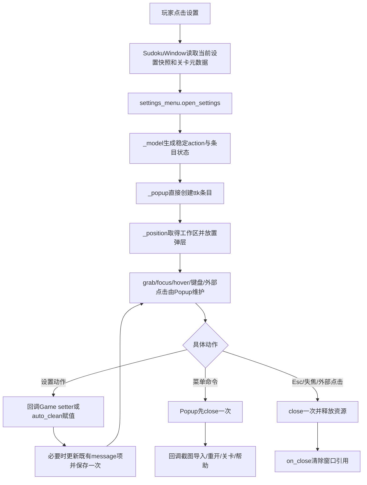
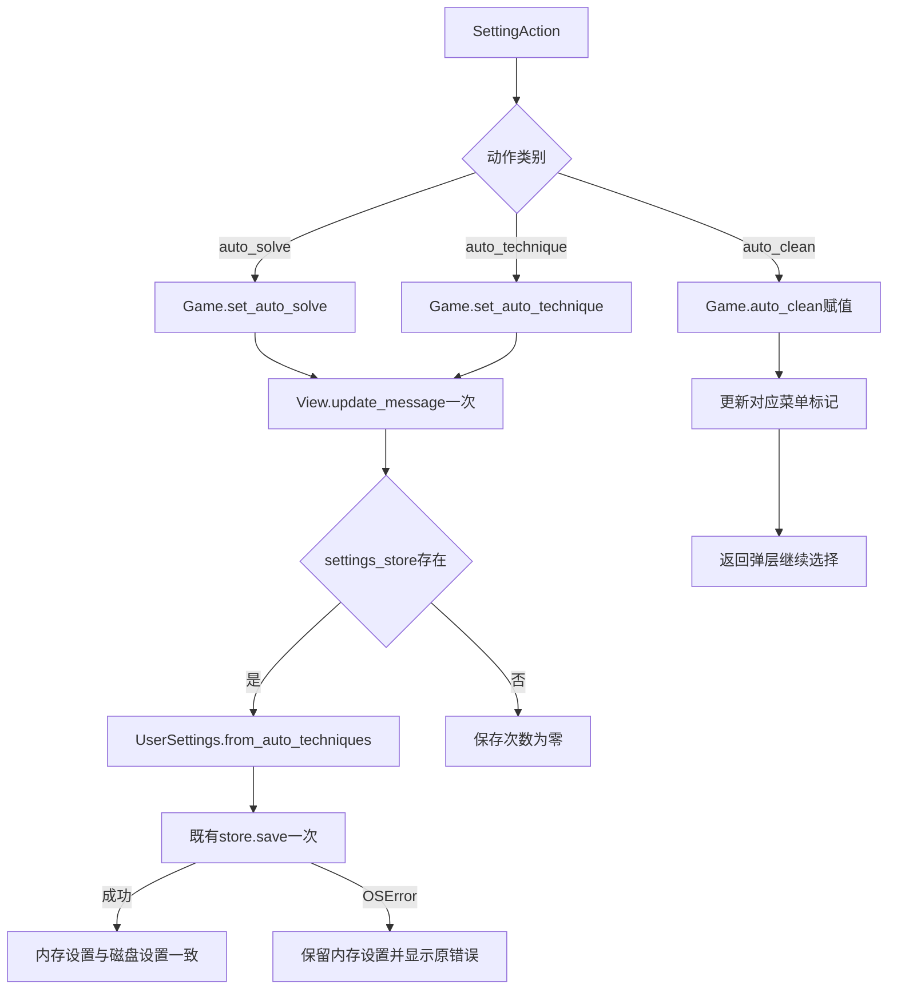
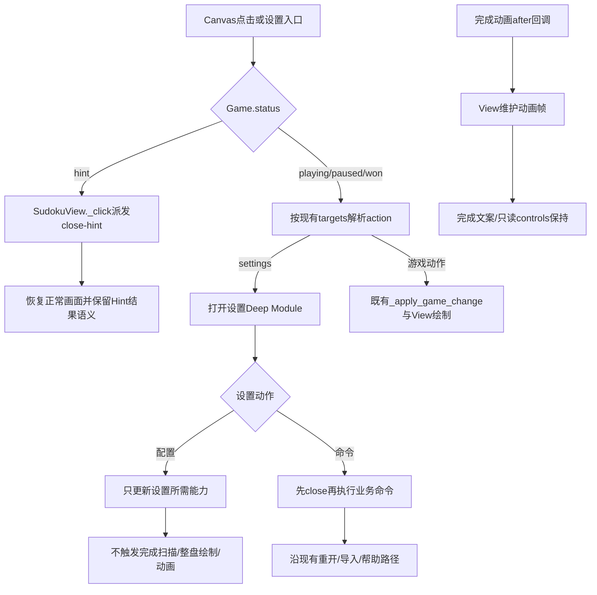
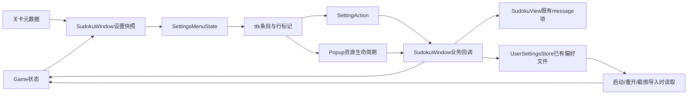

# S1-04 方案设计：设置菜单能力

~~~toml
issue_id = "S1-04"
solution_version = "S1-04-solution-v1"
design_version = "S1-04-design-v1"
artifact_version = "S1-04-design-v1"
status = "completed"
frozen = true
approval_state = "approved"
approval_locator = "docs/01_sprint记录/sprint01/00-联合方案决策/2026-10-06/发布批准记录.md"
~~~

本设计消费 [S1-04 方案决策](S1-04_方案决策.md)、[联合方案](../00-联合方案决策/2026-10-06/联合方案决策.md)、ADR-001、ADR-004、ADR-005 和当前代码/测试事实。设计范围只覆盖设置菜单能力；S1-01、S1-02、S1-03 的实现由各自 Issue Worker 负责。

## 1. 批准方向与设计目标

目标态是一个能力级 Deep Module：调用方提交当前设置快照、已有关卡元数据和具体业务动作回调，模块直接生成设置弹层、维护连续选择和资源生命周期，并把用户动作按闭集回传给 `SudokuWindow`。模块隐藏 Tk 条目布局、悬停展开、键盘、外部点击、焦点、抓取、显示器边界和销毁顺序；调用方只处理当前业务需要的设置动作。

本票保留以下可观察行为：

1. 自动求解总开关、十种算法选择、自动清理、截图导入、重新开始、关卡选择和操作说明的现有标签、顺序、可达性与关闭顺序。
2. 自动求解总开关和算法选择修改 `Game` 配置、更新既有消息项，并在已有 `UserSettingsStore` 时保存一次完整偏好；无 store 时保存次数为零。
3. 自动清理只修改 `Game.auto_clean` 和对应行标记；消息项、store、save、完成单位、整盘绘制、动画和 solver 调用均为零。
4. 设置动作不改变 board、notes、history、mistakes、hint 状态或完成动画进度。
5. 提示画面任意 Canvas 点击仍关闭提示；提示状态下 settings action 不进入设置菜单，直接 Hint 设置回调保持原结果和文本控件身份。
6. 完成态保持完成文案、只读控制和正在运行的动画进度，并允许按现有入口打开设置。

当前机器事实：正式方案在 Sprint 分支 `Sprint01` 的真实 Git 路径为 `docs/01_sprint记录/sprint01/S1-04/S1-04_方案决策.md`，其提交尖端由 HOST 读回为 `1d25126f89e3c682563c44ce54ee67f1d202e6cd`。公开 Stage 读取器按物理大小写别名读取时返回 `publication_input_missing:S1-04:solution_version`；使用实际 Git 小写路径读取同一文件并运行正式元数据解析后，`S1-04-solution-v1` 与 `S1-04-design-v1` 均满足公开版本合同。该 Runtime 定位事实由 S1-01 既有遗留承接，本票沿真实路径继续，不修改共享 Runtime。

## 2. 业务流程设计与闭合证明

### 2.1 设置打开与连续选择



闭合证明：起点是 `SudokuWindow.show_settings` 的 settings action；快照由 `Game.auto_solve`、`Game.auto_clean`、`Game.auto_technique_settings()` 和既有关卡元数据构造；`open_settings` 只创建弹层资源；设置动作返回窗口业务 owner 并循环保持弹层；命令动作先 close 再执行既有命令；所有关闭出口经过同一个幂等 `close`，最终清除窗口引用。每个出口都有真实 Tk 检查：连续勾选、键盘、Esc、失焦、外部点击、重新打开、显示器边界和关闭交错。

### 2.2 配置保存与失败恢复



闭合证明：auto_solve 和 auto_technique 的 producer 是弹层具体 action，consumer 是 `SudokuWindow` 的业务回调；Game setter 保持配置与原消息职责；View 只接收当前既有消息文本；store 由窗口持有并负责保存生命周期。auto_clean 的出口只含内存状态和当前行标记。失败出口保留已写入的内存设置、显示 `OSError` 文案，后续用户动作可再次触发单次保存。

### 2.3 提示与完成态保护



闭合证明：提示状态的 Canvas 全区域 action 仍指向 `close-hint`，直接 Hint 回调不改变控件 identity；完成态的 footer、controls 和 View 动画仍由原 owner 管理。设置配置回调绕过游戏变更通用路径中的完成单位比较，只有对应 setter、必要的既有消息项和既有 store save 被触发。

## 3. 业务逻辑设计与闭合证明

### 3.1 action 正向闭集

`_model.py` 只接受下列具体动作，名称与业务语义一一对应：

| action key | payload | 弹层行为 | 窗口 owner 行为 |
| --- | --- | --- | --- |
| `auto_solve` | `enabled: bool` | 保持弹层 | `Game.set_auto_solve`、更新既有消息项、保存一次 |
| `auto_technique:<name>` | `name`、`enabled: bool` | 保持弹层 | `Game.set_auto_technique`、更新既有消息项、保存一次 |
| `auto_clean` | `enabled: bool` | 保持弹层 | 只赋值 `Game.auto_clean` |
| `import_screenshot` | 无 | 先 close | 调用既有截图导入入口 |
| `restart` | 无 | 先 close | 调用既有重开入口 |
| `level:<title>` | 已有 Puzzle 元数据 | 先 close | 调用既有关卡切换入口 |
| `help` | 无 | 先 close | 调用既有帮助入口 |

`auto_technique:<name>` 的 name 来自 `Game.auto_technique_settings()` 当前目录；未知 name 在构造 action 时返回明确的值域错误，不创建条目，不触发 Game、View、store 或 IO。模块不解释 Game、solver、store 或关卡业务，只负责动作分类、条目状态和资源生命周期。

### 3.2 受影响路径闭合表

| 路径 | 触发/状态 | capability | 字段 producer → consumer | 生产入口 | required checks |
| --- | --- | --- | --- | --- | --- |
| 打开设置 | playing/paused/won | `open_settings` | Game 当前设置、技术条目、关卡元数据 → `_model` | `SudokuWindow.show_settings` | 条目顺序、默认勾选、won 可达、无求解/扫描/整盘 draw |
| 自动总开关 | popup 设置 action | `apply_setting` | `enabled` → Game setter；Game.message → View；Game 状态 → UserSettings | Settings row callback | board/notes/history 不变；message ≤1；已有 store save=1、无 store save=0 |
| 技法选择 | popup 技法 action | `apply_setting` | 技法 name、enabled → Game setter；完整 auto 偏好 → store | 技法 row callback | 连续勾选、action/name 定位、独立保存、solver/完成扫描/draw=0 |
| 自动清理 | popup 设置 action | `apply_setting` | enabled → Game.auto_clean 与 row icon | auto_clean row callback | message/store/save/solver/scans/draw/animation=0 |
| 命令 | popup command action | `run_command` | command/value → 既有 GUI command | command row callback | close 一次后执行；重开/导入/帮助沿原生命周期 |
| 提示点击 | Game.status=hint | `close_hint` | Canvas pointer → fixed `close-hint` | `SudokuView._click` | 任意 Canvas 坐标关闭；Hint 结果/文本控件 identity 保持 |
| 完成态 | Game.status=won | `open_settings` + View footer | Game status → footer/controls；settings snapshot → popup | `SudokuView._draw_play_surface` | footer、只读 controls、动画 frame 保持 |

## 4. 数据流与数据闭环



数据真源与闭环：

1. 算法名称、顺序、标签和默认勾选真源是 `shudu/auto_techniques.py` 与 `Game.auto_technique_settings()`；模块只复制当前快照用于显示，勾选结果由具体 `name` 回传。
2. `Game.auto_solve`、`Game.auto_clean` 和 `Game.auto_techniques` 是运行时设置真源；`UserSettingsStore` 是已有偏好的本地持久化真源，窗口负责其 load/save 生命周期。
3. `SudokuView` 的 message Canvas item 是消息显示真源；`update_message` 只向带稳定 tag 的既有 item 写入 text。won footer 没有 message item 时更新操作返回，不创建控件。
4. `SettingsPopup` 的 row image/checked 是弹层显示状态；每次具体设置 action 同时更新对应 row，继续保持弹层。
5. 数据生命周期是快照 → 具体 action → Game/既有 View/store → 下一次打开/启动恢复；保存失败时闭环回到内存设置和错误提示，下一次设置动作重新执行一次保存。

## 5. 状态流与控制流

### 5.1 Popup 状态

```text
created → posted → focused/grabbed → submenu_visible ↔ menu_visible
                                      ↓
                                   closed
```

`close` 是幂等 capability：第一次释放 `grab`、销毁顶层窗口、清理图片/行引用并调用 `on_close` 一次；后续调用直接返回。设置 action 停留在 `focused/grabbed`；命令、Esc、外部点击、失焦、窗口关闭进入 `closed`。

### 5.2 游戏控制状态

```text
playing/paused/won --open_settings--> popup lifecycle
popup --setting action--> same game state + targeted setting change
popup --command--> closed + existing command lifecycle
hint --Canvas click/key close--> playing/previous hint result contract
won --setting action--> won + footer/readonly/animation preserved
```

状态转换的 owner 是 `SudokuWindow`、`Game`、`SudokuView` 各自现有职责；settings module 只拥有 popup 状态，不拥有游戏状态、solver 状态或持久化状态。

## 6. Module / Interface / Seam / Adapter / 文件布局

### 6.1 Module

`shudu.settings_menu` 是一个 deep Module，公开入口为 `shudu/settings_menu/__init__.py`。它封装当前设置弹层的 Tk 结构、动作分类、行状态、焦点/抓取、定位和关闭生命周期。

### 6.2 Interface

公开 Interface 只保留当前业务需要的能力：

```python
SettingsMenuState(
    auto_solve: bool,
    auto_clean: bool,
    techniques: tuple[TechniqueItem, ...],
    commands: tuple[CommandItem, ...],
)

open_settings(
    root: tk.Misc,
    state: SettingsMenuState,
    on_setting: Callable[[SettingAction], None],
    on_command: Callable[[CommandAction], None],
    on_close: Callable[[], None],
    pointer: tuple[int, int],
) -> SettingsPopup

SettingsPopup.post(x: int, y: int) -> None
SettingsPopup.close() -> None
```

`TechniqueItem` 只携带 `name`、`label`、`checked`；`CommandItem` 只携带闭集 command key 和当前已有显示值。`SettingAction` 只表达上述七类具体动作，回调类型由 `_model.py` 校验。调用方不接触 Tk variable、Tcl command、菜单索引、子菜单坐标或图片对象。

### 6.3 Seam

唯一业务 seam 是 `SudokuWindow.show_settings` 与两个动作回调：

1. `show_settings` 组装快照并调用公开 `open_settings`。
2. `on_setting` 直接调用 `Game` setter/`auto_clean` 赋值，并按动作类别调用 `SudokuView.update_message` 与 `_persist_auto_settings`。
3. `on_command` 绑定现有截图、重开、关卡和帮助入口；Popup 在调用前完成 close。

View 的稳定 `message` Canvas tag 是消息增量更新 seam；`UserSettingsStore.save` 是既有本地持久化 seam；`_monitor_bounds` 是真实显示器定位 seam。保留现有 Screenshot、Game、Hint、solver 公开边界。

### 6.4 Adapter

当前唯一生产 Adapter 是 Tk/ttk：`Toplevel`、`Frame`、`Button`、`PhotoImage`、鼠标/键盘/focus/grab 事件和平台工作区 API。`SudokuWindow` 是业务宿主 Adapter，负责把 Tk action 转换为 Game/View/store/GUI 命令。当前需求没有远端资源、进程、网络或可替换 provider，保持一个 Tk Adapter。

### 6.5 文件布局

```text
shudu/
└── settings_menu/
    ├── __init__.py       # 唯一公开入口：state/action/open/post/close
    ├── _model.py         # 具体条目、action 闭集、快照和值域校验
    ├── _popup.py         # 直接创建 ttk 条目、交互与幂等生命周期
    └── _position.py      # 工作区读取、边界夹取与左右展开定位
```

`sudoku_gui.py` 保留窗口、Game、View、store 和既有命令 owner；`shudu/settings_popup.py` 的设置弹层实现迁入上述 Module，既有 `show_levels` 的独立关卡菜单继续使用其原入口。`shudu/sudoku_view.py` 增加稳定消息 tag 与 `update_message` capability。架构概念按职责分组，物理文件按共同变化的知识保持 locality。

## 7. 输入输出与字段值义

| 字段 | producer | 构造责任 | consumer 不变量 | 生命周期 |
| --- | --- | --- | --- | --- |
| `auto_solve` | `Game.auto_solve` | `show_settings` 读取 bool | `auto_solve` action 只传 bool | 打开快照到下一次打开 |
| `auto_clean` | `Game.auto_clean` | `show_settings` 读取 bool | `auto_clean` action 只传 bool | 打开快照到下一次打开 |
| technique `name` | `Game.auto_technique_settings()` / `auto_techniques.py` | 窗口传当前有序 tuple | name 必须属于当前技术目录 | 当前弹层生命周期 |
| technique `label` | 技术目录 | Game 快照带入 | 只用于显示；action 仍按 name 寻址 | 当前弹层生命周期 |
| technique `checked` | Game 当前集合 | Game 快照带入 | row image 与 action payload 同步 | 当前弹层生命周期 |
| command/value | SudokuWindow 既有命令和 Puzzle | 窗口构造 command metadata | 只回调现有命令 owner | 当前弹层生命周期 |
| message | Game setter 结果 | 窗口读取 `Game.message` | View 只更新稳定既有 item | 当前画面生命周期 |
| settings store | `SudokuWindow.settings_store` | 已有 store 传入 | save 一次或零次，OSError 明确可见 | 窗口生命周期 |
| pointer/work area | Tk root/OS | `_position` 在 post 时读取 | 弹层完全落在工作区 | 每次 post |

边界：空技术集合仍显示所有技术条目；未知技术 name 形成值域错误；没有 store 时动作仍更新内存与消息；won footer 没有 message item；popup 重复 close 直接返回；负坐标和右下边界通过同一工作区夹取函数处理。

## 8. 并发、异步、事件、队列、幂等与恢复

本票采用现有 Tk 事件循环和同步本地保存。用户事件是唯一触发源；不新增线程、队列、流式协议、远端调用或重试。store.save 保持当前一次尝试语义，失败由既有 OSError 对话框反馈；下一次明确设置动作构成新的用户事件。

Popup 资源使用幂等 `close`；`show_settings` 先关闭当前弹层，再创建一个新实例；动作 callback 与 close 顺序固定为设置动作保持弹层、命令动作先 close。真实 Tk 事件测试覆盖快速连续勾选、关闭交错、重新打开、失焦和外部点击，确认资源与 grab 状态回到稳定值。

## 9. 迁移与兼容设计

1. 先在 `settings_menu` 建立 state/action 模型和直接 ttk Popup，以现有标签、顺序和 callback 结果为基线。
2. 将 `SudokuWindow.show_settings`、设置 action 和旧 `SettingsPopup` 适配到公开入口；Game setter、UserSettingsStore、截图导入、重开、关卡、帮助命令继续由原 owner 承担。
3. 将现有索引寻址测试迁移为稳定 action/name 寻址：技术行使用 `auto_technique:<name>`，总开关/自动清理/命令使用业务 action key；测试仍生成相同真实鼠标、键盘和焦点事件。
4. 将 footer message 从每次重绘创建的文本项迁移为稳定 tag；正常状态由 `update_message` 增量修改，won 状态保留现有 completion footer。
5. 新 Interface 行为证据通过后，删除旧 settings popup 的实现与 BooleanVar/`tk.Menu` 反查路径；保留外部关卡菜单的现有 owner和交互。
6. `tests/test_architecture.py` 同步迁移为检查 `settings_menu` 公开入口、Game/View/store 的依赖方向和 completion animation 的 View owner；旧行为断言只有在对应新 Interface 证据通过后才移除。

迁移期间的契约是：每个动作先有新 seam 的 RED 行为检查，再实现最小直接路径，最后运行对应回归；任何新的业务取舍写入标准 Legacy 并保持本票当前批准范围继续。

## 10. 测试设计与测试计划

### 10.1 测试数据与层级

测试数据使用固定最小集合：`tests/test_auto_simple.py` 提供的 `AUTO_NOTES_PUZZLE`、默认 `Game`、`tmp_path / "settings.json"`、固定技术 name 集合和人工最小工作区边界。测试不读取真实用户配置，不依赖变化中的业务文件，不扩大棋盘尺寸或算法输入。

测试层级：

| 层级 | 文件/入口 | 证明范围 |
| --- | --- | --- |
| Module 单元 | 新增 `tests/test_settings_menu.py` | state/action 闭集、name/label/checked 映射、设置/命令关闭分类、重复 close 语义 |
| 真实 Tk 集成 | `tests/test_auto_technique_settings.py`、`tests/test_sudoku_gui.py` | 直接 ttk 行、真实鼠标/键盘/焦点/grab、连续选择、即时保存、失败提示、边界定位 |
| View/状态回归 | `tests/test_completion_view.py`、`tests/test_sudoku_gui.py` | message item、Hint 任意 Canvas 点击、控件 identity、won footer/readonly/animation |
| 持久化回归 | `tests/test_user_settings.py` 与设置 GUI 集成 | exact selection、master off、启动/重开/截图导入恢复、OSError 后内存保留 |
| 架构回归 | `tests/test_architecture.py` | 公开入口、依赖方向、store owner、View animation owner、旧索引断言迁移 |
| 联合 required | `.venv/Scripts/python.exe -B -m pytest -q tests/test_auto_technique_settings.py tests/test_screenshot_import_menu.py tests/test_completion_view.py tests/test_sudoku_gui.py tests/test_user_settings.py tests/test_architecture.py` | 本票受影响完整行为与现有验收语义 |

Windows Tk 是 required 门禁的真实宿主。当前基线是两次完整 pytest 运行均 `237 passed / 1 Tk setup error`，单用例隔离复跑为 `1 passed`；该隔离结果只作为诊断信息，不能替代完整门禁。实施阶段必须取得根因定位、批准范围内修复、完整命令退出码和原始日志，才能更新 `LEG-S1-04-001` 的关闭证据。

### 10.2 防回归矩阵

| 行为 | RED | GREEN | 回归证据 |
| --- | --- | --- | --- |
| 默认条目与 action/name | 新 Module/迁移测试定位失败 | 直接 ttk 条目与稳定 name 通过 | Module 单元 + GUI 默认项 |
| 连续技术选择 | 第二次选择关闭弹层或状态不一致 | popup 保持 mapped/grab，Game/store 与 row 同步 | 真实鼠标/Space/Enter |
| 总开关保存 | setter 触发通用游戏路径或 save 次数不合约 | setter、message、一次 save | board/notes/history snapshot + save spy |
| 自动清理零执行面 | 计数器观察到 message/store/scan/draw/solver | 只有内存和 row 标记变化 | 最小固定盘面计数器 |
| 保存失败 | OSError 后状态丢失或无提示 | 内存保留、原错误可见、下一次可重试 | tmp store failure adapter |
| 提示关闭与控件身份 | Canvas 点击未关闭或重建 Text | 全区域 close-hint，直接回调身份保持 | `test_sudoku_gui.py` |
| 完成态 | 设置动作重建 footer/动画/controls | footer、只读 controls、animation frame 不变 | `test_completion_view.py` |
| close/reopen/position | 重复 close 释放错误或越界 | close 一次，负坐标和右下边界均在工作区 | 真实 Tk + 固定 bounds |

执行面回归记录 read、compute、effect 三类计数：设置打开只读取快照并创建 UI；auto_solve/technique 只调用 setter、既有 message item 更新和最多一次 save；auto_clean 只改内存与 row image。`completed_units`、`draw`、`animate_completed_units`、solver 构造、候选投影和整盘扫描的计数必须保持零。

## 11. Review Focus

1. `settings_menu` 是否只有一个公开入口，调用方是否只传当前能力所需快照和具体回调。
2. action 值域、技术 name 真源、标签顺序和命令分类是否形成正向闭集。
3. Popup 是否直接创建当前 ttk 行并保持悬停、连续选择、键盘、焦点、grab、显示器边界和 close 幂等。
4. `SudokuWindow` 是否只在配置动作读取 Game/更新 View/保存一次，是否继续绕过完成单位扫描和整盘绘制。
5. auto_clean 是否具有真实零 message/store/save/scan/draw/animation/solver 证据。
6. View message 的稳定 item tag 是否与 won footer、Hint Text 控件和完成动画互不冲突。
7. 测试是否使用 action/name 定位和最小固定数据，是否同步迁移旧验收语义。
8. required Tk full gate 是否保留真实 setup error、环境、命令、退出码和日志，未验证项是否保持未通过。

## 12. 实施计划

| Item | 输入 | 实施动作 | 输出标准 | 真实门禁 |
| --- | --- | --- | --- | --- |
| I01 | 本设计第6节 Module 合同 | 建立 `settings_menu` 四文件、state/action 闭集、直接 ttk Popup、position 和 close 生命周期；新增 Module 行为测试 | 公共入口可构造当前条目，连续 action 与 close 生命周期可独立验证 | Module RED→GREEN；固定 bounds、重复 close、action/name readback |
| I03 | 本设计第3、5、10节 View 合同 | 给 View 增加稳定 message tag/update capability，迁移 Hint/完成态保护测试和架构断言 | message 增量更新不重绘；Hint/完成态/动画回归通过 | View/Hint/Completion RED→GREEN；执行面计数 |
| I02 | I01 public Interface、I03 message Interface、本设计第4、7节 | 接线 `SudokuWindow.show_settings` 与 setting/command callbacks，迁移持久化和 GUI 测试，移除旧反查路径 | 四类动作可独立验收，保存失败与无 store 行为明确，所有设置路径不扩大计算面 | GUI required RED→GREEN；完整受影响 suite 与执行面回归 |
| 收尾 | I01/I02/I03 证据、Legacy、Reviewer 结果 | 运行完整 required 命令，生成实施记录、readback 和 Reviewer 输入 | 本票实现/测试/证据满足 frozen design；Tk setup 遗留按真实状态处理 | Full required、Git、TaskRecord、readback |

Item 并行关系：I01 与 I03 无真实接口或数据依赖，可并行；I02 依赖 I01 的公开 settings_menu Interface 和 I03 的 `update_message` seam；收尾依赖三项真实证据。S1-04 对其他 Issue 无前置依赖，跨票集成由 Leader/HOST 在各票 Delivery 后处理。

## 13. to-spec

### Problem Statement

设置弹层把当前 `tk.Menu` 的索引、Tcl variable/command 和 ttk 行构造知识分散在窗口与旧弹层之间；配置动作还进入完成单位扫描、整盘绘制和动画路径，维护设置功能需要理解超出当前动作的游戏知识。

### Solution

建立 `shudu.settings_menu` Deep Module，公开一个设置打开入口和具体动作回调；直接构造当前 ttk 条目，保留设置连续选择和资源生命周期；窗口只负责 Game、View、UserSettingsStore 和既有命令 owner。配置动作按动作类型执行所需的最小读取、计算和副作用。

### User Stories

1. 作为玩家，我可以打开设置并看到当前自动求解、算法和自动清理状态。
2. 作为玩家，我可以连续勾选算法，弹层保持打开，下一次打开仍看到当前状态。
3. 作为玩家，我可以用鼠标、Space、Enter、Esc、失焦和外部点击完成设置操作。
4. 作为玩家，我可以切换自动求解总开关，同时保留已选算法。
5. 作为玩家，我可以在已有本地 store 时即时保存每次自动偏好选择。
6. 作为玩家，保存失败时仍保留本次内存设置并看到明确错误。
7. 作为玩家，我可以切换自动清理而不触发求解、重绘或消息变化。
8. 作为玩家，我可以从设置进入截图导入、重开、关卡和操作说明。
9. 作为玩家，提示画面任意 Canvas 点击仍返回棋盘。
10. 作为玩家，完成画面文案、只读按钮和动画进度保持。
11. 作为维护者，我只需理解设置能力的公开 Interface 就能修改设置弹层。

### Implementation Decisions

- 设置 Module 以 `__init__.py` 作为唯一公开入口，internal 文件按 model、popup、position 的共同变化知识组织。
- Settings state 是当前快照；actions 是具体闭集；Game、View、store 和命令的业务所有权留在窗口及原模块。
- Tk/ttk 是唯一实际 Adapter；同步本地保存和 Tk 事件循环保持现有行为。
- 直接 ttk 条目使用稳定 action/name 定位，业务操作不经菜单索引或 Tcl 变量反查。
- 设置路径不调用 solver、completed unit、全盘 draw、animation 或候选 projection。

### Testing Decisions

- 纯 action/state/position 规则用 Module 单元测试；实际鼠标、键盘、focus、grab、Toplevel 和 Canvas 用真实 Windows Tk 集成测试。
- 配置保存使用 `tmp_path` 的最小文件和受控 OSError seam；固定 `AUTO_NOTES_PUZZLE` 仅用于既有 Game 行为。
- 测试通过公开 Interface、真实动作和既有 Canvas/Store seam 观察外部行为；旧测试逐项迁移为 action/name 定位。
- full required 命令和完整 Tk setup 结果是本票门禁；隔离测试用于定位，不能替代 full gate。

### Out of Scope

- 求解器、逻辑技巧算法、截图识别、持久化格式和完成动画算法的业务变化。
- 远端、异步、队列、重试、provider 注册表和通用菜单框架。
- 其他 Issue 的实现、跨票集成和共享 Skill Runtime 修复。

## 14. to-tickets

本票是一个可独立实施、独立测试、独立验收的纵向 Issue；其内部实施 Items 保持窄范围并声明真实依赖：

| Ticket/Item | What to build | Blocked by | 独立验收 |
| --- | --- | --- | --- |
| I01 设置菜单 Deep Module | 直接 ttk 条目、闭集 action、悬停/键盘/定位/close 生命周期 | None | Module 测试、真实 Popup 交互与边界 |
| I03 View 增量消息与保护 | 稳定 message item/update capability、Hint/完成态/架构测试迁移 | None | View/Hint/Completion 测试和零重绘检查 |
| I02 窗口动作接线与即时保存 | 使用 I01/I03 公开 Interface 接线 Game/View/store/命令 | I01、I03 | 设置行为、保存成功/失败、零执行面和 required GUI suite |

I01 与 I03 可并行；I02 只在两项 Interface 与对应行为证据真实存在后开始。每项只修改其 owner surface；跨票依赖保持为空。

## 15. Implementation Items

### I01

- objective: 直接构造设置 ttk 条目并提供可独立验证的 state/action/close capability；设置动作保持弹层，命令动作先关闭。
- owner_surface: `shudu.settings_menu.open_settings`、`SettingsMenuState`、`SettingAction`、`SettingsPopup.post/close`。
- allowed_scope: 新建 `shudu/settings_menu/__init__.py`、`_model.py`、`_popup.py`、`_position.py` 与对应 Module 测试；迁移旧 `SettingsPopup` 的设置弹层职责，保留现有标签、顺序、交互和定位语义。
- completion_evidence: Module RED→GREEN 记录；固定 action/name 映射；连续鼠标/键盘选择、悬停展开、Esc/失焦/外部点击、负坐标/右下边界和重复 close 的真实 Tk 结果；公开入口、路径、OID、测试命令和 readback。
- required_behavior_checks:
  - `auto_solve`、`auto_technique:<name>`、`auto_clean` 保持弹层，`import_screenshot`、`restart`、`level:<title>`、`help` 先 close。
  - 算法条目沿 `Game.auto_technique_settings()` 的稳定 name/label/checked 顺序生成。
  - 连续勾选保持 popup mapped、submenu mapped 和 grab owner；Space/Enter 触发对应 action。
  - Esc、外部点击、失焦和窗口关闭均只释放一次资源，并允许重新打开。
  - 弹层位置落在固定 monitor work area 内，包含负坐标和右下角输入。
- item_dependencies: []

### I03

- objective: 提供既有 message Canvas item 的增量更新 capability，并保留 Hint、完成 footer、只读 controls 和动画生命周期。
- owner_surface: `shudu.sudoku_view.SudokuView._draw_footer/update_message`、`shudu.sudoku_hint_view` 的现有 close action、对应 View/Hint/Completion/architecture 测试。
- allowed_scope: View footer 稳定 tag、`update_message`、必要的测试断言迁移和架构依赖断言；保持 Game、Hint、completion animation owner。
- completion_evidence: message 更新只改变稳定既有 item 的真实 Canvas readback；won 无 message item 时不创建控件；Hint 任意 Canvas 点击、直接设置回调 Text identity、完成 footer/readonly controls/animation frame 和架构依赖测试通过；计数证明本 Item 不触发 solver 或全盘计算。
- required_behavior_checks:
  - playing/paused 状态 message 更新最多改既有 item 一次，棋盘、controls 和 targets 结构保持。
  - won 状态保留 `completion-status`、`completion-detail`，`update_message` 不创建替代消息控件。
  - Hint 状态任意 Canvas 坐标派发 `close-hint`，直接回调后的文本控件身份和 Hint 结果保持。
  - 完成动画的 `after`、帧颜色和停止逻辑继续由 View 管理。
  - `tests/test_architecture.py` 证明 Settings store 仍由 GUI 持有，Game/View/solver 依赖方向保持。
- item_dependencies: []

### I02

- objective: 将窗口设置入口接到 I01/I03 公开 Interface，完成自动偏好即时保存、失败可见、自动清理零执行面和既有命令兼容。
- owner_surface: `sudoku_gui.SudokuWindow.show_settings`、setting/command callbacks、`_persist_auto_settings`，以及设置/GUI/持久化回归测试。
- allowed_scope: 设置动作接线、Game setter/View message/store save 调用、命令 close 顺序、旧 BooleanVar/`tk.Menu` 设置反查路径迁移、测试 action/name 定位；Game 算法、UserSettingsStore 格式和既有命令实现沿用。
- completion_evidence: GUI RED→GREEN、已有/无 store 的精确 save 次数、OSError 原始错误与内存保留、自动清理零 message/store/save/scan/draw/animation/solver 计数、Hint/完成态/重开/截图恢复回归、required suite 退出码和原始日志、Git/readback。
- required_behavior_checks:
  - `show_settings` 只读取设置快照和关卡元数据，直接打开 settings Module；设置打开零 solver、完成扫描和整盘 draw。
  - auto_solve/auto_technique 只调用对应 setter、更新既有 message item 至多一次，并按 store 存在性执行一次或零次 save。
  - save 抛出 OSError 时 Game 内存值保持，显示既有错误文案，下一次用户动作可重新保存。
  - auto_clean 只更新 Game 内存值和当前 row 标记；message/store/save/scan/draw/animation/solver 计数全为零。
  - setting action 不改变 board、notes、history、mistakes、hint 状态；命令 action close 一次后沿既有业务入口执行。
  - 提示任意 Canvas 点击、直接 Hint 回调、won footer、只读 controls 和动画进度保持。
  - 完整 required 命令真实执行；237 passed/1 Tk setup error 的既有基线只有在根因修复和完整复跑后更新。
- item_dependencies: [I01, I03]

## 16. Legacy 与关闭条件

本票既有 `LEG-S1-04-001` 继续 open：当前完整 pytest 基线为 `237 passed / 1 Tk setup error`，单用例通过不能关闭。实施阶段负责在批准测试范围内复现 Tk 初始化错误、区分环境/资源生命周期、完成真实修复并取得完整 required 通过证据；共享 Runtime Stage reader 大小写定位由 S1-01 既有遗留承接。

本设计不改变历史 Issue 业务正文和状态。设计完成后由独立 `issue-reviewer` 消费本文件；若发现新的业务、架构、owner、依赖或验收取舍，先写标准 Legacy，再按当前批准合同继续可唯一执行的设计范围。
