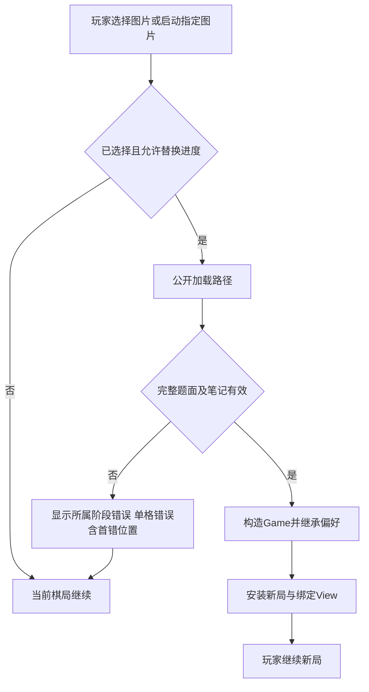
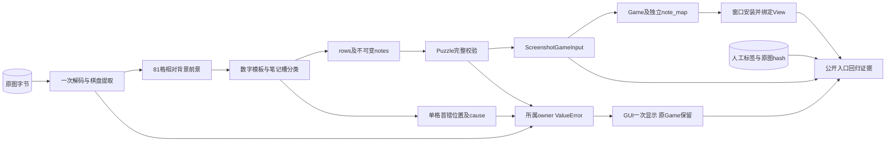
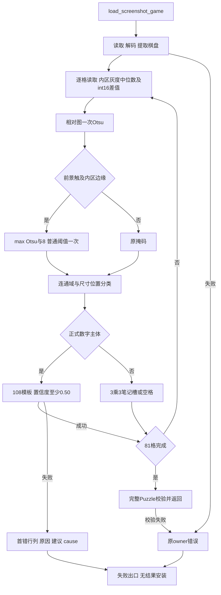

# S1-06 图片导入修复工程设计

~~~toml
artifact_kind = "design"
issue_id = "S1-06"
frozen = true
approval_state = "approved"
approval_locator = "docs/01_sprint记录/sprint01/S1-06/S1-06_执行授权.md"
solution_version = "S1-06-solution-v1"
design_version = "S1-06-design-v1"
artifact_version = "S1-06-design-v1"
~~~

## 1. 输入、目标和验收

消费已提交的 [方案决策](S1-06_方案决策.md)、[共同规格](../00-联合方案决策/2026-10-07/联合方案决策.md) 与 ADR-004、ADR-005。用户授权主 Agent 完成设计和实施至待验收。本设计只展开已确定的三个 Implementation Items。

玩家导入原始微信截图后得到完整题面：24 个正式数字、57 个空格、空笔记。失败时显示首个出错格的一基行列、原始原因及清晰截图建议，当前棋局可继续。有效截图中的正式数字、浅色或深色高亮、候选笔记、中文路径、启动导入和重复导入均维持既有行为。

原图 SHA256 为 `5c98f1e3405225167fdf4d7ea935d7a9748bbb854a7ad3c28929a0faff3388ee`。原图字节作为 fixture；九行人工转录值作为独立标签，程序输出只与标签比较。转录：

```text
..4.8....
.....7..4
..69.5..8
1......6.
34..7..85
...5.....
2.1......
.....9.3.
8..1.2.5.
```

## 2. Module → Interface → Seam → Adapter → 文件布局

| 项 | 固定设计与完成判据 |
| --- | --- |
| Module | 现有 `shudu.sudoku_screenshot` 拥有文件读取、棋盘提取、前景恢复、数字/笔记分类及识别错误。相关修复集中在该 owner。 |
| Interface | `load_screenshot_game(str或Path) → ScreenshotGameInput`；结果由有效 Puzzle 与不可变笔记组成，`note_map()` 返回独立集合。失败为现有 ValueError。调用方仅提供路径。 |
| Seam | 既有公开加载入口同时服务启动、运行中导入及回归测试。无新增调用方参数。 |
| Adapter | 当前本地 OpenCV、NumPy 及本地模板实现；GUI 在已有 `game_from_screenshot` 处把输入转换为 Game。 |
| 文件布局 | 修复留在 `shudu/sudoku_screenshot.py`，测试留在 screenshots 测试簇。设置菜单的必要门禁整改留在其现有目录 owner 内。 |
| Depth / Locality | 调用方获得完整截图恢复能力；若删除该 Module，读取、棋盘定位、前景和 OCR 知识将重新进入启动及菜单调用方。公开依赖保持路径和返回值；移除因新算法失效的 `_sparser_foreground` 内部知识。 |

## 3. 前景恢复逻辑

`_cell_binary`：灰度 → 原有 `max(6,CELL_PIXELS//14)` 裁边 → 内区中位数背景 → int16 差值绝对值 → uint8 相对图 → 一次 BINARY+OTSU。

检查结果掩码四边任一是否有前景。成立时以 `max(otsu_threshold,8)` 再做一次普通 BINARY 阈值；否则直接保留第一张掩码。把结果放回原尺寸零画布。常量 `EDGE_FOREGROUND_MIN_CONTRAST = 8` 由截图 Module 内部拥有。保持现有连通域分类、正式数字中心/尺寸规则、3×3 笔记槽、108 个模板及最低置信度 0.50。

NumPy 计算只处理固定 86×86 内区，采用已有依赖与向量运算。既有决策的 Numba 冷启动实验不支持给此短路径增加编译准备；当前采用 NumPy。

## 4. 错误逻辑和原子安装

`_read_cells` 按 row-major 扫描。仅在 `_read_cell(cell)` 调用处捕获 ValueError：

```python
raise ValueError(
    f"第{row + 1}行第{col + 1}列：{error}。请使用清晰截图重试。"
) from error
```

首次失败立即传播；异常链保留原始错误。文件、棋盘、无正式数字和 Puzzle 校验错误在原 owner 传播。完整九行及笔记验证后返回，GUI 构造完整 Game 后才调用 `_install_game`。失败时 GUI 原有 `showerror` 调用一次，原 Game、View 绑定、board、notes、history、自动总开关、技巧选择与清理偏好均保留。

## 5. 数据与受影响路径闭合

| 路径 / 字段 | producer / 构造责任 | consumer 不变量与生命周期 | 真实入口检查 |
| --- | --- | --- | --- |
| 原图文件 / bytes | 用户原文件；测试直接复制并核对 SHA256 | 一次读取、一次解码；当前调用内释放图像 | 公开加载与 GUI 启动 |
| 单格 / mask | 现有棋盘提取归一化900×900；单格前景 owner 构造100×100 mask | uint8；裁边之外为0；正反字形均可识别 | 有效浅/深底、低对比字形、真实原图 |
| rows / notes | `_read_cells` 构造81值和 frozenset 候选 | 大数字格无笔记；空格无伪笔记；首次失败无返回结果 | 81格独立标签与候选回归 |
| Puzzle / result | 公开加载完整校验后构造 | 九行合法；notes只在空格；调用方获得值结果 | `load_screenshot_game` |
| Game / view | `game_from_screenshot` 构造 board、given、notes、notes_mode、auto_techniques、auto_solve、message；窗口继承auto_clean后安装 | 导入后不立即自动填数；成功绑定同一 Game；失败保持原对象及全部状态 | 启动函数与真实 Tk `_load_screenshot` |
| 单格异常 / message、cause | `_read_cells` 只添加行列上下文 | 一基坐标、首错顺序、原 cause；GUI显示一次 | 实际错误 glyph 经公开加载和 Tk 导入 |
| 可选菜单 focus 检查 / pending id | SettingsPopup 仅拥有其一个 after_idle 任务 | 重复FocusOut合并；完成先清空id；close取消自有任务且只执行一次 | 条件触发时真实Tk瞬变、稳定外焦点、Esc、外点、连续勾选 |

## 6. 能力执行面与机制

截图能力成功最多81格、失败仅扫描至首错；一文件读取、一解码、原有一次棋盘提取。每格 Otsu 一次、总 threshold 最多两次，模板仍为现有108个缓存结果。错误定位复用当前循环，零额外 OCR。截图 Module 无配置写入、子进程或远端操作；GUI只在成功后安装及按既有动作绘制。

当前单次本地导入同步完成；采用现有函数返回值和现有Tk事件。数据是固定9×9小批量；模板缓存沿用现有lru_cache。异步、流式、队列、远端及重试的成立条件为实际业务需要，本票当前事实只满足本地同步恢复。执行面通过公开入口的真实调用计数及架构测试验证。

## 7. 测试设计、命令和 ReviewFocus

| 验收 / 回归 | 测试面 | 判据 |
| --- | --- | --- |
| 原始 JPEG | `test_screenshot_foreground.py` 经公开加载、Game启动 | 原字节hash；81值、24given、57blank、notes{} |
| 有效前景 | 同文件公开加载；保留原 `test_sudoku_screenshot.py` | 深/浅底、平底/边缘噪声、低对比无触边字形；数字和候选均保持 |
| 首错定位 | `test_screenshot_errors.py` 实际失败glyph；通过公开加载 | 一基坐标、首错row-major、准确原因、cause ValueError |
| 其他错误 | 公开加载不存在文件、坏文件、无棋盘、无正式数字 | 原owner文本；无单格坐标 |
| GUI安装 | 扩展 `test_screenshot_import_menu.py` 调用实际loader | 成功新局值正确、偏好继承、重复安装；失败完整旧局和一次错误 |
| 实际执行面 | 公开加载入口观察读取/解码/单格/阈值/模板调用；现有架构检查 | 成功81、失败前缀、最多两阈值/格、一读一解码；无额外配置/子进程/远端 |
| 设置菜单门禁 | 原业务断言与真实焦点前置；若证据触发，最小生命周期回归 | 持续勾选保留，稳定外失焦/Esc/外点关闭，资源一次释放 |
| 整体兼容 | 全部既有测试加新增；ruff修改文件 | 同一最终tip、同一环境连续三轮完整pytest退出0；保留既有有效断言 |

正式 Issue worktree 使用其自身 `.venv`，`uv sync --locked` 后验证解释器和依赖。聚焦命令：`.venv/Scripts/python.exe -B -m pytest -ra tests/test_sudoku_screenshot.py tests/test_screenshot_import_menu.py tests/test_architecture.py tests/test_screenshot_foreground.py tests/test_screenshot_errors.py`。完整命令：`.venv/Scripts/python.exe -B -m pytest -ra`。质量命令：`.venv/Scripts/ruff.exe check <本票修改Python文件>` 和 `ruff format --check <同集合>`。

ReviewFocus：公开契约完整；原图与独立标签分离；阈值条件精确；uint8差值不回绕；错误范围及cause；GUI零失败安装；低对比有效前景；完整回归及真实Tk失焦行为；读取/计算/副作用预算有真实证据。

## 8. 门禁失败处理

当前原图公开调用重现0.12置信度错误。历史完整测试曾出现设置菜单None，直接事件根因尚待验证。先建立应用映射、root.focus_force与root.update的真实焦点前置，保留业务断言。只在实际诊断证明瞬时FocusOut错误关闭时整改现有owner：每个popup一个after_idle，重复事件合并；回调先清pending，关闭态退出、内部focus保留、稳定None/外部focus关闭。close先置关闭态并取消自有pending，再执行既有on_close、grab释放、destroy及引用清理；Esc/外点/命令仍立即关闭。实际失败发生后修复所属owner并重新完整三轮；直接复现与机制探针分别报告。

## 9. Implementation Items、DAG与执行计划

只有S1-06一个可执行Issue，Issue依赖边为空，并行组为{S1-06}，关键路径为S1-06。主Agent拥有本票三个Items，独立评审只读设计与实现。

### I01 — 原图及有效截图完整恢复

- objective：公开截图加载准确恢复用户原图，保持正式值与笔记语义。
- owner_surface：`shudu.sudoku_screenshot.load_screenshot_game` 的单格前景恢复能力。
- allowed_scope：`_cell_binary`、内部floor常量及失效helper删除；原图bytes、独立标签和公开入口测试。
- completion_evidence：新增行为测试真实RED→GREEN；81格/24given/57blank/notes{}；有效截图、执行计数、Game真实结果。
- required_behavior_checks：int16相对背景、原裁边、边缘条件、一次Otsu至多两threshold；模板108/置信度0.50/3×3笔记保持；一读一解码；成功81、失败前缀；fixturehash及人工标签。
- item_dependencies：[]。

### I02 — 首错定位和失败后保留棋局

- objective：玩家定位首个无法识别格，当前棋局仍可继续。
- owner_surface：`_read_cells` 的单格识别错误上下文与既有 GUI 导入契约。
- allowed_scope：只包装 `_read_cell` ValueError；固定消息和cause；实际失败glyph、公开加载与真实Tk回归。
- completion_evidence：位置行为测试RED→GREEN；真实首错、cause及GUI一次对话框/完整状态快照；其他owner错误保持。
- required_behavior_checks：row-major一基首错；无额外读取/OCR；成功契约保持；失败无新局安装、board/notes/history/偏好/view绑定一致。
- item_dependencies：[]。与I01函数修改互不重叠，允许同文件并行；主Agent按测试和编辑顺序执行。

### I03 — 全量门禁、评审与交付

- objective：当前全部测试修复并完成工程待验收。
- owner_surface：本票required checks、真实Tk门禁和交付载体。
- allowed_scope：本票测试、实际失败的焦点测试前置及ADR-005批准的必要生命周期整改、质量修正、评审整改、精确提交和Sprint集成。
- completion_evidence：同一最终tip和环境连续三轮完整pytest退出0、ruff通过、独立实施评审release、Sprint合并及待验收readback。
- required_behavior_checks：全部原测试和新增集合；原Hint/求解/偏好/Numba/UI语义保持；真实Windows焦点/资源行为；所有items证据可定位。
- item_dependencies：[I01,I02]。

Item DAG：I01与I02可并行 → I03。HOST材料化ID、owner paths/symbols、digest、Git OID、命令和exit code；LLM只判断语义和结果。每个Item先RED再实现、GREEN和required回归，最后独立评审及交付。

## 10. 闭合业务流程图



## 11. 闭合数据流程图



## 12. 闭合逻辑设计图



## 13. 阶段输出和完成标准

设计输出为本文件、设计总结、HOST材料化Items及独立设计评审release；绑定正式solution版本，状态读回方案已设计。实施输出为实际代码/测试、RED/GREEN与完整门禁证据、正式实施总结及独立实施评审release；完成Sprint合并、tracker待验收与真实Git读回。历史S1-01至04保留待验收，S1-05/07/08保留已取消。

ADR-004/005足以约束当前修复，无新增ADR取舍。Runtime路径及提交能力缺口沿[遗留](S1-06_遗留问题.md)保留原始错误，由独立owner后续修复Rust/TypeScript；本票在既定授权内用HOST等价效果和真实验证继续。
