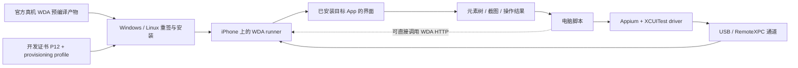
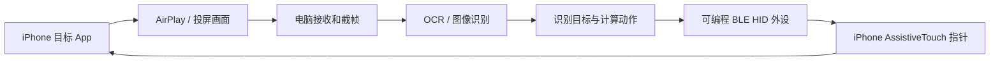

# Windows 10 / Ubuntu 26 操作真实 iPhone 界面的研究

研究日期：2026-10-07（北京时间）。研究场景：电脑自动操作真实 iPhone 上已经安装的第三方 App，用户完全没有可用 Mac。用户尚未提供 iPhone 型号、iOS 版本、目标 App、具体流程、签名资产以及 Ubuntu 26 的具体版本和运行形态。本轮完成了一手文档与维护者源码核验，尚未连接手机、安装软件或执行真机验证。

## 结论与选择

**Windows 和 Linux 都已有可用来搭建 iOS 自动化的工具路线。长期脚本优先研究 WebDriverAgent（WDA）；Windows 上的快速操作实验可先评估投屏控制软件；Ubuntu 上的本地视觉方案需要分别解决画面获取和输入。** 目前最清楚的完整软件路线是“官方预编译 WDA → Windows/Linux 重签安装 → 直接调用 WDA，或接入支持非 macOS 主机的 Appium XCUITest driver”。Appium 官方明确把 Windows/Linux 支持限定为有限支持，当前非 macOS 模式要求真实设备运行 iOS/tvOS 18 及以上。[Appium 非 macOS 主机指南](https://appium.github.io/appium-xcuitest-driver/11.17/guides/non-macos-hosts/)

**决定能否落地的关键是手机版本与 WDA 签名资产。** 将电脑从 Windows 10 换成 Ubuntu 26 可以改变驱动、权限与部署方式；现有证据不足以证明这次切换必然解决设备连接或签名问题。官方文档覆盖 Windows/Linux，没有给出本轮用户的 Windows 10、Ubuntu 26 和 iPhone 组合的实测结果。

| 路线 | Windows 10 | Ubuntu 26 | 主要前提 | 研究判断 |
| --- | --- | --- | --- | --- |
| WDA + go-ios / pymobiledevice3，直接脚本或 HTTP 调用 | 工具声明支持 Windows；需核验 Apple 设备驱动 | 工具声明支持 Linux；需核验 usbmuxd 和隧道环境 | 有效签名的真机 WDA runner、手机开发者模式、配对及版本匹配 | 少量点击、滑动、输入和截图的首个验证对象；也能按元素操作 |
| WDA + Appium 3 + 支持非 macOS 的 XCUITest driver | 官方有限支持 | 官方有限支持 | 当前模式 iOS 18+；显式 UDID/iOS 版本；WDA；RemoteXPC 隧道 | 长流程、标准客户端和持续维护的优先候选 |
| AirDroid Cast 桌面客户端 + 画面识别 / 桌面操作脚本 | 厂家声明控制功能要求 Windows 10 1803+ | 当前资料没有证明 Linux 桌面控制客户端支持 | 手机与电脑配对、控制功能套餐、实际蓝牙/输入兼容性 | Windows 上验证人工鼠标控制的快捷候选；脚本自动化层需另行搭建 |
| UxPlay + 可编程 BLE HID + 画面识别 | UxPlay 可运行，开发链更需核验 | 适合研究 Linux 画面接收；具体 Ubuntu 26 未实测 | AirPlay 画面链、AssistiveTouch、BLE HID 外设及控制程序 | 开源本地候选，需要外设和固件开发；组合链路尚未实施 |
| 快捷指令 / App Intents | 动作实际在 iPhone 执行，电脑触发需另行核验 | 同左 | 目标 App 已提供所需动作 | 如果覆盖业务动作，优先使用；适用范围由 App 暴露的动作决定 |

表中跨平台工具声明分别见 [go-ios](https://github.com/danielpaulus/go-ios)、[pymobiledevice3](https://github.com/doronz88/pymobiledevice3)、[AirDroid Cast](https://www.airdroid.com/cast/)、[UxPlay](https://github.com/FDH2/UxPlay)、[Apple App Intents](https://developer.apple.com/documentation/appintents)。这些声明构成候选依据，尚未构成用户设备上的成功证据。

## 路线一：WebDriverAgent 驱动手机界面

WDA 是运行在 iPhone 上的 WebDriver 服务，使用 XCTest 调用设备上的界面操作能力，可以启动/结束 App、点击、滚动和检查界面元素。电脑发送命令，手机执行命令。[WDA 项目说明](https://github.com/appium/WebDriverAgent/blob/v16.14.1/README.md)

对已从 App Store 安装的第三方 App，研究路线是**签名安装 WDA runner，然后用目标 App 的 bundleId 启动或激活已有 App**。Appium 的 `appium:bundleId` 用于指定被操作的 App；`appium:app` 用于提供要安装的包，这两个用途可以分别处理。因此，一般的已有 App 界面操作无需目标 App 源码，也无需重签目标 App。具体 App 是否能提供所需元素、是否能完成整个流程，仍须真机检查。[Appium capabilities](https://appium.github.io/appium-xcuitest-driver/11.17/reference/capabilities/)



### 首次准备与后续运行

首次准备需要取得真机 WDA 产物、完成签名并安装到手机。后续运行需要启动或复用 WDA、建立设备通信，再发送操作命令。**运行 XCTest 的工具支持 Windows/Linux，并不自动意味着它能够从 WDA 源码完成首次构建；已有预编译产物可以承接这一步。**

1. **取得真机预编译包。** 本轮读取官方 release API，当前观察到 WDA `v16.14.1`，发布日期为 2026-10-07，包含 `WebDriverAgentRunner-Runner.zip`；同时另列 `WebDriverAgentRunner-Build-Sim-arm64.zip` 和 `WebDriverAgentRunner-Build-Sim-x86_64.zip`。前者的发布流水线使用 `generic/platform=iOS`、`Debug-iphoneos`，构建脚本使用 `ARCHS=arm64` 与 `CODE_SIGNING_ALLOWED=NO`。该包需要后续有效签名。发布流水线的编译工作由项目的 macOS/Xcode 环境承担。[官方 release](https://github.com/appium/WebDriverAgent/releases/tag/v16.14.1)、[发布流水线](https://github.com/appium/WebDriverAgent/blob/v16.14.1/.github/workflows/publish.js.yml)、[真机构建脚本](https://github.com/appium/WebDriverAgent/blob/v16.14.1/Scripts/ci/build-real.sh)
2. **准备用户的签名资产。** P12 必须含证书和对应私钥；开发 provisioning profile 应匹配 WDA bundle ID、证书和该手机 UDID。go-ios 已提供通过 App Store Connect 创建开发签名资产的功能，以及用 P12/profile 重签并安装 WDA 的功能。[go-ios 签名实现](https://github.com/danielpaulus/go-ios/blob/273d3e06e803fb6ee95e4df914d8be82c5ee4bb0/ios/signing/signing.go)、[App Store Connect 实现](https://github.com/danielpaulus/go-ios/blob/273d3e06e803fb6ee95e4df914d8be82c5ee4bb0/ios/signing/appstoreconnect.go)
3. **安装并准备设备。** 手机需完成信任/配对，并开启 Developer Mode。Apple 官方步骤是在“设置 → 隐私与安全性 → 开发者模式”开启，重启后再次确认。本轮没有执行这些设备动作。[Apple Developer Mode](https://developer.apple.com/documentation/xcode/enabling-developer-mode-on-a-device)
4. **建立设备通道和启动 WDA。** 使用 Appium 当前非 macOS 模式时，按其 RemoteXPC 文档准备平台依赖、创建隧道，保持隧道进程与 Appium server 都在运行；WDA 使用 `usePreinstalledWDA` 或通过 `webDriverAgentUrl` 接入已运行服务。[Appium RemoteXPC 隧道](https://appium.github.io/appium-xcuitest-driver/11.17/guides/remotexpc-tunnels-real-devices/)

本轮也核验了 go-ios 已发布的 `v1.3.2` CLI 合同，包含 `sign provision appstoreconnect`、`sign app`、`ui download`、`ui install`。签名库使用纯 Go 实现，不依赖 Apple 的 `codesign` 命令或 macOS，并处理 framework、plugin 和 XCTest 等嵌套包。[go-ios v1.3.2 CLI](https://github.com/danielpaulus/go-ios/blob/v1.3.2/internal/clihelp/help.yaml)、[go-codesign](https://github.com/aluedeke/go-codesign)、[嵌套签名实现](https://github.com/aluedeke/go-codesign/blob/5ed22b985417372f2aed2e2d4abcef8a47283df2/pkg/codesign/resign.go)

由这些一手资料可以推断：**在具备有效签名资产时，用户可尝试完全在 Windows/Linux 完成预编译 WDA 的重签、安装与运行。** 本轮未验证上述版本之间的实际组合，也未执行证书创建、重签、安装或手机运行。

### 签名资产的成本与边界

Apple Developer Program 官方标价为 **99 美元/年**，实际地区结算以 Apple 为准。Apple 官方说明，免费 Personal Team 的 App ID、设备、证书和 profile 由 Xcode 管理，相关 profile 7 天到期；加入 Developer Program 后可使用 Certificates, Identifiers & Profiles 和 App Store Connect。go-ios 的 App Store Connect 自动获取路线还需账号具备对应 API 权限。[Apple Developer Program](https://developer.apple.com/programs/)、[Apple 开发者账号说明](https://developer.apple.com/help/account/basics/developer-account-overview)

Sideloadly 官方证明它可在 Windows 用免费或付费 Apple ID 对普通 IPA 侧载，并提供重新签名功能；免费账号侧载有效期为 7 天。针对后续数独目标的研究找到 SideTap：其源码读取免费侧载产生的签名资产，再用 go-ios 修复 WDA 嵌套包签名，维护者记录了自己的真机恢复案例。当前官方 WDA ZIP 与其文档所需 IPA 存在准备差异，用户设备兼容仍待验证。详情见[数独接入决策地图预览](接入路线与决策地图快照.md)。[Sideloadly 官方说明](https://sideloadly.io/index.html)、[SideTap 固定版本签名源码](https://github.com/ucsandman/SideTap/blob/bc43e6f56b199a28c44ca6f696fba42e5f2194a4/src/phone_harness/signing.py)、[维护者案例](https://github.com/ucsandman/SideTap/blob/bc43e6f56b199a28c44ca6f696fba42e5f2194a4/docs/ERRORS.md)

### Windows 与 Ubuntu 的具体差异

| 环节 | Windows 10 | Ubuntu 26 / Linux |
| --- | --- | --- |
| USB 设备发现 | Appium 官方要求 Apple Mobile Device 驱动，独立版、非 Microsoft Store 的 iTunes 安装包提供驱动 | pymobiledevice3 平台说明要求 usbmuxd；USB 设备访问和实际服务状态需检查 |
| Appium 当前隧道 | 使用 `appium-ios-remotexpc`，核验驱动、隧道和 RSD 服务目录 | 加载 TUN/TAP、授予所需权限，并安装 `iproute2`；保持隧道运行 |
| 软件运行范围 | 官方支持类别为 Windows，Win10具体构建与设备组合仍待验证 | 官方支持类别为 Linux，Ubuntu26小版本、原生安装/WSL/虚拟机形态仍待确认 |
| WDA 准备 | 可用 go-ios 对预编译包重签安装 | 同样可用 go-ios 对预编译包重签安装 |

来源：[Appium RemoteXPC 平台要求](https://appium.github.io/appium-xcuitest-driver/11.17/guides/remotexpc-tunnels-real-devices/)、[pymobiledevice3 平台安装说明](https://github.com/doronz88/pymobiledevice3/blob/90b8d44c83999db6c57e5fbcd5b796be5567de3f/docs/installation.md)。选择系统时，优先沿用已有可维护的运行环境，再通过同一手机的最小验证比较两端连接表现。

### iOS 版本与工具选择

当前 Appium 非 macOS 主机指南要求 **iOS 18+**；pymobiledevice3 则另有 iOS 17 通信路线。其当前隧道文档说明，iOS 17.4+ 可使用进程内、无需管理员的 userspace 通道，Linux/Windows 上的 iOS 17.0–17.3.1 通常需要有权限的 `tunneld`。不同工具的隧道和支持矩阵应分别核对。[pymobiledevice3 iOS17 隧道指南](https://github.com/doronz88/pymobiledevice3/blob/90b8d44c83999db6c57e5fbcd5b796be5567de3f/docs/guides/ios17-tunnels.md)

本轮观察到 WDA `v16.14.1` 工程声明 `IPHONEOS_DEPLOYMENT_TARGET=15.0`。这只是工程配置，**不能替代 Appium 非 macOS 模式的 iOS18门槛，也不能保证当前 release 在所有 iOS15+ 设备上运行**。WDA、driver、手机系统和开发者镜像需作为一组版本核验。[WDA 工程配置](https://github.com/appium/WebDriverAgent/blob/v16.14.1/WebDriverAgent.xcodeproj/project.pbxproj)

go-ios、pymobiledevice3 可以启动已安装的 runner。pymobiledevice3 当前 WDA CLI 支持 `--xctrunner`，并可按 selector 点击、滑动、输入、截图及获取状态。少量操作可以从这层开始；需要标准 Appium 客户端及完整会话管理时再接 Appium。[pymobiledevice3 WDA CLI 源码](https://github.com/doronz88/pymobiledevice3/blob/90b8d44c83999db6c57e5fbcd5b796be5567de3f/pymobiledevice3/cli/developer/wda.py)

旧 tidevice 本体的维护者明确说明暂停维护、未实现 iOS17 支持，并推荐 go-ios、pymobiledevice3 等项目。Airtest 的官方连接文档仍把正确安装的 WDA 作为前提；其 iOS-Tagent 页面列出的测试范围到 iOS16.7.1，旧“用 Windows 启动 WDA”教程主要描述后续运行。[tidevice 维护状态](https://github.com/alibaba/tidevice)、[Airtest iOS 连接文档](https://airtest.doc.io.netease.com/en/IDEdocs/3.2device_connection/4_ios_connection/)

### Appium 会话示意

以下仅是已签名安装 WDA、隧道已准备后的能力配置示例；占位符必须替换为实机读回值。本轮没有运行此配置。

```json
{
  "platformName": "iOS",
  "appium:automationName": "XCUITest",
  "appium:platformVersion": "<实际 iOS 版本，当前非 macOS 模式需 18+>",
  "appium:udid": "<手机 UDID>",
  "appium:usePreinstalledWDA": true,
  "appium:updatedWDABundleId": "<WDA 实际安装的完整 bundleId>",
  "appium:updatedWDABundleIdSuffix": "",
  "appium:bundleId": "<目标 App 的 bundleId>",
  "appium:noReset": true
}
```

空 suffix 表示使用所填的完整 WDA bundle ID；通常默认会添加 `.xctrunner`，所以必须与签名/安装结果对应。若 WDA 已由外部工具启动，可以按官方指南改用 `appium:webDriverAgentUrl` 指向可达服务地址。[预安装 WDA 指南](https://appium.github.io/appium-xcuitest-driver/11.17/guides/run-preinstalled-wda/)

## 路线二：画面识别与鼠标输入

这条路线由两条独立通道组成：iPhone 将画面传给电脑；电脑另行向 iPhone 发送鼠标/键盘输入。Apple 官方支持通过 AssistiveTouch 连接有线鼠标、触控板或辅助蓝牙设备，并以屏幕指针点击图标。因此，输入端可以研究 HID 外设通路，无需在手机安装开发签名的 WDA runner。[Apple 指针设备与 AssistiveTouch](https://support.apple.com/en-us/111775)



上图的自动识别、电脑到 HID 的命令桥及反馈闭环是**待开发、待验证的组合方案**。HID 鼠标常用相对位移，桌面画面坐标需要处理缩放、方向、指针位置与加速；脚本需要在动作后检查新画面，以确认点击结果。普通电脑蓝牙适配器能配对设备，也不自动证明它已经提供可编程 HID 外设能力。

**Windows 快速实验：AirDroid Cast 桌面客户端。** 官方页面声明可以用电脑鼠标键盘控制 iPhone/iPad，控制功能要求 Windows 10 1803+；Cast Web 没有手机控制功能，控制需要桌面客户端。Standard 套餐当前官网价为 29.99 美元/年或 3.49 美元/月，并列出 iOS 控制。它证明厂家提供了人工控制产品，不证明已经提供脚本 API；电脑端图像识别与输入自动化属于另加的一层。[AirDroid Cast 产品与系统要求](https://www.airdroid.com/cast/)、[官方套餐](https://www.airdroid.com/pricing/airdroid-cast/)

本轮 AirDroid iOS 控制教程的完整正文没有取得：AnySearch 提取失败、同代理直读原页面返回403。因此，教程中的蓝牙5等细节只见搜索片段，本报告不把它作为已完整核验的硬件条件。购买前应先用用户的设备核验真实配对与手动控制。[AirDroid 官方支持中心](https://help.airdroid.com/)

ApowerMirror 厂家2021年的教程描述过蓝牙控制 iOS。这是一份旧教程，现有证据不足以给出现版本与用户 iOS 的兼容保证，可保留为次选实验对象。[厂家 iOS 控制教程](https://www.apowersoft.com/control-iphone-pc.html)

**Ubuntu 本地候选：UxPlay + BLE HID。** UxPlay 是开源 AirPlay 接收端，可在 Linux 接收 iPhone 画面，也支持 Windows；本轮把它作为画面层。输入可以单独研究 ESP32 BLE HID：维护者的 HijelHID_BLEMouse README 声称在 iOS26.3 测试，要求开启 AssistiveTouch，并提供移动/点击/滚轮API。这属于维护者测试证据。电脑经 USB 串口向 ESP32 固件下发动作、固件再发送 BLE HID 的完整组合是本轮推断，尚未实现。[UxPlay](https://github.com/FDH2/UxPlay)、[HijelHID_BLEMouse](https://github.com/HijelHub/HijelHID_BLEMouse)

## 优先检查 App 已提供的业务动作

Apple App Intents 让 App 把业务动作和数据开放给 Siri、快捷指令等系统功能。若目标 App 已提供“打开某内容、保存、查询、发送”等所需动作，可以研究用这些动作组成流程，降低界面识别的工作量。支持范围以该 App 实际提供的动作和参数为准；电脑怎样触发该手机快捷指令、是否需要手机确认，本轮尚未验证。[Apple App Intents](https://developer.apple.com/documentation/appintents)

## 最小验证步骤

下面是后续技术验证建议，不表示本轮已经实施。

1. **读回设备和目标。** 记录手机型号、实际iOS版本、目标App及bundleId，选一个可以恢复的三步流程，例如“打开页面 → 点进入详情 → 返回”。同时确认现有签名资产、Windows10构建号、Ubuntu26具体版本及原生/WSL形态。
2. **验证设备通道。** 使用选定工具读回UDID、系统版本和已安装App；Appium路线还要读回隧道/RSD目录。完成条件是明确识别同一手机并能持续通信，保留命令、版本、退出码和日志。
3. **验证WDA准备。** 核对下载的是真机包，profile包含手机UDID并匹配证书与WDA bundleId；签名、安装后读回实际安装ID。WDA启动后获取真实状态响应和一张手机截图。安装成功、进程存在与HTTP服务可用应分别确认。
4. **验证目标App的一次操作。** 通过bundleId激活已有App，检查页面元素，点击一个可恢复的目标并验证新界面。元素暴露不佳的自绘/Canvas界面可再评估截图与坐标；不得由WDA启动成功推导所有App均可自动化。
5. **验证短流程稳定性。** 建议先连续执行20次同一三步流程，记录成功次数、单次时长、断连、定位错误与截图。若流程会写入业务数据，应换成可恢复的实验流程或先明确实验对象。达标后再扩大到长流程。
6. **如果选择画面/HID路线。** 先人工验证“看到实时画面 → 鼠标点击改变手机界面”，再让脚本做一次识别和点击，最后加入动作后的画面检查。Ubuntu候选需要分别验证UxPlay画面、HID配对、电脑到外设的命令桥，最后验证组合链路。

## 核验范围、未知与请求异常

**已核验：** 当前Windows系统代理启用，代理地址为 `127.0.0.1:47891`；联网子进程显式使用相同HTTP/HTTPS代理，绕过项限于本地回环地址。AnySearch的code垂直发现、检索及多项原文提取成功；部分提取失败后，通过同一代理读取精确一手URL。WDA release元数据、固定tag的发布脚本、go-ios与pymobiledevice3源码均已读取。

**尚未核验：** 用户手机实际iOS/App、签名资格和资产、设备驱动、USB/蓝牙硬件、Windows10与Ubuntu26的具体组合、WDA深签/安装/启动、目标App元素树、手势与输入效果、投屏延迟及长期稳定性。免费Apple账号的无Mac WDA全流程、AirDroid脚本化能力、Ubuntu视觉/HID组合链路仍属于待验证范围。

| 本轮实际请求异常 | 处理及证据边界 |
| --- | --- |
| AnySearch提取Apple指针设备页面失败（request ID前缀 `0c573190`） | 同代理直读Apple官方页面HTTP200，已取得正文 |
| AnySearch提取AirDroid iOS控制教程失败（request ID前缀 `1a7eb7e4`）；原网页直读403 | 保留失败；未把搜索片段中的蓝牙版本要求升级为正文结论 |
| AnySearch提取go-ios索引的 `_autodocs/api-reference/signing.md` 失败（`5209aea1-e918-4f8b-ba4b-7406541faac6`）；原路径404 | 通过真实GitHub tree定位现存signing源码，以固定commit源码支持结论 |
| AnySearch提取pymobiledevice3索引的 `cli/developer/wda.py` 失败（`41d5ab60-619d-4e23-a79a-cab7056e4ab4`）；原路径404 | 当前真实路径带 `pymobiledevice3/` 前缀；已读取固定commit的正确源码 |
| AltServer安装文档提取失败（`cb4f2e8f-4761-4008-a9ec-c90be66981cb`），所请求路径直读404 | 未建立AltServer与WDA runner的兼容结论 |
| Windows curl直读GitHub时出现 `CRYPT_E_REVOCATION_OFFLINE` | 改用已核验的Python requests，同代理、TLS校验保持开启，精确源URL读取成功 |

本次交付状态为**研究完成，设备兼容和自动化流程待技术验证**。按目前证据，已有或能够取得开发签名资产且手机iOS18+时，优先做WDA最小验证；仅希望尽快确认Windows能否控制当前手机时，先验证桌面投屏控制，再决定是否需要识别脚本或完整Appium链路。
