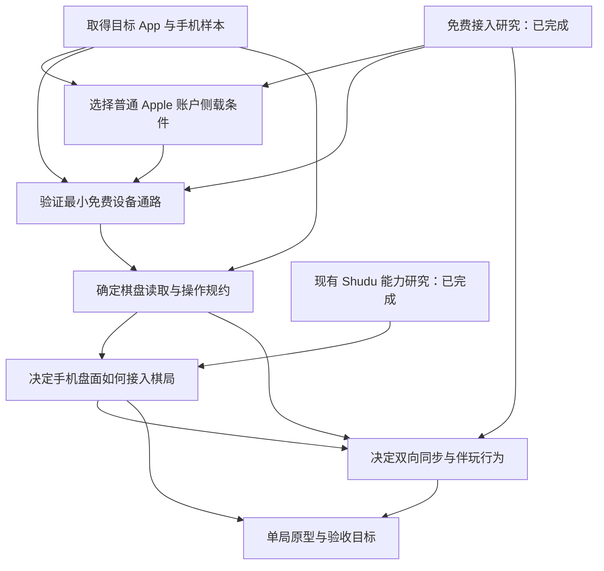

# Shudu 与 iOS 数独双向同步：接入路线与决策地图快照

2026-10-07。本文件保存本次预研的路线与决策状态快照。后续继续 wayfinder 时读取[当前工作地图](../../../../.scratch/ios-sudoku-companion/map.md)与其子票状态。

## 目标

在电脑上的现有 Shudu 中手动操作、按指定算法自动求解、一键笔记和查看提示；操作应用到目标 iOS 数独 App，手机手动填数、擦除或修改笔记后自动同步到电脑。条件为软件免费、当前没有开发者账号、完全没有 Mac。Windows 10 与 Ubuntu 26 均为候选。

## 当前发现

现有 Shudu 已提供无 GUI 的截图输入、笔记计算、Hint 与所选算法求解能力。设备读取、手机动作和同一局的外部状态同步仍需接入。当前截图把全部大数字合入题面，导入后成为固定线索；接收手机中途棋局需要保留线索数与玩家已填值的区别。

免费接入已找到 Windows 候选 SideTap：固定源码包含普通 Apple 账户侧载后的签名材料读取、WDA 嵌套签名修复和启动；维护者也记录了自己的真机案例。当前官方 WDA 真机 ZIP 与 SideTap 教程预期 IPA 存在包准备差异，用户设备尚未测试。Ubuntu 的免费首次签名准备链仍缺完整证据。是否采用普通 Apple 账户免费侧载，需要用户明确选择。

这些结论分别记录在[现有 Shudu 能力研究](现有Shudu能力与接入缺口.md)与[免费设备接入研究](免费设备接入研究.md)。

## 决策依赖

## 决策票

| 决策票 | 类型 | 当前状态 |
| --- | --- | --- |
| [取得目标数独 App 与手机样本](../../../../.scratch/ios-sudoku-companion/issues/01-target-device-and-app.md) | 人工前置任务 | 等待 App 名称、手机型号、iOS 版本与样本 |
| [核验无 Mac 和开发者账号的免费设备接入](../../../../.scratch/ios-sudoku-companion/issues/02-free-device-control.md) | 研究 | 已完成，找到候选并定位证据缺口 |
| [确认现有 Shudu 可复用能力与接入缺口](../../../../.scratch/ios-sudoku-companion/issues/03-existing-shudu-capabilities.md) | 研究 | 已完成 |
| [选择普通 Apple 账户免费侧载条件](../../../../.scratch/ios-sudoku-companion/issues/09-free-sideload-conditions.md) | 人工决定 | 依赖目标设备和免费研究 |
| [取得免费设备通路的最小真机证据](../../../../.scratch/ios-sudoku-companion/issues/08-free-control-device-validation.md) | 人工前置任务 | 依赖侧载条件选择 |
| [确定目标 App 的棋盘读取与操作规约](../../../../.scratch/ios-sudoku-companion/issues/04-app-observation-and-actions.md) | 研究 | 依赖设备通路和真实样本 |
| [决定手机盘面如何接入 Shudu 棋局](../../../../.scratch/ios-sudoku-companion/issues/05-game-state-ingestion.md) | 人工决定 | 依赖现有能力与 App 观测 |
| [决定双向同步与电脑伴玩行为](../../../../.scratch/ios-sudoku-companion/issues/06-sync-and-desktop-behavior.md) | 人工决定 | 依赖状态接入和操作规约 |
| [用单局原型确认接入与同步验收](../../../../.scratch/ios-sudoku-companion/issues/07-prototype-and-acceptance.md) | 原型讨论 | 依赖状态与同步决定 |

## 最先需要的资料

目标 App 名称或 App Store 链接、iPhone 型号和 iOS 版本。之后取得带题面、已填值、候选笔记及数字键盘的真实界面样本。

当前研究票完成表示资料问题已经回答；设备连接、手机控制和双向同步仍待真机验证。生产代码、现行 ADR 与 Sprint tracker 未修改；本轮交付地图、研究答案和领域词汇。

## 首次地图交付记录

地图、9 张子票、2 份研究和领域词汇共 13 个文件已在 Sprint01 提交为 `53b40d4689a45113e06a510cc2fb489be9d75393`，消息为 `docs: 登记iOS数独双向伴玩决策地图`。研究上下文分别由 `research/ios-sudoku-free-control` 与 `research/ios-sudoku-shudu-capabilities` 分支保存。

已完成文档读回、仓库本地链接存在性与依赖环检查；生产代码未变更，本次没有运行回归测试或真机测试。远端发布未核验。
